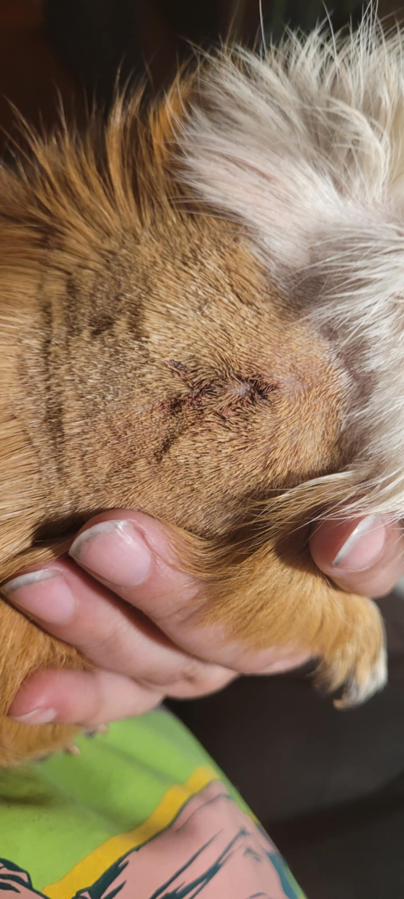
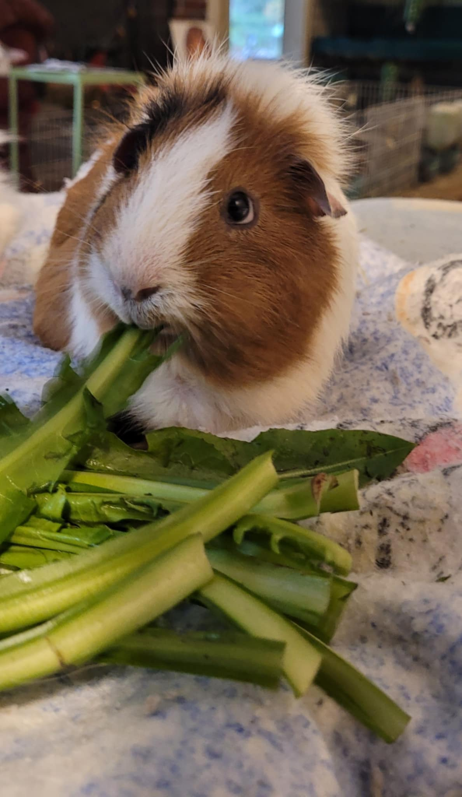
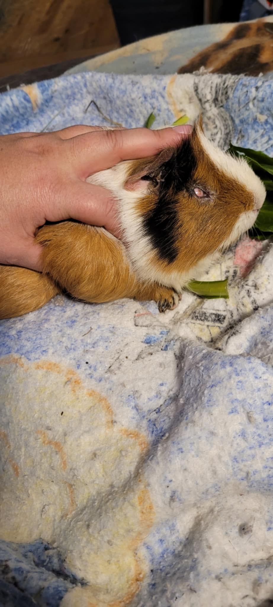

## Boba Update!

On October 10, Boba had his surgery at Southern Maine Hospital for Small Mammals, and it was a big success! The tumor was removed with excellent margins, and Boba came through surgery perfectly, eating and pooping as soon as he woke up. The incision is so small and clean, and we're so grateful to Dr Ford for his excellent work! Boba will be recovering with some pain meds for a few days, but we expect him to be back to normal ASAP. 

# Fundraiser for Boba: Help Our Brave Guinea Pig Fight Lymphoma

Meet Boba, a remarkable 7-year-old guinea pig with a heart full of resilience and the spirit of a fighter. Boba has faced more than his fair share of challenges in his life, but he never gave up—and now, he needs our help to overcome his toughest battle yet. Boba has been diagnosed with lymphoma, and he’s scheduled to undergo surgery to remove a cancerous tumor. We are raising funds to cover the cost of his surgery and post-operative care, and every donation—no matter how small—will make a huge difference.

[You can read more about lymphoma in guinea pigs here.](../../docs/Guinea%20Pigs/lymphoma)

<!-- truncate -->

## Boba’s Journey: A True Survivor

Boba’s story is one of courage and survival. He’s not just any guinea pig—he’s a warrior who has been through many health challenges over the years. At 7 years old, Boba has already lived a full life, but it hasn’t been without its struggles:

\- **Missing an Eyeball**: Boba lost one of his eyes earlier in life, but that never slowed him down. He learned to navigate the world with one eye, always full of curiosity and determination.  
    
\- **Surviving Bumblefoot**: Boba also battled and beat bumblefoot, a painful condition affecting the feet of guinea pigs. With proper treatment, care, and a lot of love, Boba healed and bounced back stronger than ever.

Now, Boba is facing another hurdle: lymphoma. Despite his age and past health issues, Boba’s spirit remains strong, and we believe he deserves every chance to live out his golden years cancer-free.

## Why Boba Needs Your Help

Boba’s upcoming surgery is essential to removing the cancerous tumor, but it comes with significant costs, including:

\- **Surgical Expenses**: The procedure to remove Boba’s tumor is complex and requires expert veterinary care.  
    
\- **Post-Operative Care**: After surgery, Boba will need specialized care to ensure a smooth recovery. This includes medications, follow-up vet visits, and supportive care at home.

As a small, volunteer-run animal rescue, we rely on the generosity of our supporters to give guinea pigs like Boba the medical care they need. Every dollar raised will go directly towards covering Boba’s surgery and recovery expenses.

## How You Can Help Boba

We are asking for your help to give Boba a fighting chance. Here’s how you can support his surgery and recovery:

1\. **Donate**: Every donation, no matter the amount, brings us one step closer to funding Boba’s surgery. Whether it’s $5 or $50, your contribution will make a difference.

2\. **Share**: If you’re unable to donate, you can still help by sharing Boba’s story with your friends, family, and social media followers. The more people who know about Boba’s journey, the closer we’ll get to reaching our goal.

3\. **Send Love**: Boba may not understand words, but he knows love and kindness. Leave a comment or message of support for Boba to let him know how many people are rooting for him\!

## Boba’s Future Depends on You

Boba has shown time and again that he’s a survivor, and we believe he can overcome lymphoma with the right medical care. But we can’t do it without your help. Let’s rally together to support this brave little guy and give him the chance to live out his remaining years in comfort and good health.

Thank you so much for your generosity and compassion. Boba may be missing an eye, but he’s never lost his sight for the love and support around him. Together, we can help Boba fight this cancer and continue to live his best life.

## Donate today to help Boba win his battle against lymphoma\!

❤ [PayPal](https://www.paypal.com/ncp/payment/8SJFNZQVMQ452)    
❤ [Venmo](https://account.venmo.com/u/haltrescue)    
❤ [CashApp](https://cash.app/$Haltrescue)    
❤ [Amazon Wish List](https://bit.ly/halt-piggies)    

