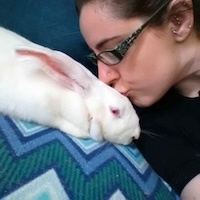
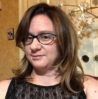
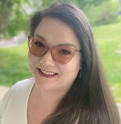
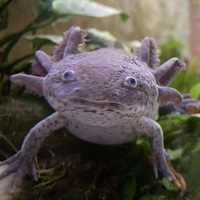
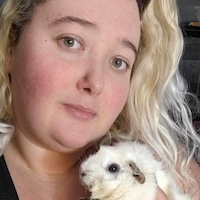

## Meet the Board of Directors

We want to be open and transparent with our followers and supports about who's running things, so we're thrilled to introduce our Board of Directors!

### President: Danni Challender

Danni started Helping All Little Things in August of 2010 when her best friend's rescue was overwhelmed with guinea pig surrenders.

Fun fact: Danni was terrified of guinea pigs when she was a child! Danni currently runs the sanctuary from her home in New Hampshire. She houses senior, hospice, and special needs small animals and gives them all the care they need to live a normal, happy life. She also manages our foster team which are based in NJ, PA, NY and DE..

### Vice President: Ericka Chadbourne

Ericka has been involved in animal rescue since 2000 when two little feral kittens entered her life unexpectedly. Their intro initiated 24 years of devoted loving work in rescue. Ericka started rescuing small animals about 14 years ago when she became heavily involved in HALT.

She now provides sanctuary to two hedgehogs and six chinchillas while supporting the rescue in other ways. Ericka heads up the arts and crafts division while collecting items for and running auctions. Her primary focus now is to collaborate with others on raising funds that help cover medical care and provide rich and fulfilling lives for the animals in the rescue’s care. Ericka shares her house with the chinchillas, hedgies and with four lovely kitties who she is devoted to entirely.

### Secretary: Alanna Burke

Alanna has always been involved in rescue, mostly working with cats, but became a part of HALT in 2017 when she adopted rats and then guinea pigs. Alanna handles all things technical and web-related for the rescue, as well as most of the graphics. She currently has 7 guinea pigs, 3 cats, and a dog. 

### Treasurer: Lynne Blecher

Lynne is a passionate animal advocate, dedicating her life to giving pets and humans a second chance at a good life. Lynne has both fostered and adopted unwanted pets since she was a teenager- from reptiles, amphibians, birds, guinea pigs, mice, rats, fish, dogs and cats.

Lynne is currently member of Bucks County Aquarium Society who teaches the public how to ethically keep fish and supports the CARES program which works to keep endangered fish species alive.

Her family includes her husband, two rescue dogs, an African Grey parrot, a 90 gallon aquarium and one Axolotl.

### Jen Dupee

Jen has been involved in animal rescue for a number of years. She started working with wildlife rehabilitation at the age of 16, and evolved into domestic animal rescue in 2017. Jen became involved with HALT about 5 years ago. Her primary focus is New Jersey-based surrenders as well as New Jersey-based sanctuary cases. She currently has a variety of different animals she shares a house with, including cats, dogs, rabbits, guinea pigs and a variety of other smaller exotics, insects, and arachnids.