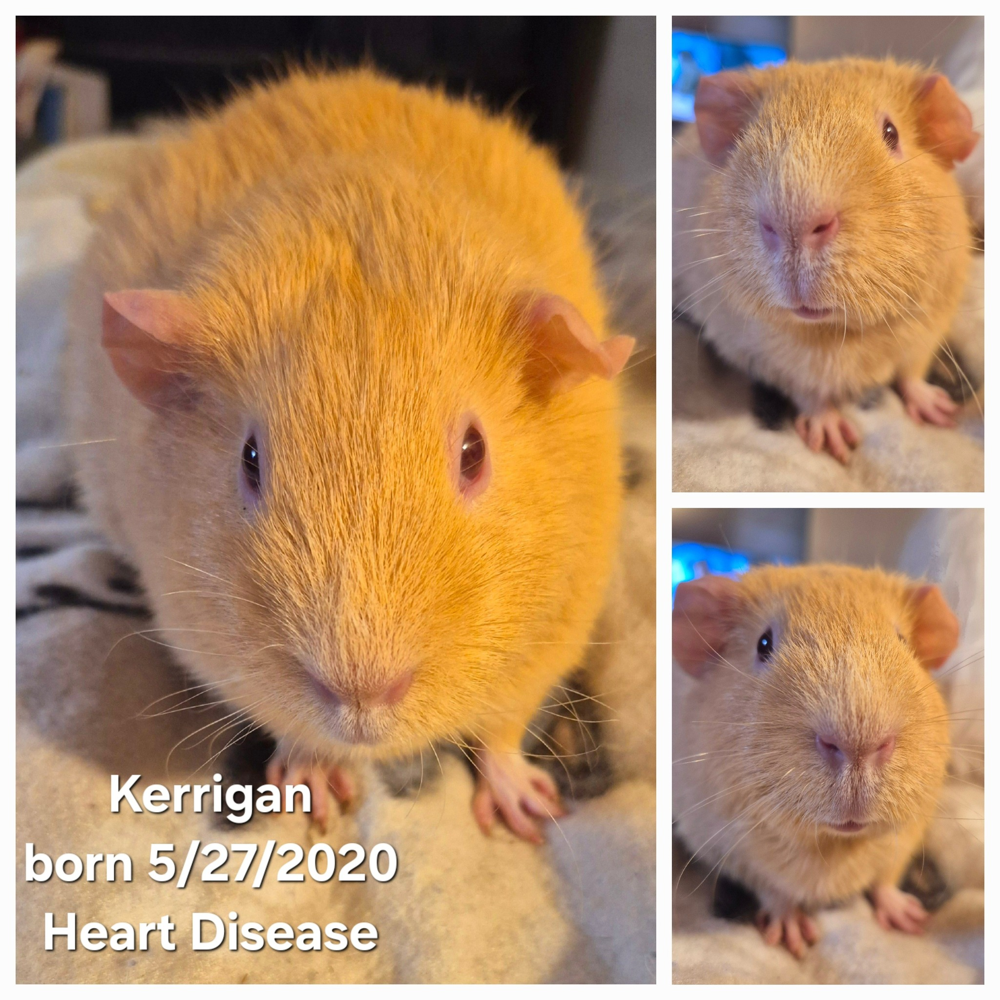
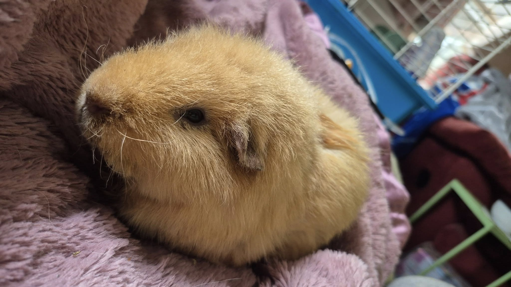
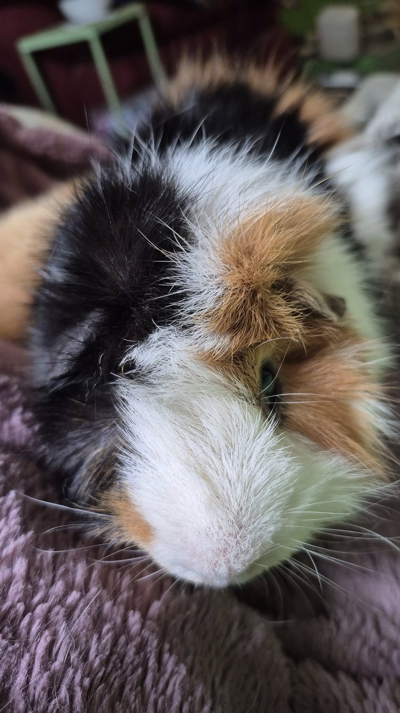

We have some sad news, but also some cautiously hopeful updates to share.

<!-- truncate -->

💔 First, the heartbreaking part:

### Kerrigan

Our sweet Kerrigan, who had been living with congestive heart failure, passed away peacefully this morning. Kerrigan was born in the rescue on May 27, 2020, and was adopted as a baby before returning to us last June. I had a feeling she belonged with us, so she joined our large female herd, where she was surrounded by friends and love.

Not long after her return, she was diagnosed with CHF. With Lasix and Pimobendan, we were able to manage her condition for quite a while. Kerrigan was a happy, affectionate girl who adored her herd and the extra cuddles she got during medication time. She’s now reunited with her sister—hopefully popcorning together over the rainbow bridge. 💕

### Novel and Parody

🌱 Now for some cautiously good news:
The round-the-clock care over the past few weeks has been exhausting—but it’s starting to feel worth it. Our lethal babies are thriving, and both Novel and Parody seem to have turned a corner.

✨ Novel is now holding himself upright instead of lying flat and floppy. Truthfully, I’ve never had success bringing back an animal once they’ve reached that point—but Novel is alert, interested in food, has started urinating, and even let out a little protest during his last sub-q fluids. These are all wonderful signs.

✨ Parody is full of curiosity and taking food like a champ. His poops are well-formed—still not quite as much as we’d like, but any output right now is a win.

After days of being glued to their sides, terrified to step away, I finally feel like I can breathe a bit. I may even take a shower and grab some fresh veggies for the crew. (I also need to get my second rabies shot after that bat incident, but that’s another story…)

----

## 🙏  Support Our Rescue Work

If you believe in the work we do, please consider making a contribution.
Your support helps us continue saving and caring for the most vulnerable small animals. 💕

⸻

### 💸  Ways to Donate
 - PayPal: donations@helpingalllittlethings.org
 - Venmo: [@haltrescue](https://account.venmo.com/u/haltrescue) (watch for imposters — it’s _not_ haltrescue_)
 - CashApp: [$haltrescue](https://cash.app/$Haltrescue)
 - Mail a Check:  
  
    Helping All Little Things    
    PO Box 11    
    Deerfield, NH 03037    
    (Make checks payable to Helping All Little Things)    

### 🛒 Wishlist Donations
 - 🛍️ [Amazon Wishlist](https://tinyurl.com/HALT-Amazon-Wishlist)
 - 🛍️ [Chewy Wishlist](https://tinyurl.com/HALT-Chewy-Wishlist)

### 📞 Donate Directly to Our Vets
 - Southern Maine Hospital for Small Mammals: (207) 535-9330
 - Broadview Vets of Dover: (603) 740-1800
 - House Paws: (856) 234-5230
(Note: The account may still be under Helping All Little Pipsqueaks — we’re in the process of updating it.)

Thank you for your continued love and support.
Every life matters, and we’re so grateful you’re part of this mission with us. 🐹💕
