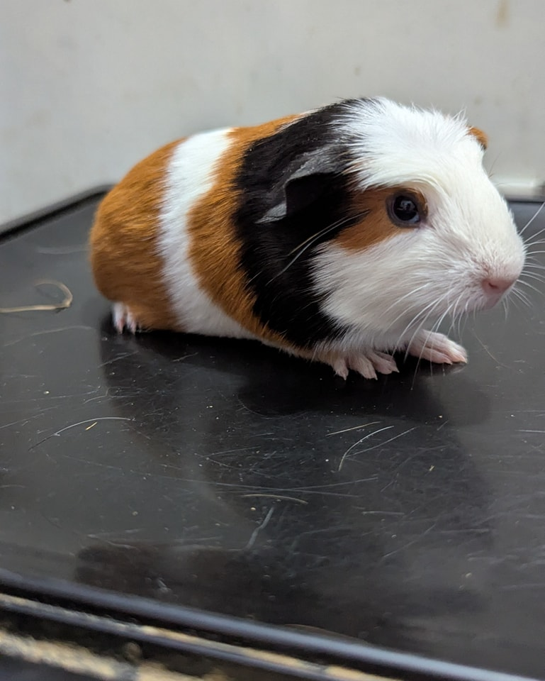
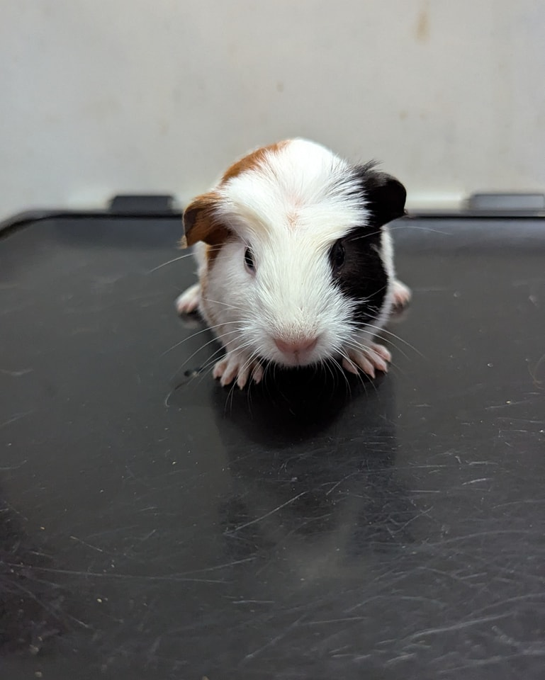

## From the Desk of Susan from Marketing and Carol from HR

📢 Please have a seat—this won’t take long, but it is a mandatory meeting.

Susan from Marketing and Carol from HR have prepared a brief presentation on why you need business pigs in your life—and how they can help you solve all your productivity problems!

There will be a PowerPoint presentation (because would it even be a real business meeting without one?).

<!-- truncate -->

Susan from Marketing will be leading the bulk of today’s session. She and Carol firmly believe that every home needs business guinea pigs. What do they bring to the table?
	•	First, they’re excellent at keeping everyone on schedule. They know when it’s veggie time and will politely remind you—by screaming into the void—if you’re even a minute late.
	•	They’re highly motivating. Who wouldn’t want to work harder for these tiny, adorable faces?
	•	They bring structured fun to the workplace—think of it as business-appropriate enrichment. Maybe a veggie party at lunch to boost team morale?

Now, let’s address logistics. Susan and Carol are a bonded pair and must stay together. They’re a dynamic duo, and let’s be honest: two business pigs are always better than one.

While they believe everyone could benefit from business pigs in their lives, they are the only ones currently looking to transfer offices. So don’t miss your chance—submit your hiring packets soon!

📩 That concludes today’s presentation. Susan and Carol are happy to take questions, but if you’re already sold, applications can be found on our Petfinder!

Bonus: They’d be thrilled to join an existing team of business pigs, if you’ve already got an established office looking for fresh talent.

