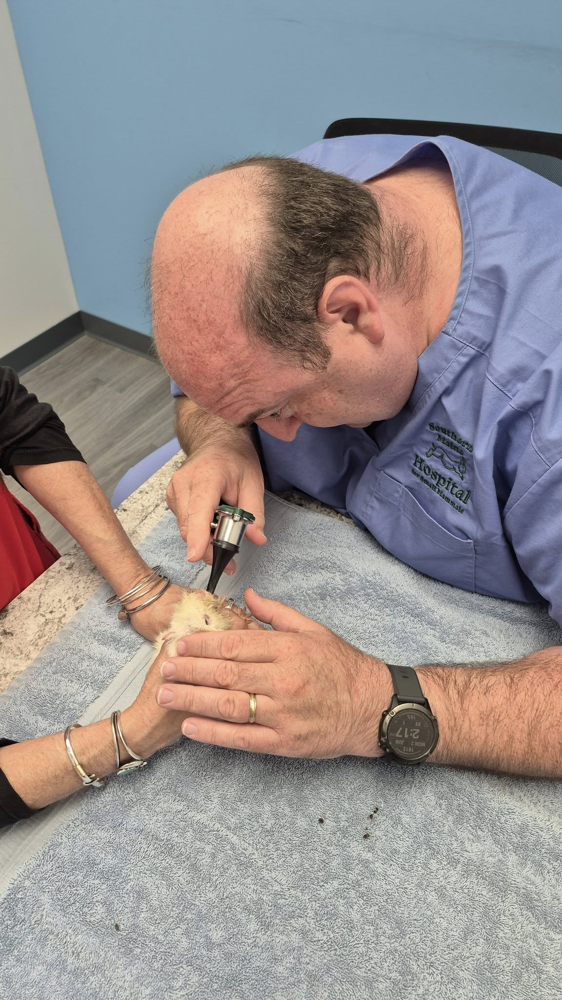
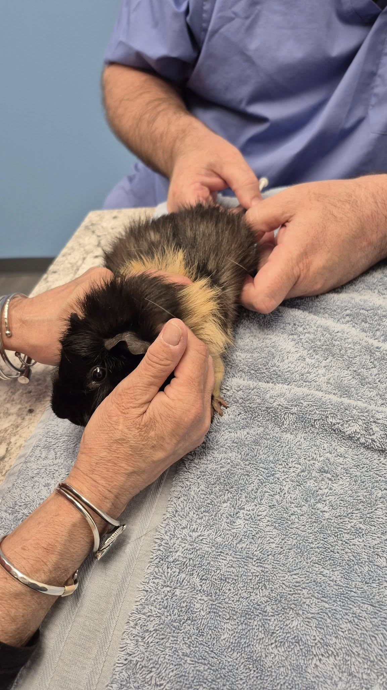
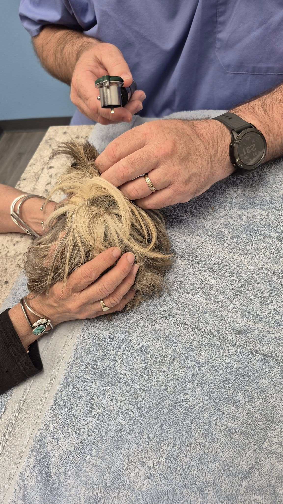
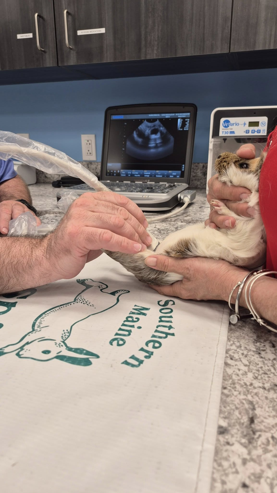
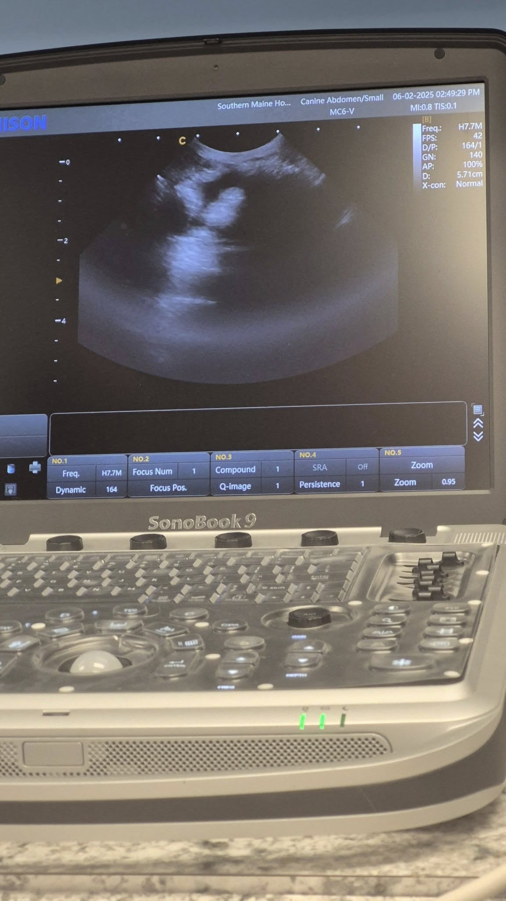
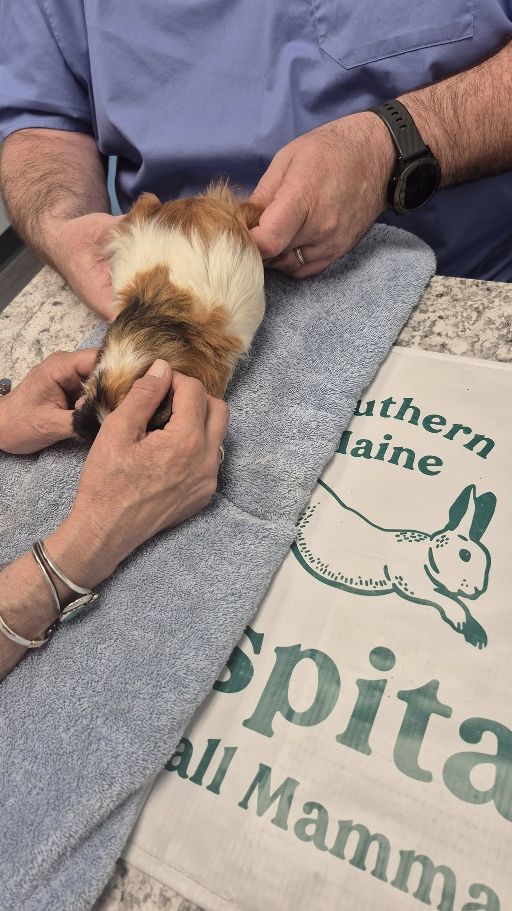
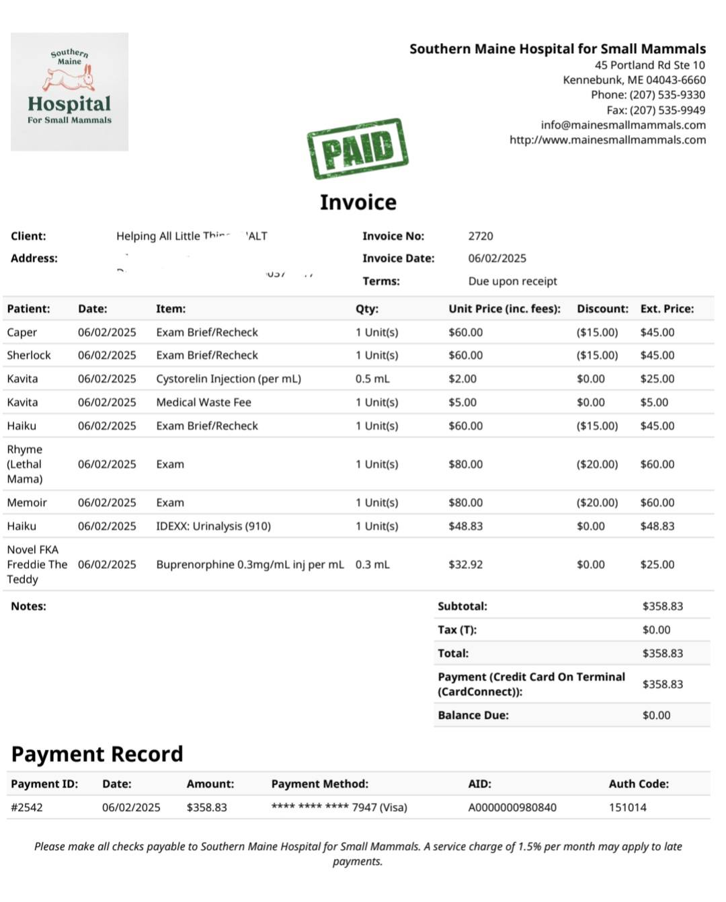

Today was a very busy day at the vet. Thankfully, nothing was outright terrible—but we did learn some surprising things about a few of our little ones. Here’s a full update!

<!-- truncate -->

### 🐭 Sherlock the Chinchilla

No surprise here—Sherlock needs a dental surgery, which is scheduled for Wednesday. We absolutely need help covering the cost of this procedure. Donations, shares, and good vibes are all deeply appreciated.

⸻

### 🐹 Caper

Caper came in for a recheck. I just wanted to be absolutely sure that his drooling was from having no incisors (rather than bad molars). His molars look fantastic!

Caper is actually the first small animal I’ve had with zero incisors—I’ve seen many missing one or two, but not all four. He’s growing slowly and is much smaller than his brother, and may just be a tiny guy for life.

Sadly, based on past experience, very stunted pigs often have shorter life spans due to poor genetics. I knew this going in, but it doesn’t make it any easier. These babies have my whole heart, and when their time comes, I will not be okay.

⸻

### 🐹 Kavita

Kavita got her second hormone injection today, and it’s already helping! Her hair is growing back and the ovarian cysts have shrunk significantly after just one dose. We’re hopeful this second round will resolve things completely.

⸻

### 🐹 Haiku

Haiku was meant to be seen just for a heart check, but she was very painful and grumpy with the tech and Dr. Ford—very unlike her.

She’s been eating well and has great poops, but has lost weight. We were discussing possible arthritis and other ideas when she urinated on the table—and all three of us noticed how diluted her urine looked.

We took a sample and sent it for testing. Kidney issues would explain the weight loss… and while her heart sounded good today, possible kidney disease is deeply concerning.

⸻

### 🐹 Rhyme (Mother of the Lethals)

I brought Rhyme in to confirm that she wasn’t pregnant again (she’s not). During the ultrasound, however, we discovered that her colon has adhered to her bladder—a not-uncommon result of pregnancy and birth.

There’s nothing to be done now, but it’s critical information in case she ever needs abdominal surgery.

We also saw that her bladder looked inflamed, even though she has no UTI symptoms. She’s starting a round of antibiotics and we’ll recheck her soon.

⸻

### 🐹 Memoir

Memoir is a stunning satin girl who arrived just under a month ago. At intake, she was bunny hopping, which usually indicates arthritis or osteodystrophy.

Her X-rays didn’t show any bone loss at that time, so we started her on a low-dose pain med. Unfortunately, her pain is already increasing—a sign that Satin Syndrome may be progressing.

We’re increasing her dose of Metacam and hoping it will bring her some much-needed comfort. Satin Syndrome is heartbreaking and can advance so quickly.

----

## 🙏  Support Our Rescue Work

If you believe in the work we do, please consider making a contribution.
Your support helps us continue saving and caring for the most vulnerable small animals. 💕

⸻

### 💸  Ways to Donate
 - PayPal: donations@helpingalllittlethings.org
 - Venmo: [@haltrescue](https://account.venmo.com/u/haltrescue) (watch for imposters — it’s _not_ haltrescue_)
 - CashApp: [$haltrescue](https://cash.app/$Haltrescue)
 - Mail a Check:  
  
    Helping All Little Things    
    PO Box 11    
    Deerfield, NH 03037    
    (Make checks payable to Helping All Little Things)    

### 🛒 Wishlist Donations
 - 🛍️ [Amazon Wishlist](https://tinyurl.com/HALT-Amazon-Wishlist)
 - 🛍️ [Chewy Wishlist](https://tinyurl.com/HALT-Chewy-Wishlist)

### 📞 Donate Directly to Our Vets
 - Southern Maine Hospital for Small Mammals: (207) 535-9330
 - Broadview Vets of Dover: (603) 740-1800
 - House Paws: (856) 234-5230
(Note: The account may still be under Helping All Little Pipsqueaks — we’re in the process of updating it.)

Thank you for your continued love and support.
Every life matters, and we’re so grateful you’re part of this mission with us. 🐹💕
