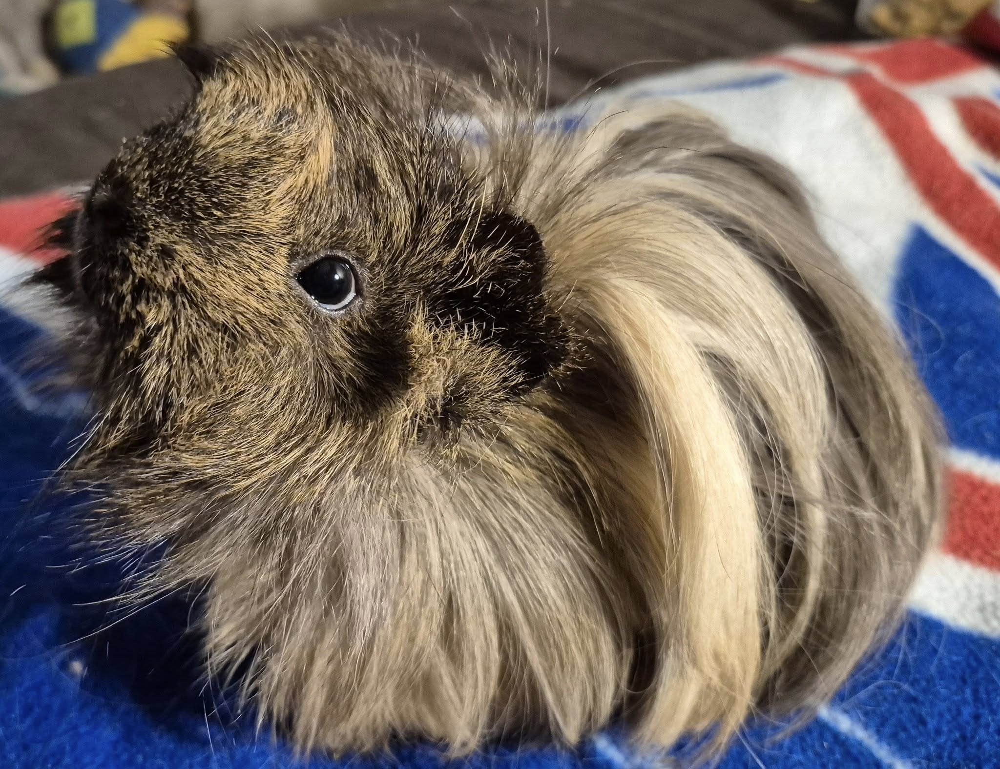

## 🩺 Medical Update + Urgent Funding Need

### Haiku

Haiku’s urinalysis results just came back and showed:

 - Very low specific gravity, and
 - Crystals in her urine

This is a first for us—we’ve never had a piggy with crystals before—but in theory, it should be manageable. Everyone here is already on a fairly low-calcium diet, but we’ll be separating Haiku from the herd temporarily and adjusting her diet to an even more kidney-friendly plan.

Given how underweight she was at intake, we suspect this issue started long before she arrived at the rescue.

### 🧪 What’s Next?

We’d like to do bloodwork to rule out or confirm kidney disease or hyperthyroidism—both of which could explain her weight loss despite a healthy appetite.

Hyperthyroidism can impact kidney function, but it’s also very manageable with a proper diagnosis. We need confirmation to move forward with the right treatment plan.

There’s a chance we may need to lightly sedate her for the blood draw since she was extremely uncooperative at her last exam. We’ll be at the vet tomorrow for Sherlock’s dental, and we’re hoping to get her bloodwork done then if we can raise the funds in time.

⸻

💸 Here’s What We Need Help Covering

 - 🐱 Rabies boosters for sanctuary cats (due to bat exposure)	$250
 - 🐹 Novel & Parody’s vet visit $208
 - 🐹 Sherlock, Haiku, Kavita, Caper, Rhyme & Memoir’s visit (6/5)	$358
 - 🦷 Sherlock’s dental surgery (6/6)	$350
 - 🧪 Haiku’s bloodwork (incl. potential sedation)	$350

🆘 Total Needed: **$1,516**

If we don’t end up needing the full amount for Haiku’s bloodwork, the remaining funds will roll over to cover other vet bills, as we’re absolutely drowning in medical costs right now. Every dollar helps. Every share helps.

⸻

## 🙏  Support Our Rescue Work

If you believe in the work we do, please consider making a contribution.
Your support helps us continue saving and caring for the most vulnerable small animals. 💕

⸻

### 💸  Ways to Donate
 - PayPal: donations@helpingalllittlethings.org
 - Venmo: [@haltrescue](https://account.venmo.com/u/haltrescue) (watch for imposters — it’s _not_ haltrescue_)
 - CashApp: [$haltrescue](https://cash.app/$Haltrescue)
 - Mail a Check:  
  
    Helping All Little Things    
    PO Box 11    
    Deerfield, NH 03037    
    (Make checks payable to Helping All Little Things)    

### 🛒 Wishlist Donations
 - 🛍️ [Amazon Wishlist](https://tinyurl.com/HALT-Amazon-Wishlist)
 - 🛍️ [Chewy Wishlist](https://tinyurl.com/HALT-Chewy-Wishlist)

### 📞 Donate Directly to Our Vets
 - Southern Maine Hospital for Small Mammals: (207) 535-9330
 - House Paws: (856) 234-5230
(Note: The account may still be under Helping All Little Pipsqueaks — we’re in the process of updating it.)

Thank you for your continued love and support.
Every life matters, and we’re so grateful you’re part of this mission with us. 🐹💕
