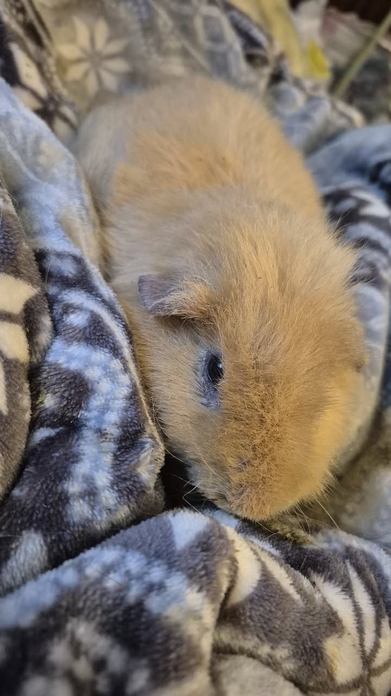
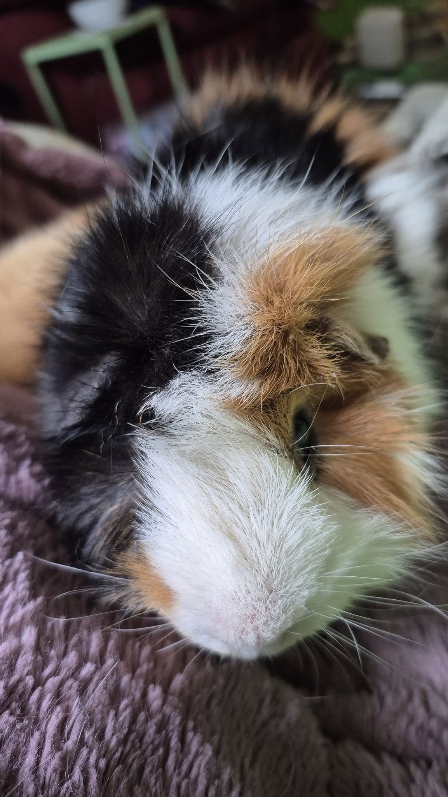

## 💊 Pain Management Update + A Sweet Social Shift

Both Parody and Novel had a really positive response to the addition of Buprenex to their pain management plans!

Last night, Novel was eating celery on his own, and this afternoon, Parody munched on some pellets and veggies without help. It’s clear the medication helped—but just as clear when it wears off. Since Buprenex is a controlled substance, vets have to be careful with how they prescribe it. We were given just one dose each to test their response.

Now that we know it helps, we should be able to get a bit more at a time—but I expect I’ll still need to make regular trips to the vet to pick it up. (Not a problem—I’m there at least once a week anyway!)

<!-- truncate -->

## 🐹 A New Roommate and a Little Surprise

I also took a chance and moved Parody into the couch cage, and so far he’s doing great! He’s very calm and seems completely smitten with Hero. Honestly, the babies really seem to lift everyone’s spirits—mine included.

And even as a lifelong crazy guinea pig lady, I never thought I’d be the kind of person with a couch cage…
But here we are. 💁‍♀️🐹💕

## 🙏  Support Our Rescue Work

If you believe in the work we do, please consider making a contribution.
Your support helps us continue saving and caring for the most vulnerable small animals. 💕

⸻

### 💸  Ways to Donate
 - PayPal: donations@helpingalllittlethings.org
 - Venmo: [@haltrescue](https://account.venmo.com/u/haltrescue) (watch for imposters — it’s _not_ haltrescue_)
 - CashApp: [$haltrescue](https://cash.app/$Haltrescue)
 - Mail a Check:  
  
    Helping All Little Things    
    PO Box 11    
    Deerfield, NH 03037    
    (Make checks payable to Helping All Little Things)    

### 🛒 Wishlist Donations
 - 🛍️ [Amazon Wishlist](https://tinyurl.com/HALT-Amazon-Wishlist)
 - 🛍️ [Chewy Wishlist](https://tinyurl.com/HALT-Chewy-Wishlist)

### 📞 Donate Directly to Our Vets
 - Southern Maine Hospital for Small Mammals: (207) 535-9330
 - Broadview Vets of Dover: (603) 740-1800
 - House Paws: (856) 234-5230
(Note: The account may still be under Helping All Little Pipsqueaks — we’re in the process of updating it.)

Thank you for your continued love and support.
Every life matters, and we’re so grateful you’re part of this mission with us. 🐹💕
