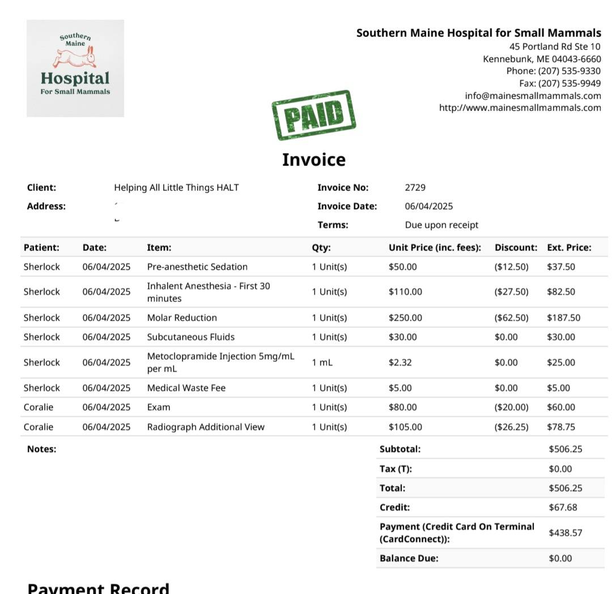
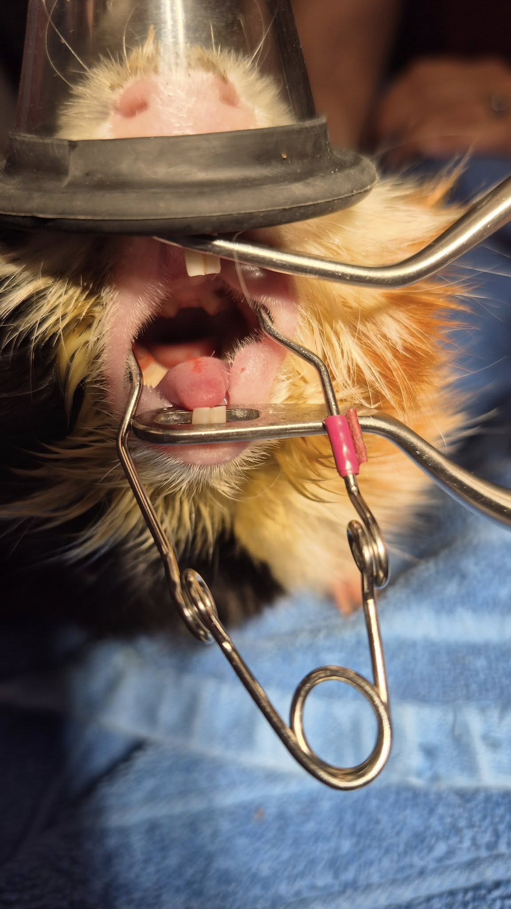
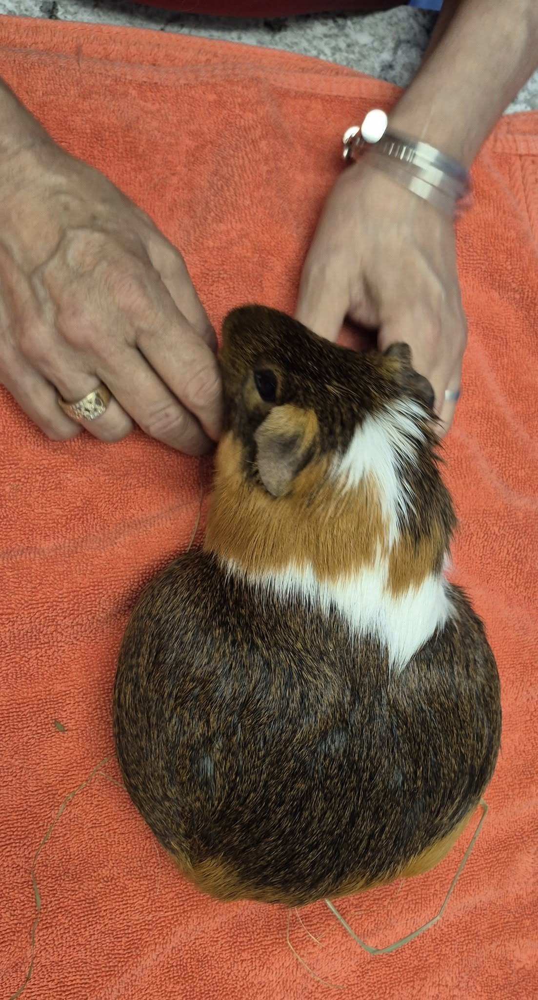
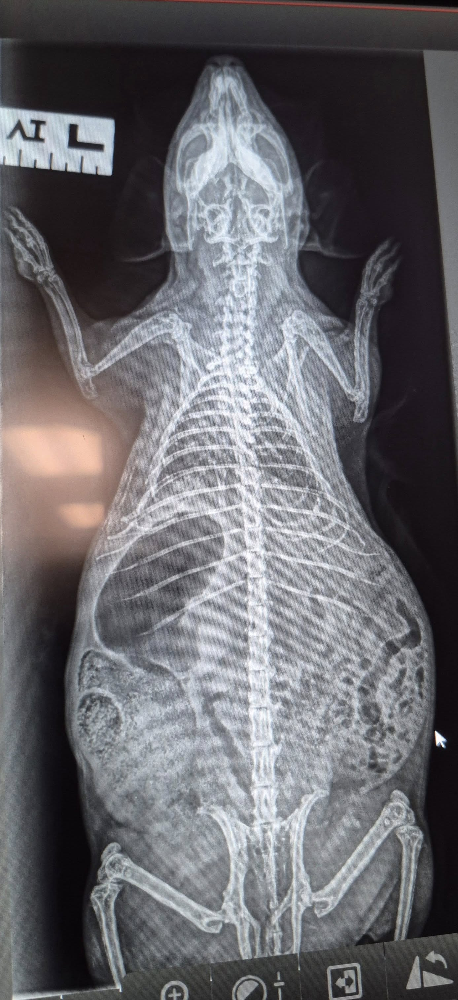

## 🐾 Vet Day Recap + Chaos Incoming

Currently sitting in my car, kind of dreading walking into my house. Between the disaster zone that is my living room and the stack of things I need to do—on top of handfeeding multiple piggies—I’m feeling more than a little twitchy. But anyway… here’s today’s vet report!

<!-- truncate -->

## 🦷 Sherlock

Sherlock was an absolute champ. He even ate Oxbow pellets after waking up from surgery—this blew my mind, because at home, if I offer him Oxbow, he dumps the bowl and pees in it out of spite.

He has a recheck in a month to see how soon we’ll need to schedule the next dental. Oh, and fun fact? He has a bonus rogue tooth growing in a totally inappropriate location. Honestly, that tracks. Of course the animal living in my house has an extra, chaotic tooth.

⸻

## 🐹 A Fun Surprise!

I finally got to meet Betsy from Wheektopia Rescue in person today at Dr. Ford’s office! I recommended Southern Maine to her a while back, and she loved them so much she made them her primary vet too.

It was so nice to meet another fellow crazy guinea pig person in real life—and yes, I got to smooch some of the adorable pigs she brought in for exams. Check out this massive mama-to-be! I had to head out before her ultrasound, but I’ll be texting Betsy later to see how many babies are packed in there.

⸻

## 😔 Poor Coralie

In not-so-great news: Coralie has very advanced osteodystrophy in her jaw, and it’s incredibly worn down. Honestly, I don’t know how she hid it for so long—girl can EAT.

She also has significant bone wear around her knees. While I often use “Satin Syndrome” as a general term, osteodystrophy specifically refers to when the body stops absorbing calcium properly, causing the bones to erode or break down. Satin Syndrome is more of a catch-all term for the various issues that satins can face.

Looking into her mouth, you’ll see red sores—not because of bad teeth (hers are actually great), but likely from chewing awkwardly to avoid jaw pain.

Coralie and Novel will now be on stronger pain meds 2x/day, compared to the other satins, who are doing well on once-daily higher-dose Metacam.

⸻

## 🏗️ Housing Shuffle Incoming

I’m tinkering with the idea of grouping the satin girls together in one cage to reduce food competition and give them a more consistent care setup.

I’m also considering moving Haiku, Kavita, Brynlee, and Blakely into their own setup since Haiku and Brynlee have kidney issues, and I’d like to try them on 100% Timothy pellets.

So yes… it’s going to be a very long weekend of playing musical guinea pigs. 🙃

⸻

Thanks as always for following our chaos and supporting our crew. If you’d like to help us through this endless wave of medical needs and cage reconfigurations, please check out our donation info! 💕🐹

## 🙏  Support Our Rescue Work

If you believe in the work we do, please consider making a contribution.
Your support helps us continue saving and caring for the most vulnerable small animals. 💕

⸻

### 💸  Ways to Donate
 - PayPal: donations@helpingalllittlethings.org
 - Venmo: [@haltrescue](https://account.venmo.com/u/haltrescue) (watch for imposters — it’s _not_ haltrescue_)
 - CashApp: [$haltrescue](https://cash.app/$Haltrescue)
 - Mail a Check:  
  
    Helping All Little Things    
    PO Box 11    
    Deerfield, NH 03037    
    (Make checks payable to Helping All Little Things)    

### 🛒 Wishlist Donations
 - 🛍️ [Amazon Wishlist](https://tinyurl.com/HALT-Amazon-Wishlist)
 - 🛍️ [Chewy Wishlist](https://tinyurl.com/HALT-Chewy-Wishlist)

### 📞 Donate Directly to Our Vets
 - Southern Maine Hospital for Small Mammals: (207) 535-9330
 - Broadview Vets of Dover: (603) 740-1800
 - House Paws: (856) 234-5230
(Note: The account may still be under Helping All Little Pipsqueaks — we’re in the process of updating it.)

Thank you for your continued love and support.
Every life matters, and we’re so grateful you’re part of this mission with us. 🐹💕
