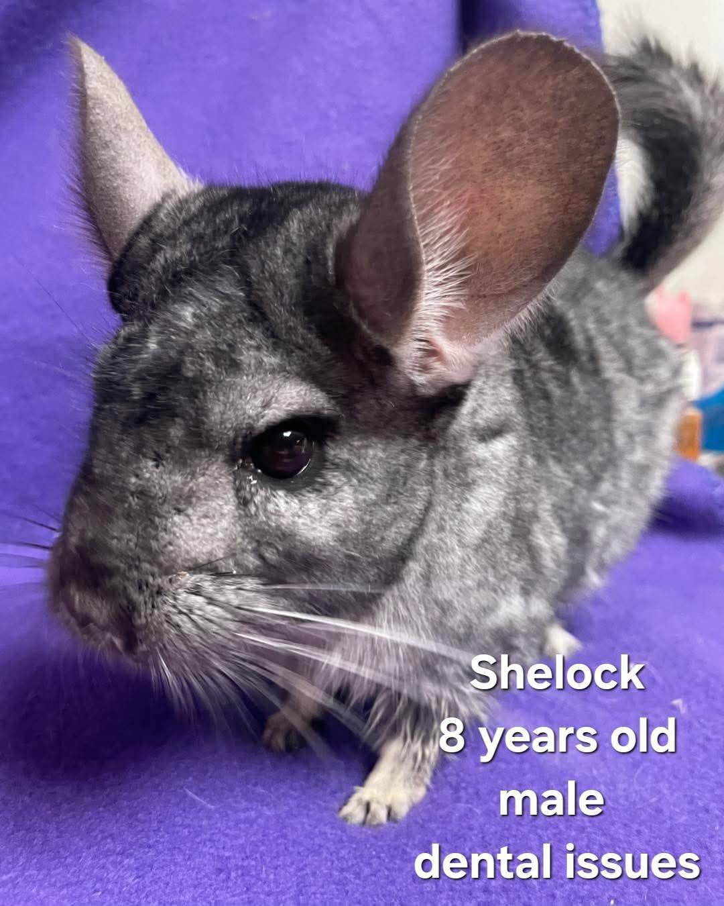
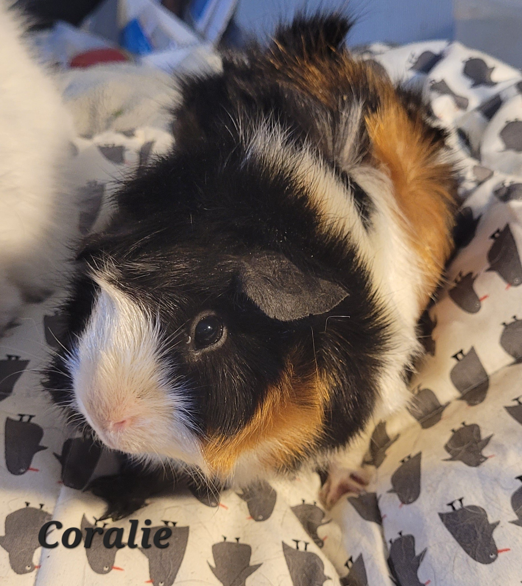

## 🦷 Sherlock Update + Urgent Help Needed!

We really need to take some updated glamour shots of Sherlock, because this brave boy made it through dental surgery like a champ! 💪

As expected, his teeth were a complete mess—including a random spare tooth just hanging out where it didn’t belong. We’re likely looking at dental surgeries every 6 weeks to keep him healthy and comfortable.

<!-- truncate -->

⸻

### 🐹 Sherlock’s Favorites (for anyone who wants to spoil him!)

 - 🥣 Pellets: Science Selective
 - 🍲 Recovery Food: Sherwood Recovery (he eats bowlfuls!)
 - 🍓 Treats: A tiny dried Oxbow strawberry after meds = pure joy

### 💸 Estimated Costs

 - 🦷 Sherlock’s dental surgery: ~$400
(We’re waiting for the final invoice since he’s still in recovery)

We would love to find some sponsors to help cover his ongoing care. If you’ve ever considered sponsoring a special-needs animal—this is your guy. 🐾

## 🚨 New Concern: Coralie

Last night during veggie time, Coralie (one of our beautiful satin girls) refused her peppers—her absolute favorite. That’s a big red flag.

She’s heading to the vet at 3 PM today, and we’re anticipating about $150 for her exam and X-rays to check for Satin Syndrome.

<SupportUs />
