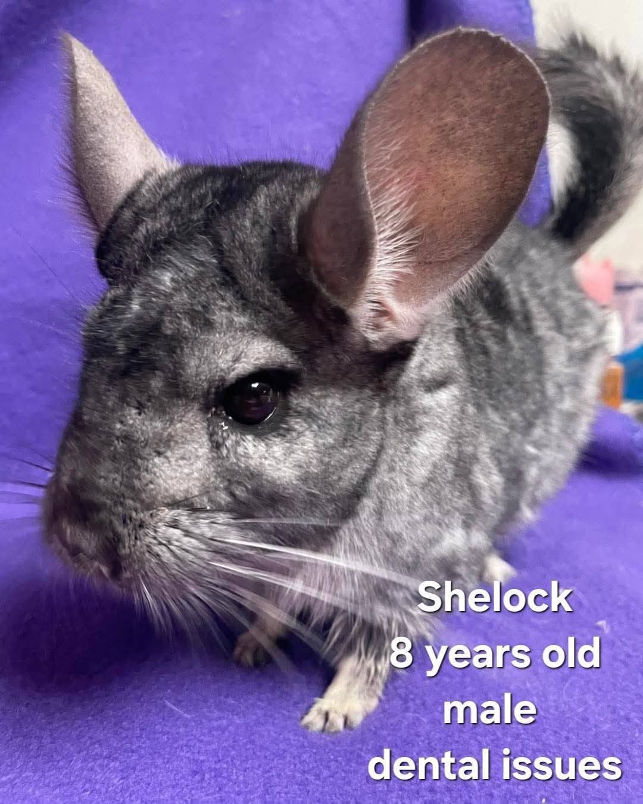
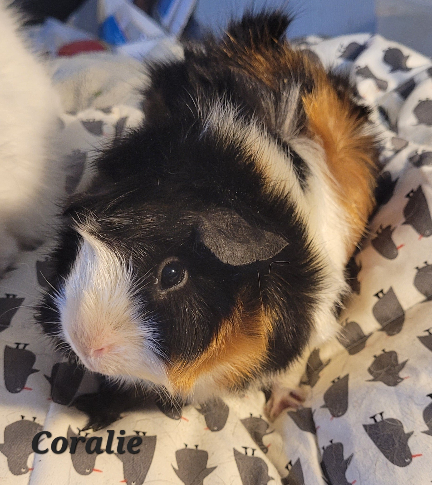

## 🦷 Sherlock Update + Urgent Help Needed!

We really need to take some updated glamour shots of Sherlock, because this brave boy made it through dental surgery like a champ! 💪

As expected, his teeth were a complete mess—including a random spare tooth just hanging out where it didn’t belong. We’re likely looking at dental surgeries every 6 weeks to keep him healthy and comfortable.

<!-- truncate -->

⸻

### 🐹 Sherlock’s Favorites (for anyone who wants to spoil him!)

 - 🥣 Pellets: Science Selective
 - 🍲 Recovery Food: Sherwood Recovery (he eats bowlfuls!)
 - 🍓 Treats: A tiny dried Oxbow strawberry after meds = pure joy

### 💸 Estimated Costs

 - 🦷 Sherlock’s dental surgery: ~$400
(We’re waiting for the final invoice since he’s still in recovery)

We would love to find some sponsors to help cover his ongoing care. If you’ve ever considered sponsoring a special-needs animal—this is your guy. 🐾

## 🚨 New Concern: Coralie

Last night during veggie time, Coralie (one of our beautiful satin girls) refused her peppers—her absolute favorite. That’s a big red flag.

She’s heading to the vet at 3 PM today, and we’re anticipating about $150 for her exam and X-rays to check for Satin Syndrome.

## 🙏  Support Our Rescue Work

If you believe in the work we do, please consider making a contribution.
Your support helps us continue saving and caring for the most vulnerable small animals. 💕

⸻

### 💸  Ways to Donate
 - PayPal: donations@helpingalllittlethings.org
 - Venmo: [@haltrescue](https://account.venmo.com/u/haltrescue) (watch for imposters — it’s _not_ haltrescue_)
 - CashApp: [$haltrescue](https://cash.app/$Haltrescue)
 - Mail a Check:  
  
    Helping All Little Things    
    PO Box 11    
    Deerfield, NH 03037    
    (Make checks payable to Helping All Little Things)    

### 🛒 Wishlist Donations
 - 🛍️ [Amazon Wishlist](https://tinyurl.com/HALT-Amazon-Wishlist)
 - 🛍️ [Chewy Wishlist](https://tinyurl.com/HALT-Chewy-Wishlist)

### 📞 Donate Directly to Our Vets
 - Southern Maine Hospital for Small Mammals: (207) 535-9330
 - Broadview Vets of Dover: (603) 740-1800
 - House Paws: (856) 234-5230
(Note: The account may still be under Helping All Little Pipsqueaks — we’re in the process of updating it.)

Thank you for your continued love and support.
Every life matters, and we’re so grateful you’re part of this mission with us. 🐹💕
