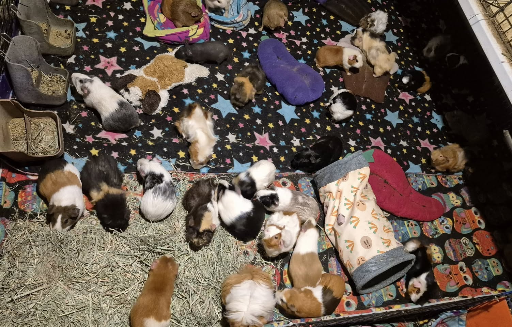
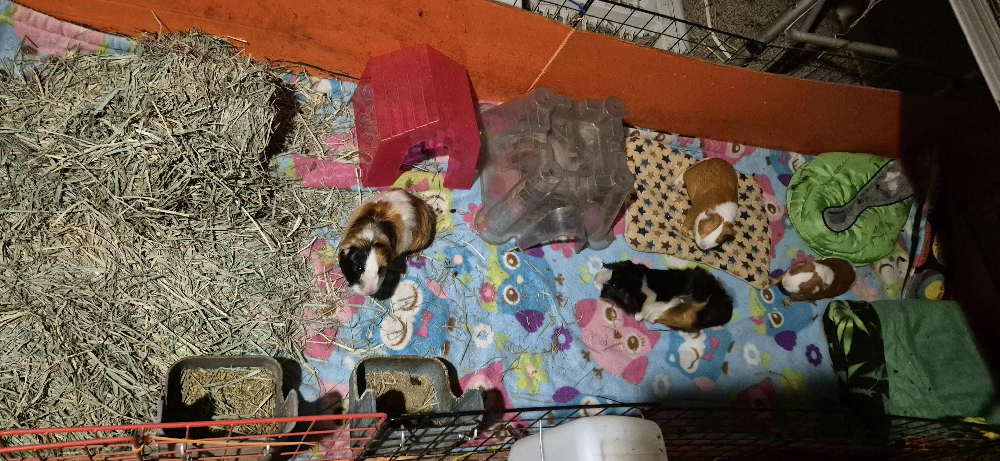

## 🎓  Not-So-Baby Girls Graduate!

Our “babies” aren’t babies anymore—Saga, Fantasy, Madrigal, Gothic, and Rhyme have officially graduated and joined the adult herd! These girls are now around 6–7 months old, and while we’ll always think of them as our little ones, they’re growing up beautifully.

Their move into the adult cage made space for a new special group…

<!-- truncate -->

⸻

## 💫 Introducing: Team Wonkiest Females

With their old cage freed up, we created a cozy setup for Team Wonkiest Females—a crew of our beloved ladies who need a little extra care and monitoring:

Haiku, Brynlee, Blakely, Memoir, and Coralie.

⸻

## 🍽️ Eating Update!

The good news keeps coming—Coralie and Memoir are back to eating on their own, thanks to a solid pain management routine.
 - Novel is still our most hand-fed piggy right now, but he’s making slow progress.
 - Caper gets a little handfeeding too… but honestly? That’s more because he’s spoiled and likes the attention. 😄

⸻

We’re celebrating the little wins every day—whether it’s a piggie eating on their own again, or a herd shuffle that just works. Thank you for supporting us as we care for these incredible little lives. 🐹💕

⸻

## 🙏  Support Our Rescue Work

If you believe in the work we do, please consider making a contribution.
Your support helps us continue saving and caring for the most vulnerable small animals. 💕

⸻

### 💸  Ways to Donate
 - PayPal: donations@helpingalllittlethings.org
 - Venmo: [@haltrescue](https://account.venmo.com/u/haltrescue) (watch for imposters — it’s _not_ haltrescue_)
 - CashApp: [$haltrescue](https://cash.app/$Haltrescue)
 - Mail a Check:  
  
    Helping All Little Things    
    PO Box 11    
    Deerfield, NH 03037    
    (Make checks payable to Helping All Little Things)    

### 🛒 Wishlist Donations
 - 🛍️ [Amazon Wishlist](https://tinyurl.com/HALT-Amazon-Wishlist)
 - 🛍️ [Chewy Wishlist](https://tinyurl.com/HALT-Chewy-Wishlist)

### 📞 Donate Directly to Our Vets
 - Southern Maine Hospital for Small Mammals: (207) 535-9330
 - Broadview Vets of Dover: (603) 740-1800
 - House Paws: (856) 234-5230
(Note: The account may still be under Helping All Little Pipsqueaks — we’re in the process of updating it.)

Thank you for your continued love and support.
Every life matters, and we’re so grateful you’re part of this mission with us. 🐹💕
