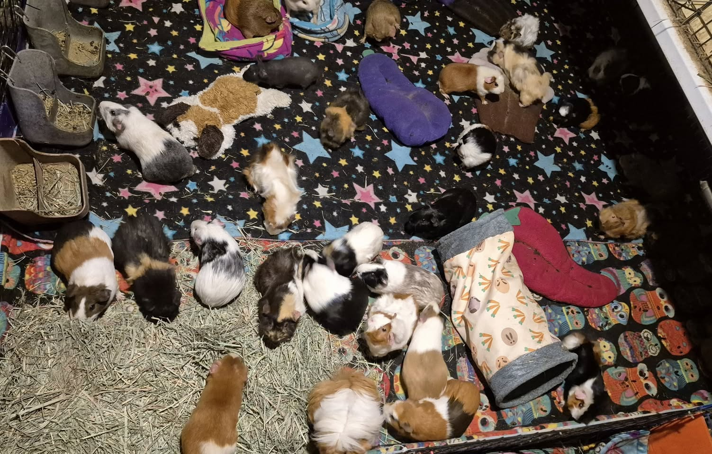
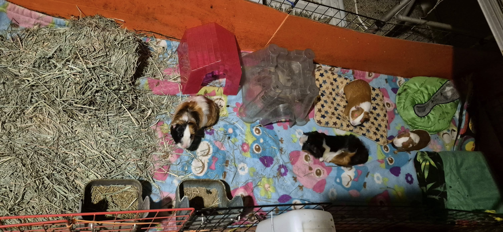

## 🎓  Not-So-Baby Girls Graduate!

Our “babies” aren’t babies anymore—Saga, Fantasy, Madrigal, Gothic, and Rhyme have officially graduated and joined the adult herd! These girls are now around 6–7 months old, and while we’ll always think of them as our little ones, they’re growing up beautifully.

Their move into the adult cage made space for a new special group…

<!-- truncate -->

⸻

## 💫 Introducing: Team Wonkiest Females

With their old cage freed up, we created a cozy setup for Team Wonkiest Females—a crew of our beloved ladies who need a little extra care and monitoring:

Haiku, Brynlee, Blakely, Memoir, and Coralie.

⸻

## 🍽️ Eating Update!

The good news keeps coming—Coralie and Memoir are back to eating on their own, thanks to a solid pain management routine.

 - Novel is still our most hand-fed piggy right now, but he’s making slow progress.
 - Caper gets a little handfeeding too… but honestly? That’s more because he’s spoiled and likes the attention. 😄

⸻

We’re celebrating the little wins every day—whether it’s a piggie eating on their own again, or a herd shuffle that just works. Thank you for supporting us as we care for these incredible little lives. 🐹💕

⸻

<SupportUs />
