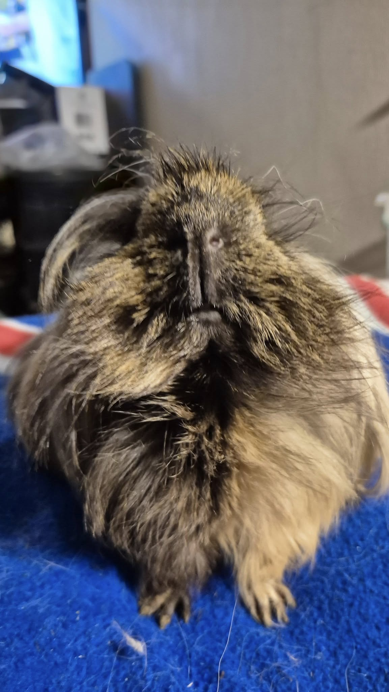
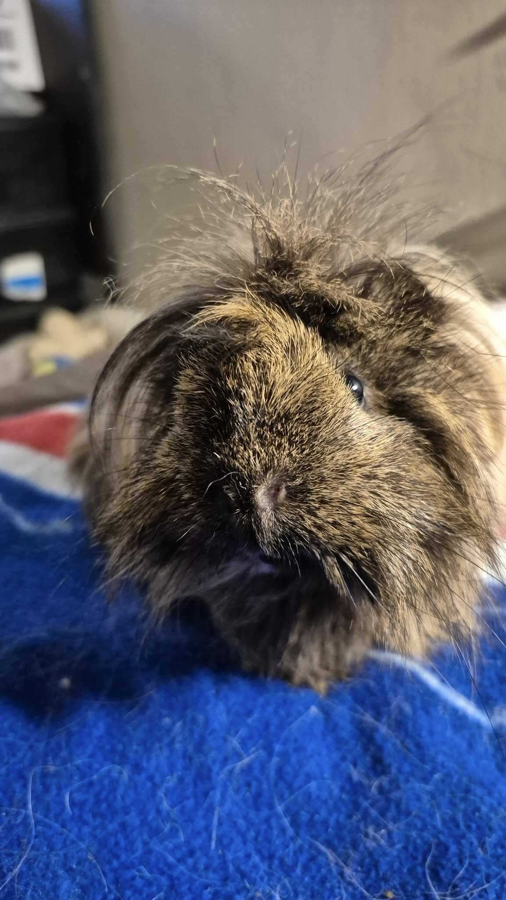
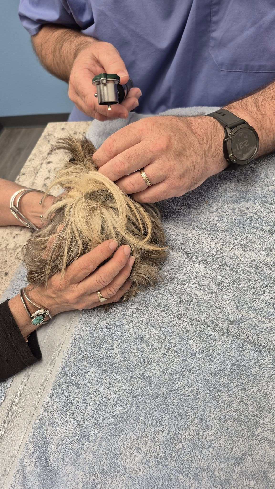

## 🎉 Meds Sponsored + Next Goal: Haiku’s Bloodwork!

Great news—Novel and Coralie’s medications have been fully sponsored! 💖 Thank you so much to everyone who helped make that happen!

<!-- truncate -->

## 🧪 Next up on our urgent to-do list: Haiku’s bloodwork

Haiku has been struggling with some ongoing health concerns, and we’re scheduled to do bloodwork at her next appointment:

📅 Appointment Date: Tuesday, June 11th at 3 PM    
💰 Estimated Cost: ~$350    
(Includes the cost of light sedation, since she was very uncooperative at her last visit.)    

If she doesn’t wind up needing sedation, any leftover funds will go directly toward another one of our special-needs critters.

⸻

## 🐹 Every donation is welcome!

Even $5 or $10 makes a big difference when we all chip in. Let’s get Haiku the answers she needs—and hopefully a solid plan for moving forward with treatment.

⸻

## 🙏  Support Our Rescue Work

If you believe in the work we do, please consider making a contribution.
Your support helps us continue saving and caring for the most vulnerable small animals. 💕

⸻

### 💸  Ways to Donate
 - PayPal: donations@helpingalllittlethings.org
 - Venmo: [@haltrescue](https://account.venmo.com/u/haltrescue) (watch for imposters — it’s _not_ haltrescue_)
 - CashApp: [$haltrescue](https://cash.app/$Haltrescue)
 - Mail a Check:  
  
    Helping All Little Things    
    PO Box 11    
    Deerfield, NH 03037    
    (Make checks payable to Helping All Little Things)    

### 🛒 Wishlist Donations
 - 🛍️ [Amazon Wishlist](https://tinyurl.com/HALT-Amazon-Wishlist)
 - 🛍️ [Chewy Wishlist](https://tinyurl.com/HALT-Chewy-Wishlist)

### 📞 Donate Directly to Our Vets
 - Southern Maine Hospital for Small Mammals: (207) 535-9330
 - Broadview Vets of Dover: (603) 740-1800
 - House Paws: (856) 234-5230
(Note: The account may still be under Helping All Little Pipsqueaks — we’re in the process of updating it.)

Thank you for your continued love and support.
Every life matters, and we’re so grateful you’re part of this mission with us. 🐹💕
