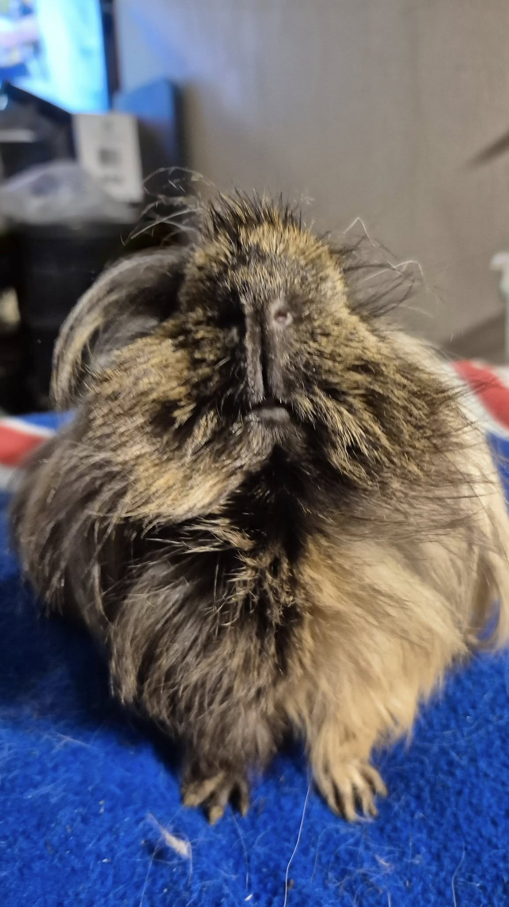
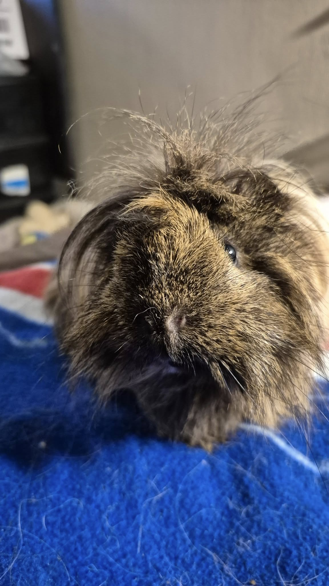
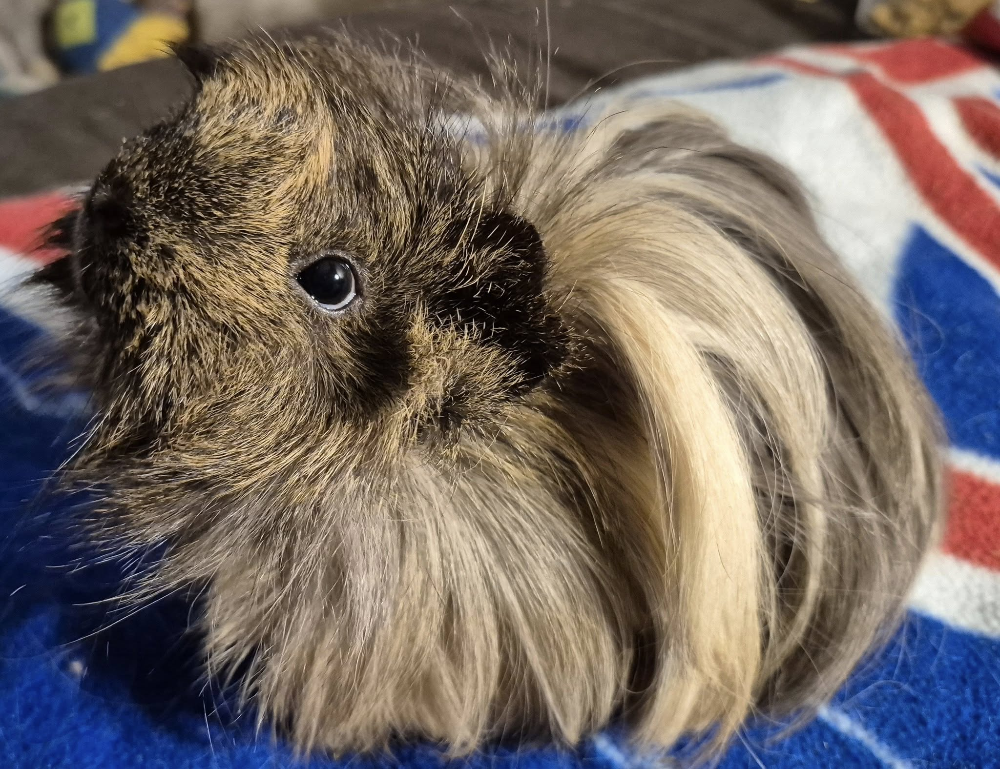
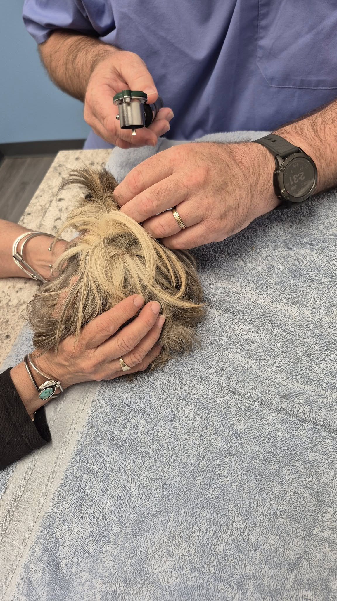

## 🎉 Meds Sponsored + Next Goal: Haiku’s Bloodwork!

Great news—Novel and Coralie’s medications have been fully sponsored! 💖 Thank you so much to everyone who helped make that happen!

<!-- truncate -->

## 🧪 Next up on our urgent to-do list: Haiku’s bloodwork

Haiku has been struggling with some ongoing health concerns, and we’re scheduled to do bloodwork at her next appointment:

📅 Appointment Date: Tuesday, June 11th at 3 PM    
💰 Estimated Cost: ~$350    
(Includes the cost of light sedation, since she was very uncooperative at her last visit.)    

If she doesn’t wind up needing sedation, any leftover funds will go directly toward another one of our special-needs critters.

⸻

## 🐹 Every donation is welcome!

Even $5 or $10 makes a big difference when we all chip in. Let’s get Haiku the answers she needs—and hopefully a solid plan for moving forward with treatment.

⸻

<SupportUs />
