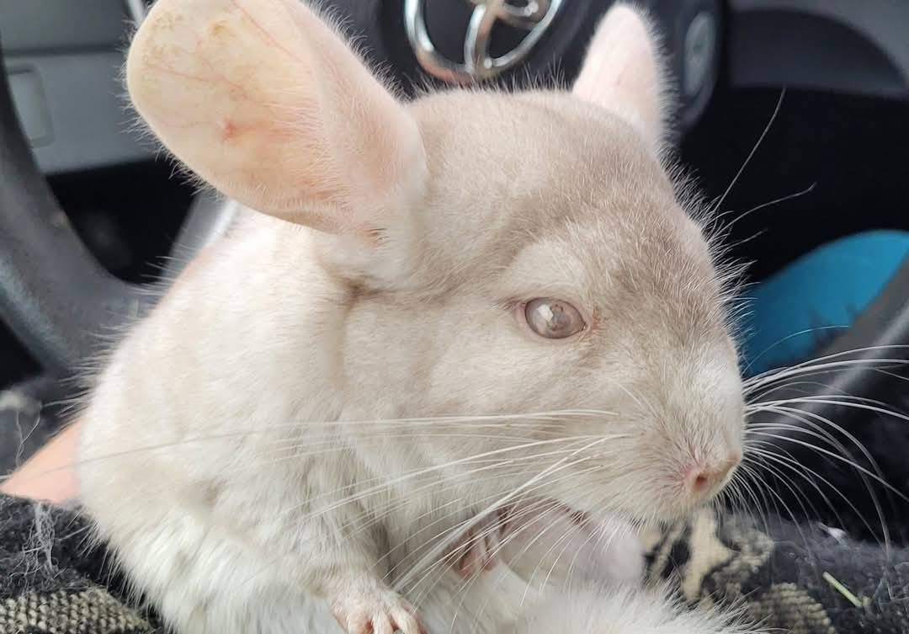
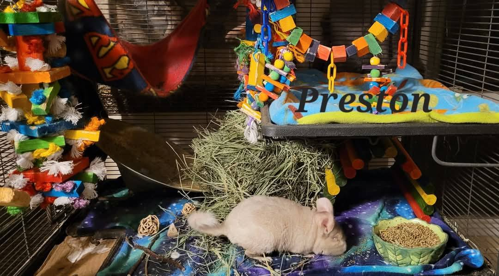

## 💔 Saying Goodbye to Preston 🌈

We are absolutely heartbroken to share that we’ll be bringing Preston in for humane euthanasia this afternoon.

Around 3 AM, Preston suffered what appeared to be a neurological event. We were hoping it might be inner ear-related and started antibiotics right away, but sadly, there’s been no improvement. We can’t let him suffer, and this is the most compassionate option we have left.

<!-- truncate -->

⸻

## 🐹 About Preston

Preston came to us from the NHSPCA after being rescued from a hoarding situation. His previous owner had passed away, so we had very little background on his age or condition.

He was a sweet but shy boy who found comfort in his best friend, Sherlock. Letting him go is breaking our hearts.

⸻

## 💸 Cost: $136

This loss was completely unexpected. If anyone is able to sponsor or co-sponsor Preston’s euthanasia, it would mean the world to us. Even small contributions help in moments like this.

⸻

## 🙏  Support Our Rescue Work

If you believe in the work we do, please consider making a contribution.
Your support helps us continue saving and caring for the most vulnerable small animals. 💕

⸻

### 💸  Ways to Donate
 - PayPal: donations@helpingalllittlethings.org
 - Venmo: [@haltrescue](https://account.venmo.com/u/haltrescue) (watch for imposters — it’s _not_ haltrescue_)
 - CashApp: [$haltrescue](https://cash.app/$Haltrescue)
 - Mail a Check:  
  
    Helping All Little Things    
    PO Box 11    
    Deerfield, NH 03037    
    (Make checks payable to Helping All Little Things)    

### 🛒 Wishlist Donations
 - 🛍️ [Amazon Wishlist](https://tinyurl.com/HALT-Amazon-Wishlist)
 - 🛍️ [Chewy Wishlist](https://tinyurl.com/HALT-Chewy-Wishlist)

### 📞 Donate Directly to Our Vets
 - Southern Maine Hospital for Small Mammals: (207) 535-9330
 - Broadview Vets of Dover: (603) 740-1800
 - House Paws: (856) 234-5230
(Note: The account may still be under Helping All Little Pipsqueaks — we’re in the process of updating it.)

Thank you for your continued love and support.
Every life matters, and we’re so grateful you’re part of this mission with us. 🐹💕
