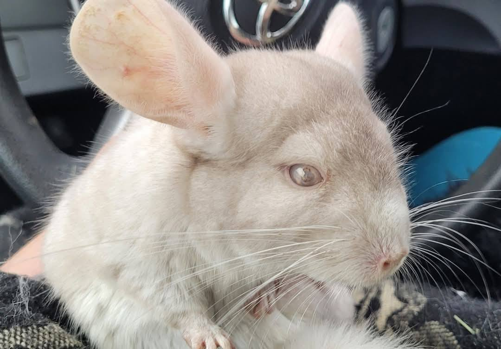
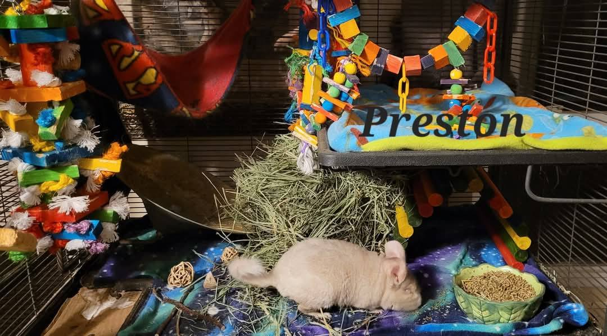

## 💔 Saying Goodbye to Preston 🌈

We are absolutely heartbroken to share that we’ll be bringing Preston in for humane euthanasia this afternoon.

Around 3 AM, Preston suffered what appeared to be a neurological event. We were hoping it might be inner ear-related and started antibiotics right away, but sadly, there’s been no improvement. We can’t let him suffer, and this is the most compassionate option we have left.

<!-- truncate -->

⸻

## 🐹 About Preston

Preston came to us from the NHSPCA after being rescued from a hoarding situation. His previous owner had passed away, so we had very little background on his age or condition.

He was a sweet but shy boy who found comfort in his best friend, Sherlock. Letting him go is breaking our hearts.

⸻

## 💸 Cost: $136

This loss was completely unexpected. If anyone is able to sponsor or co-sponsor Preston’s euthanasia, it would mean the world to us. Even small contributions help in moments like this.

⸻

<SupportUs />
