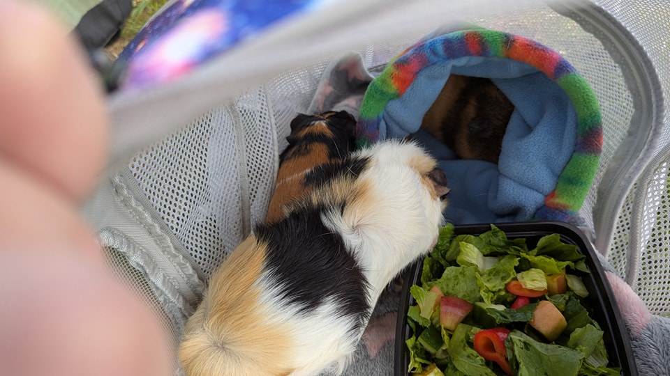
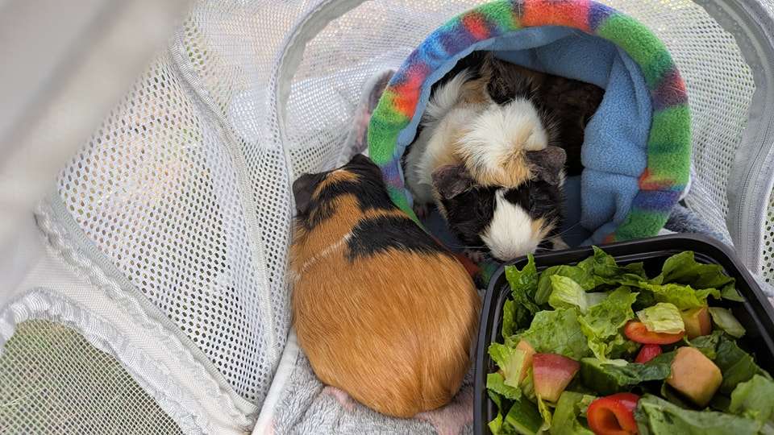
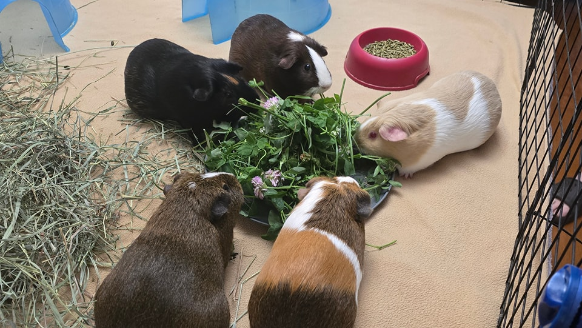
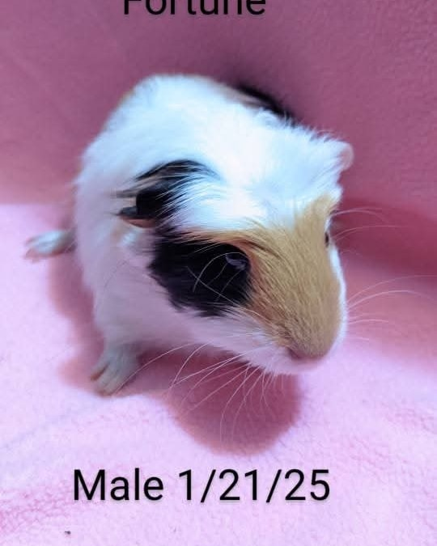

## 🐹✨ Triple Adoption Celebration! ✨🐹

We are so excited to share not one, not two, but three wonderful adoptions today!

## 💕 Sylvie & Checkers

We started the day with the exciting news that Sylvie and Checkers were adopted this morning! Their new family had previously adopted a guinea pig named Frazzle from us, but unfortunately, Frazzle wasn’t getting along with one of their existing piggies.

They decided the best option was to keep Frazzle in her own space and find her a new friend—but when they came to meet Sylvie and Checkers, they just couldn’t choose… so they adopted both! Frazzle now has two new companions, and we couldn’t be happier for all three!

⸻

## 🥖 Challah

Challah also found her forever home today! She went home with one of our previous adopters, and as you can see, she’s already fitting in beautifully with their group. She even matches the theme and looks like she’s always belonged. We’re so thrilled to see her thriving already!

⸻

## 🍀 Fortune

And to round out this amazing day—Fortune has been adopted! This very handsome boy went home to a lovely family, including a senior guinea pig and an owner who happens to be a veterinarian! The plan is to have Fortune neutered and eventually start a small herd of females once their senior pig passes. We’re absolutely overjoyed knowing he’s in such knowledgeable and loving hands.

⸻

It’s been a fantastic day for adoptions, and we are so grateful to our adopters, fosters, and supporters who make happy endings like these possible. 🥰 Stay tuned for more updates as we continue finding loving homes for these amazing little lives! 💛

⸻

## 🙏  Support Our Rescue Work

If you believe in the work we do, please consider making a contribution.
Your support helps us continue saving and caring for the most vulnerable small animals. 💕

⸻

### 💸  Ways to Donate
 - PayPal: donations@helpingalllittlethings.org
 - Venmo: [@haltrescue](https://account.venmo.com/u/haltrescue) (watch for imposters — it’s _not_ haltrescue_)
 - CashApp: [$haltrescue](https://cash.app/$Haltrescue)
 - Mail a Check:  
  
    Helping All Little Things    
    PO Box 11    
    Deerfield, NH 03037    
    (Make checks payable to Helping All Little Things)    

### 🛒 Wishlist Donations
 - 🛍️ [Amazon Wishlist](https://tinyurl.com/HALT-Amazon-Wishlist)
 - 🛍️ [Chewy Wishlist](https://tinyurl.com/HALT-Chewy-Wishlist)

### 📞 Donate Directly to Our Vets
 - Southern Maine Hospital for Small Mammals: (207) 535-9330
 - Broadview Vets of Dover: (603) 740-1800
 - House Paws: (856) 234-5230
(Note: The account may still be under Helping All Little Pipsqueaks — we’re in the process of updating it.)

Thank you for your continued love and support.
Every life matters, and we’re so grateful you’re part of this mission with us. 🐹💕
