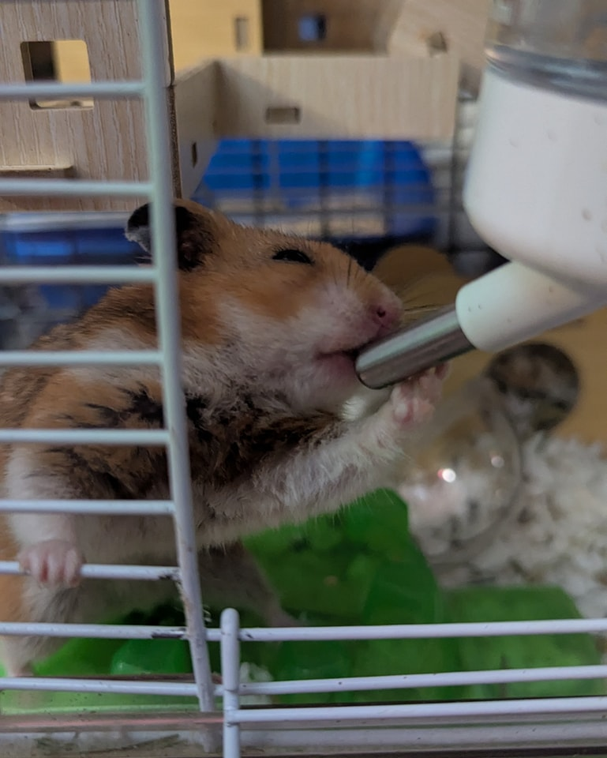
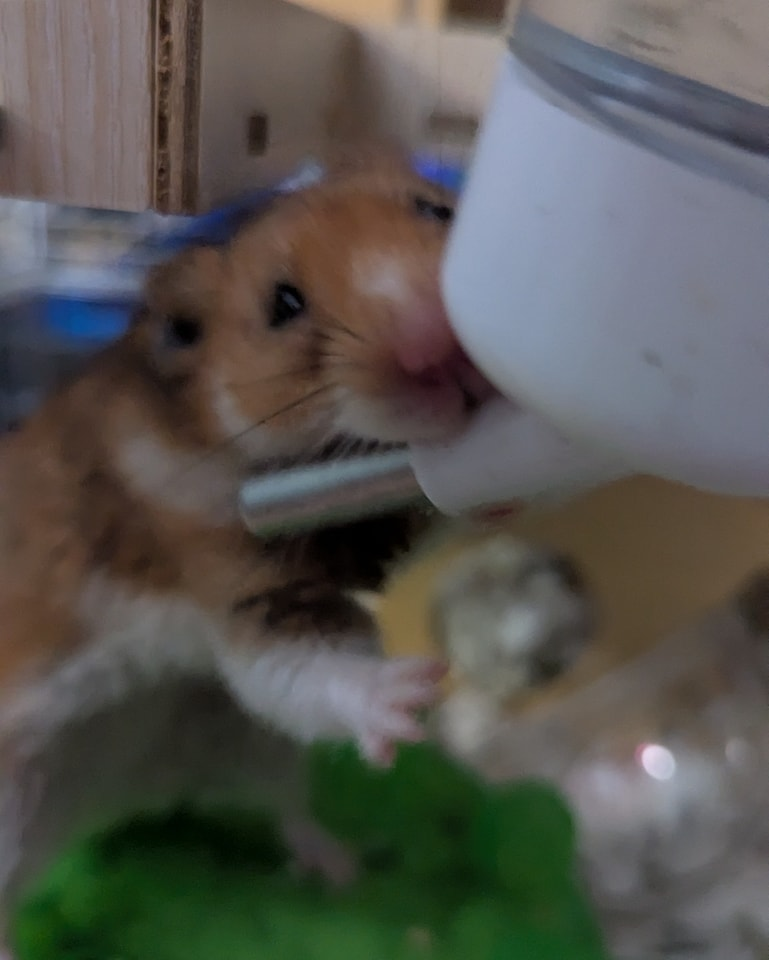

We haven’t posted about him in a while, but it’s time for an update on everyone’s favorite grumpy (and now confused) old man—Harold.

<!-- truncate -->

Harold is likely just over two years old now and is definitely showing his age. While we had hoped to find him a cozy retirement home, it looks like he’ll be staying on as a hospice ham with me. (Which, of course, means he’s probably going to live for years more 😂.)

Lately, I’ve had to hold Harold’s water bottle for him and gently squeeze it while he drinks. When it’s attached to the cage, he just tries to pouch it. 😅 If there’s a hamster version of dementia, Harold most definitely has it. 🥴

But we love him—confused old man and all. 💛

⸻

## 🙏  Support Our Rescue Work

If you believe in the work we do, please consider making a contribution.
Your support helps us continue saving and caring for the most vulnerable small animals. 💕

⸻

### 💸  Ways to Donate
 - PayPal: donations@helpingalllittlethings.org
 - Venmo: [@haltrescue](https://account.venmo.com/u/haltrescue) (watch for imposters — it’s _not_ haltrescue_)
 - CashApp: [$haltrescue](https://cash.app/$Haltrescue)
 - Mail a Check:  
  
    Helping All Little Things    
    PO Box 11    
    Deerfield, NH 03037    
    (Make checks payable to Helping All Little Things)    

### 🛒 Wishlist Donations
 - 🛍️ [Amazon Wishlist](https://tinyurl.com/HALT-Amazon-Wishlist)
 - 🛍️ [Chewy Wishlist](https://tinyurl.com/HALT-Chewy-Wishlist)

### 📞 Donate Directly to Our Vets
 - Southern Maine Hospital for Small Mammals: (207) 535-9330
 - Broadview Vets of Dover: (603) 740-1800
 - House Paws: (856) 234-5230
(Note: The account may still be under Helping All Little Pipsqueaks — we’re in the process of updating it.)

Thank you for your continued love and support.
Every life matters, and we’re so grateful you’re part of this mission with us. 🐹💕
