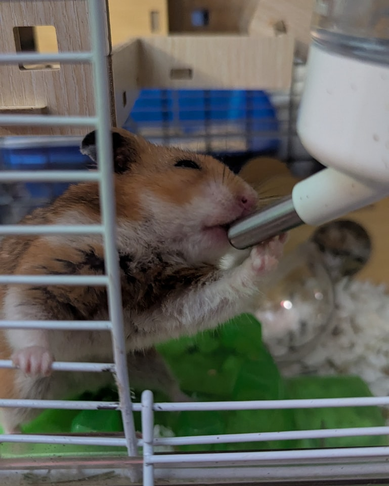
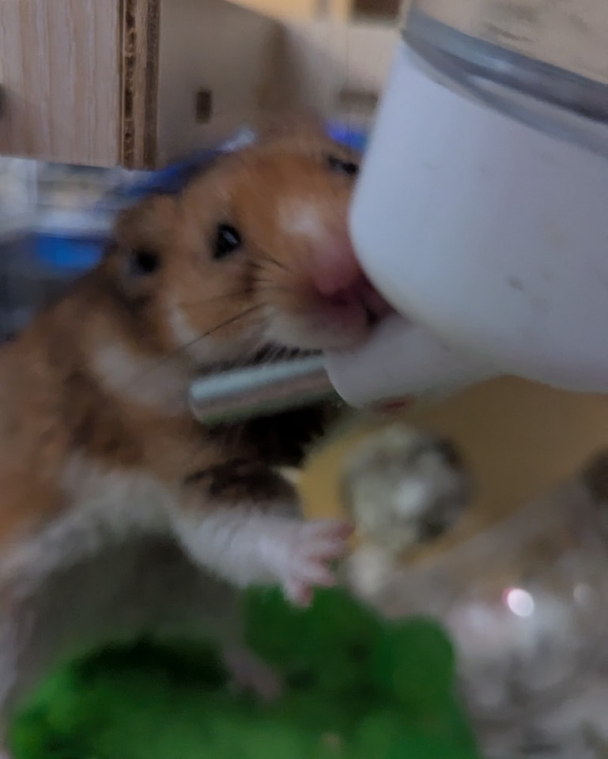

We haven’t posted about him in a while, but it’s time for an update on everyone’s favorite grumpy (and now confused) old man—Harold.

<!-- truncate -->

Harold is likely just over two years old now and is definitely showing his age. While we had hoped to find him a cozy retirement home, it looks like he’ll be staying on as a hospice ham with me. (Which, of course, means he’s probably going to live for years more 😂.)

Lately, I’ve had to hold Harold’s water bottle for him and gently squeeze it while he drinks. When it’s attached to the cage, he just tries to pouch it. 😅 If there’s a hamster version of dementia, Harold most definitely has it. 🥴

But we love him—confused old man and all. 💛

<SupportUs />
