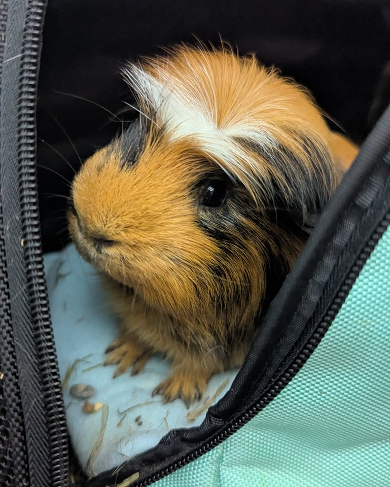
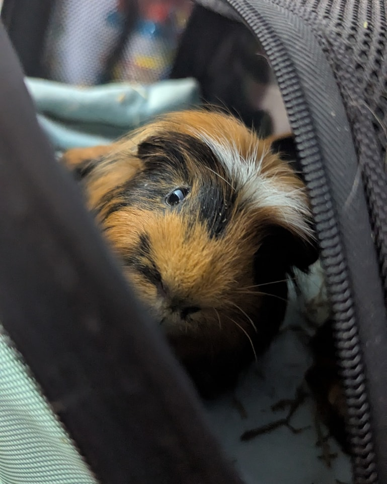

## Certified Creeper

Did you know that in addition to guinea pigs, hamsters, rabbits (and pretty much everything else 😂), we also have a certified creeper living at Jen’s house? Don’t worry—he’s the cute kind. 😉

<!-- truncate -->

Mistro was born right at Jen’s house on April 21st, 2024—yes, they share a birthday! He was always on the smaller side and had a few respiratory issues early on, so he and his brother ended up becoming permanent residents. A few months ago, Mistro developed a head tilt. We got him checked out and started treatment, but he decided he likes life with a tilt. 😅 It’s fine. Everything’s fine. 🥴

The best part? Mistro doesn’t seem to notice at all—he’s happy, curious, and full of personality. He earned the nickname “the creeper” because he’s always lurking from behind something, just watching with his adorable tilted head. 😆

But let’s be honest: isn’t he the most dashing little creeper you’ve ever seen?

⸻

## 🙏  Support Our Rescue Work

If you believe in the work we do, please consider making a contribution.
Your support helps us continue saving and caring for the most vulnerable small animals. 💕

⸻

### 💸  Ways to Donate
 - PayPal: donations@helpingalllittlethings.org
 - Venmo: [@haltrescue](https://account.venmo.com/u/haltrescue) (watch for imposters — it’s _not_ haltrescue_)
 - CashApp: [$haltrescue](https://cash.app/$Haltrescue)
 - Mail a Check:  
  
    Helping All Little Things    
    PO Box 11    
    Deerfield, NH 03037    
    (Make checks payable to Helping All Little Things)    

### 🛒 Wishlist Donations
 - 🛍️ [Amazon Wishlist](https://tinyurl.com/HALT-Amazon-Wishlist)
 - 🛍️ [Chewy Wishlist](https://tinyurl.com/HALT-Chewy-Wishlist)

### 📞 Donate Directly to Our Vets
 - Southern Maine Hospital for Small Mammals: (207) 535-9330
 - Broadview Vets of Dover: (603) 740-1800
 - House Paws: (856) 234-5230
(Note: The account may still be under Helping All Little Pipsqueaks — we’re in the process of updating it.)

Thank you for your continued love and support.
Every life matters, and we’re so grateful you’re part of this mission with us. 🐹💕
