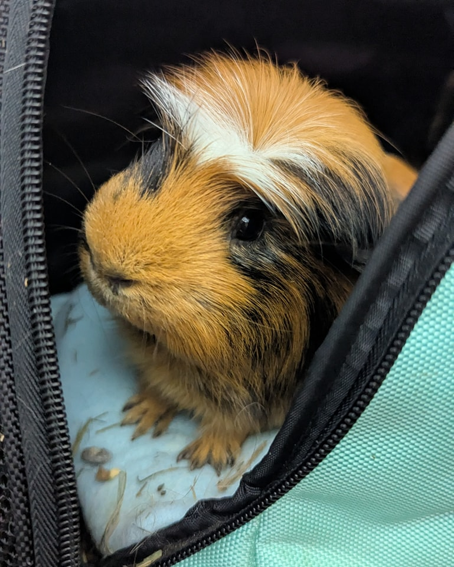
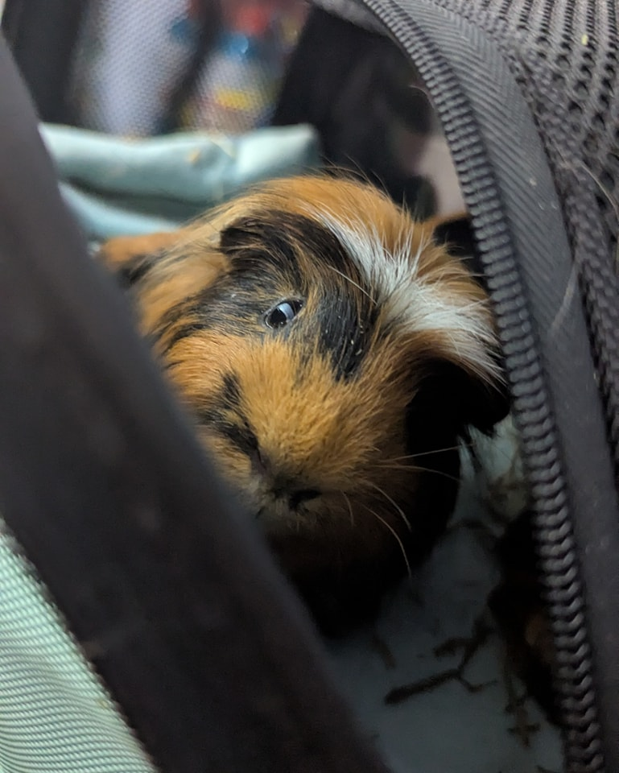

## Certified Creeper

Did you know that in addition to guinea pigs, hamsters, rabbits (and pretty much everything else 😂), we also have a certified creeper living at Jen’s house? Don’t worry—he’s the cute kind. 😉

<!-- truncate -->

Mistro was born right at Jen’s house on April 21st, 2024—yes, they share a birthday! He was always on the smaller side and had a few respiratory issues early on, so he and his brother ended up becoming permanent residents. A few months ago, Mistro developed a head tilt. We got him checked out and started treatment, but he decided he likes life with a tilt. 😅 It’s fine. Everything’s fine. 🥴

The best part? Mistro doesn’t seem to notice at all—he’s happy, curious, and full of personality. He earned the nickname “the creeper” because he’s always lurking from behind something, just watching with his adorable tilted head. 😆

But let’s be honest: isn’t he the most dashing little creeper you’ve ever seen?

<SupportUs />
