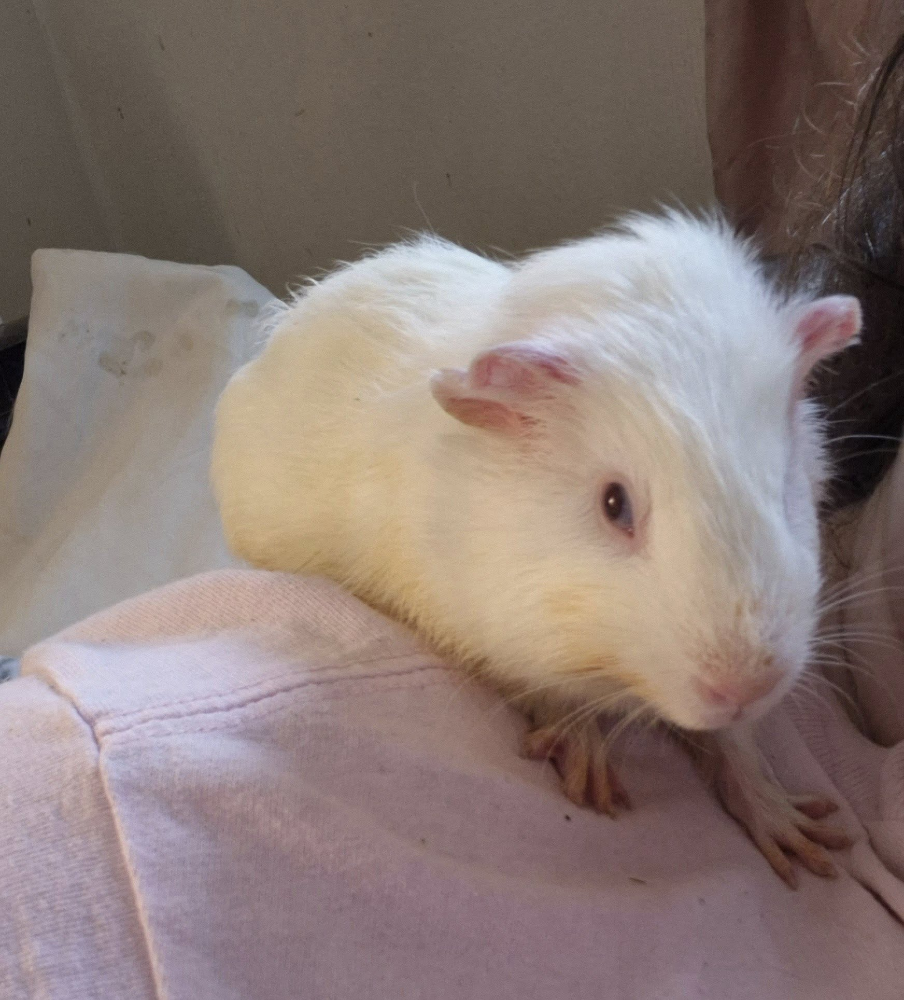

Hero is back to his popcorning self, and Parody is thriving—he no longer needs to be hand-fed. He’s eating, drinking, and his output is great. The only odd thing is that his stomach makes the wildest noises, which we suspect may be related to the mass in his abdomen.

<!-- truncate -->

We also have a very interesting update about Novel. Since arriving, he hadn’t been drinking on his own, so he’s been getting sub-q fluids 1–3 times a day. A few days ago, while I was feeding him on a white blanket, he peed—and it was quite pink! He was immediately started on antibiotics and is already feeling so much better. I even caught him nibbling on some pellets and hay!

This poor pig has been hiding so many health issues, but we’re tackling them one by one—and slowly seeing a much happier piggie emerge. It’s been a slow process, but I’m so glad I didn’t give up on him

⸻

## 🙏  Support Our Rescue Work

If you believe in the work we do, please consider making a contribution.
Your support helps us continue saving and caring for the most vulnerable small animals. 💕

⸻

### 💸  Ways to Donate
 - PayPal: donations@helpingalllittlethings.org
 - Venmo: [@haltrescue](https://account.venmo.com/u/haltrescue) (watch for imposters — it’s _not_ haltrescue_)
 - CashApp: [$haltrescue](https://cash.app/$Haltrescue)
 - Mail a Check:  
  
    Helping All Little Things    
    PO Box 11    
    Deerfield, NH 03037    
    (Make checks payable to Helping All Little Things)    

### 🛒 Wishlist Donations
 - 🛍️ [Amazon Wishlist](https://tinyurl.com/HALT-Amazon-Wishlist)
 - 🛍️ [Chewy Wishlist](https://tinyurl.com/HALT-Chewy-Wishlist)

### 📞 Donate Directly to Our Vets
 - Southern Maine Hospital for Small Mammals: (207) 535-9330
 - Broadview Vets of Dover: (603) 740-1800
 - House Paws: (856) 234-5230
(Note: The account may still be under Helping All Little Pipsqueaks — we’re in the process of updating it.)

Thank you for your continued love and support.
Every life matters, and we’re so grateful you’re part of this mission with us. 🐹💕
