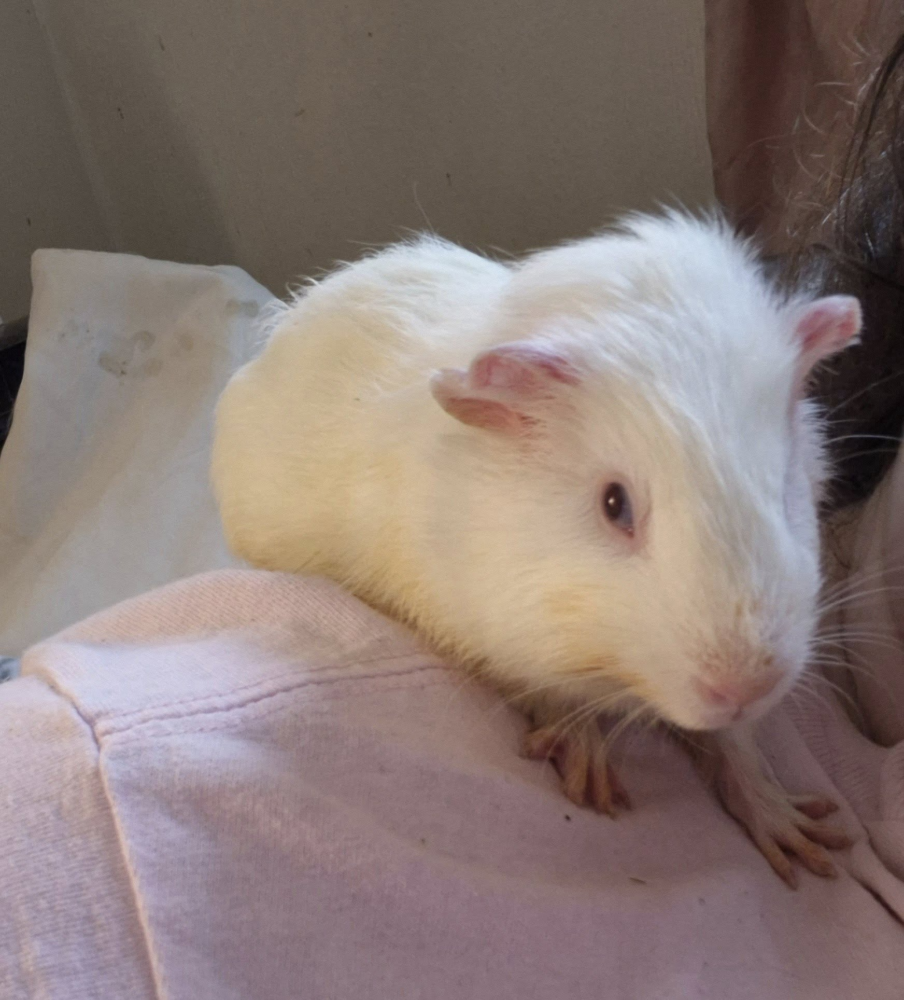

Hero is back to his popcorning self, and Parody is thriving—he no longer needs to be hand-fed. He’s eating, drinking, and his output is great. The only odd thing is that his stomach makes the wildest noises, which we suspect may be related to the mass in his abdomen.

<!-- truncate -->

We also have a very interesting update about Novel. Since arriving, he hadn’t been drinking on his own, so he’s been getting sub-q fluids 1–3 times a day. A few days ago, while I was feeding him on a white blanket, he peed—and it was quite pink! He was immediately started on antibiotics and is already feeling so much better. I even caught him nibbling on some pellets and hay!

This poor pig has been hiding so many health issues, but we’re tackling them one by one—and slowly seeing a much happier piggie emerge. It’s been a slow process, but I’m so glad I didn’t give up on him

<SupportUs />
