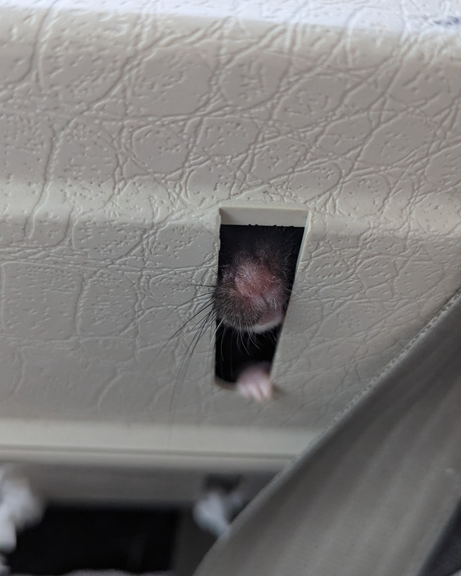
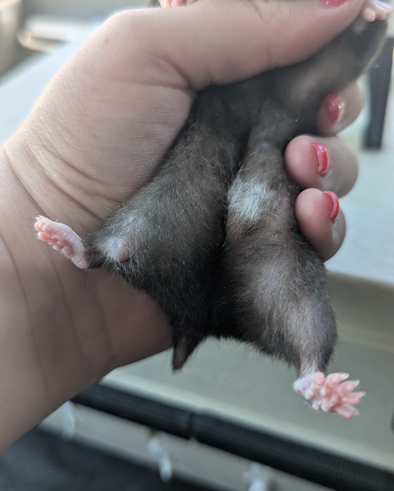
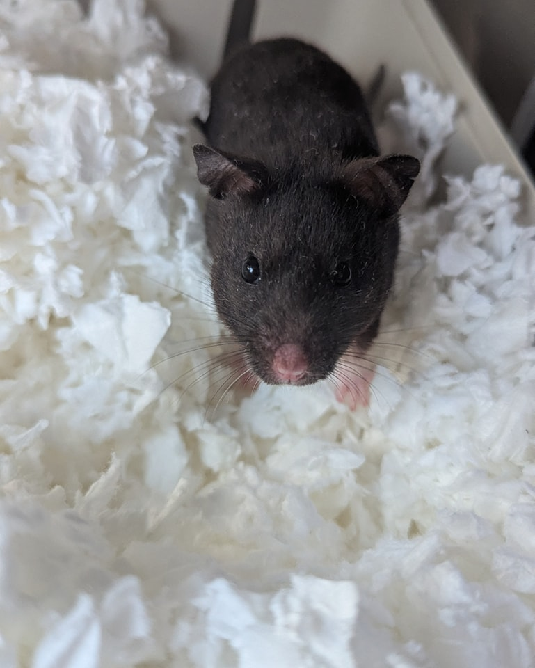

For those of you who remember Little Miss Wheelbarrow—the hamster who was supposed to be “normal,” but came in with a very clearly not-normal leg 😅—we have an exciting update!

<!-- truncate -->

She’s now back in Northern New Jersey with Jen, and we’re thrilled to have her there! A huge thank you to Danni’s parents for taking such wonderful care of her and making sure she got to all her vet appointments.

It was determined that she had experienced a very significant break in her leg, but the good news is that it had mostly healed. After further x-rays and monitoring, the vet decided that because Anesthesia poses a high risk for small animals, and her leg was stable, amputation wasn’t necessary.

She’s doing fabulously—her leg looks amazing, and she’s getting around really well! She’ll be staying on as a sanctuary hamster, though, since the injury increases her risk for early arthritis or other complications. We feel most comfortable keeping her with us for continued monitoring.

The best news? She’s expected to live a normal, happy, healthy hamster life! 💛

<SupportUs />
