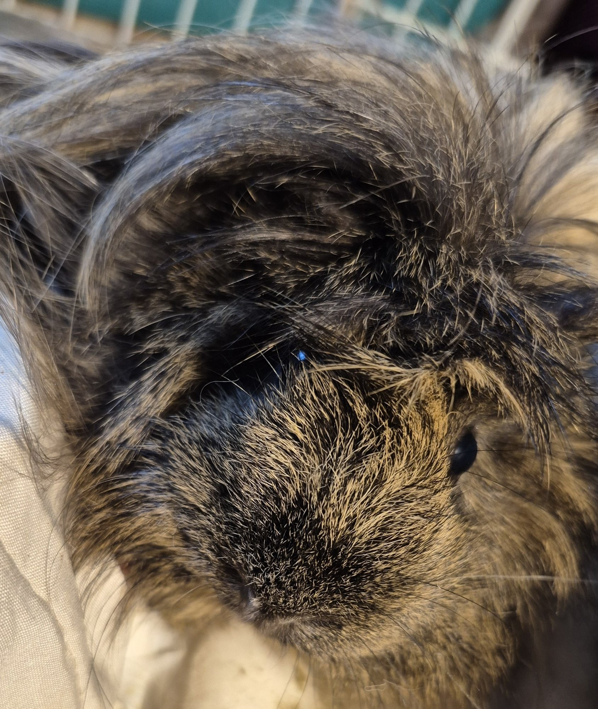
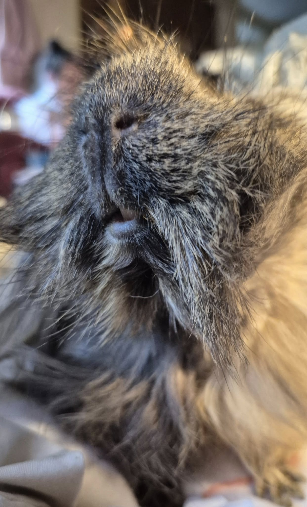
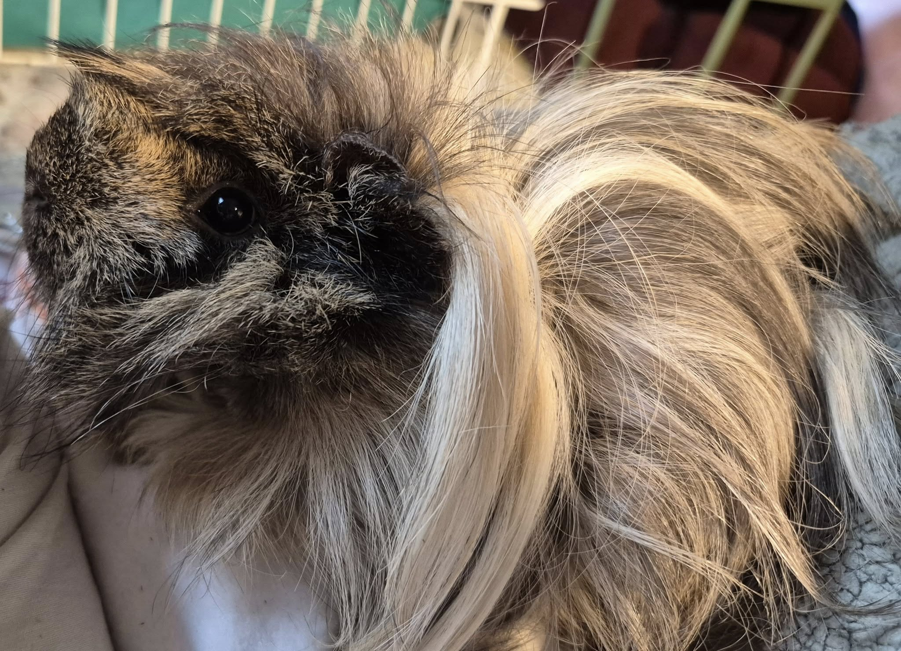

Haiku is truly a character.

<!-- truncate -->

At home, she’s the sweetest little thing—she lays on my chest, bruxes contentedly, and covers my face, hands, and arms in kisses. But the moment we step into the vet’s office? She transforms into a feral wild child. 😅

We recently got all of her test results back, and things are… a bit weird. Her urine specific gravity was low, which initially pointed us toward kidney issues. But her bloodwork came back completely normal, aside from some mild anemia. We decided to dig deeper and tested her T4 levels to rule out thyroid disease, but those results were normal too.

That said, her urine looked a bit more normal today, which is encouraging. For now, our weekend focus is on getting her weight up—which looks promising since she seems to enjoy the recovery food.

Next week, we’ll be following up on a few things with our vet:
 - Penelope may need another hormone injection
 - Memoir needs a recheck—I still can’t get her to eat, and I’m worried her satin syndrome is progressing quickly
 - Hero’s teeth will be discussed
 - And depending on Haiku’s weight trend, we’ll revisit our options for her too

Lots going on—but we’re taking it one day (and one pig) at a time. 💛

⸻

## 🙏  Support Our Rescue Work

If you believe in the work we do, please consider making a contribution.
Your support helps us continue saving and caring for the most vulnerable small animals. 💕

⸻

### 💸  Ways to Donate
 - PayPal: donations@helpingalllittlethings.org
 - Venmo: [@haltrescue](https://account.venmo.com/u/haltrescue) (watch for imposters — it’s _not_ haltrescue_)
 - CashApp: [$haltrescue](https://cash.app/$Haltrescue)
 - Mail a Check:  
  
    Helping All Little Things    
    PO Box 11    
    Deerfield, NH 03037    
    (Make checks payable to Helping All Little Things)    

### 🛒 Wishlist Donations
 - 🛍️ [Amazon Wishlist](https://tinyurl.com/HALT-Amazon-Wishlist)
 - 🛍️ [Chewy Wishlist](https://tinyurl.com/HALT-Chewy-Wishlist)

### 📞 Donate Directly to Our Vets
 - Southern Maine Hospital for Small Mammals: (207) 535-9330
 - Broadview Vets of Dover: (603) 740-1800
 - House Paws: (856) 234-5230
(Note: The account may still be under Helping All Little Pipsqueaks — we’re in the process of updating it.)

Thank you for your continued love and support.
Every life matters, and we’re so grateful you’re part of this mission with us. 🐹💕
