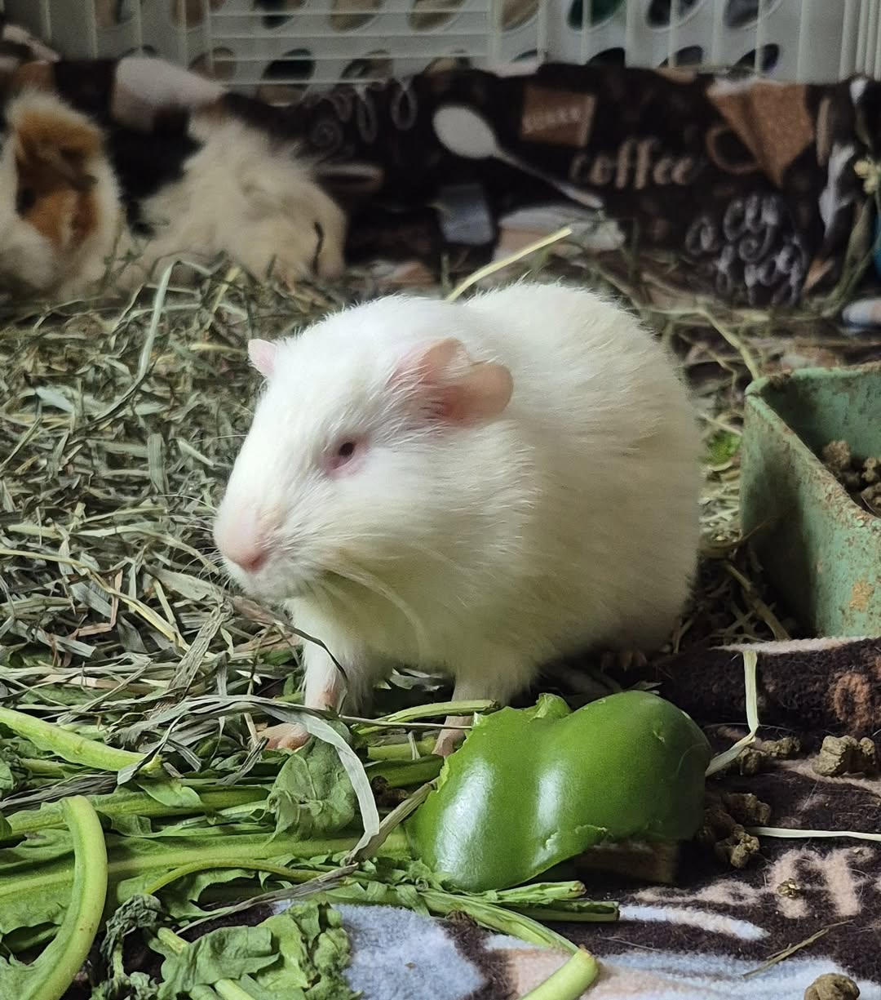
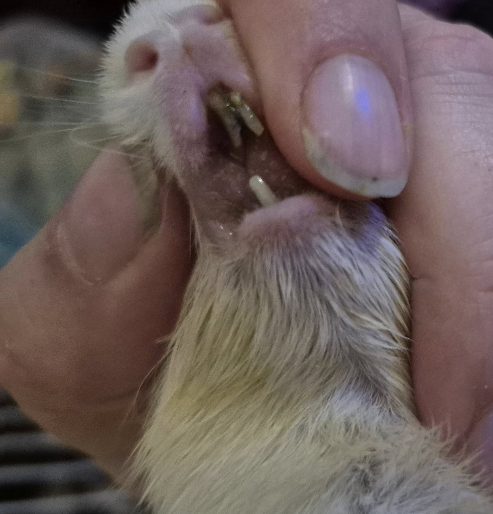

Hero is growing like a weed! 🌱 But I do have some concerns about his teeth. I’ve been trimming them once a week—which is thankfully pretty easy—but the color of his top teeth often looks like a sign of scurvy.

<!-- truncate -->

He’s already on a high vitamin C diet and also receives oral vitamin C supplements, so we’ll be checking in with Dr. Ford soon to see what he thinks.

In the meantime, Hero continues to be the most joyful piggie I’ve ever met. He popcorns constantly, and when he’s not mid-bounce, he’s napping curled up with Parody and Novel. 💛

<SupportUs />
