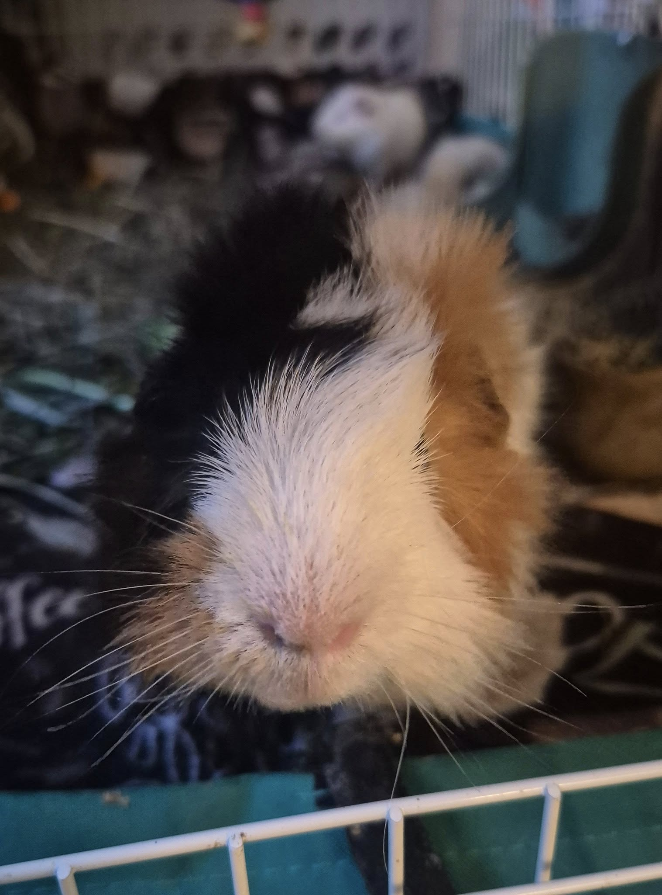
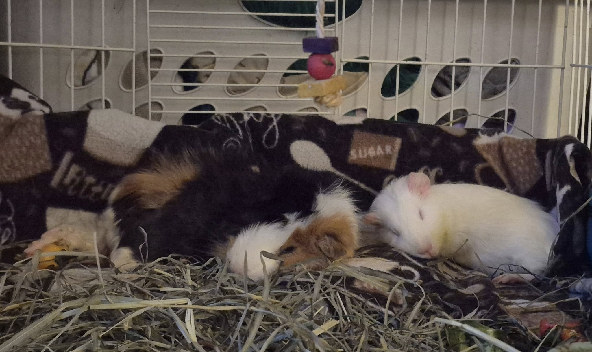

Just a little Parody appreciation post. 💛

I really thought I’d have to move Parody to a hospice foster home because of his difficulty getting along with other piggies. And then he got so sick—I honestly didn’t think he’d pull through. That’s when I moved him to the couch cage, and everything changed.

<!-- truncate -->

There, he met Hero, and the two of them absolutely fell in love. Now they’re side by side all the time, inseparable companions.

Since I’ve been a bit under the weather this week, I’ve spent more time next to their cage—and Parody has made it his job to check in on me. He’ll poke his little nose at me for a few boops, then wander off to wherever Hero is waiting.

He also likes to pop over during Novel’s handfeeding sessions, just so he can sneak a few milliliters of recovery food—not because he needs it, but because he likes it. And honestly? I’m perfectly okay with that.

⸻

## 🙏  Support Our Rescue Work

If you believe in the work we do, please consider making a contribution.
Your support helps us continue saving and caring for the most vulnerable small animals. 💕

⸻

### 💸  Ways to Donate
 - PayPal: donations@helpingalllittlethings.org
 - Venmo: [@haltrescue](https://account.venmo.com/u/haltrescue) (watch for imposters — it’s _not_ haltrescue_)
 - CashApp: [$haltrescue](https://cash.app/$Haltrescue)
 - Mail a Check:  
  
    Helping All Little Things    
    PO Box 11    
    Deerfield, NH 03037    
    (Make checks payable to Helping All Little Things)    

### 🛒 Wishlist Donations
 - 🛍️ [Amazon Wishlist](https://tinyurl.com/HALT-Amazon-Wishlist)
 - 🛍️ [Chewy Wishlist](https://tinyurl.com/HALT-Chewy-Wishlist)

### 📞 Donate Directly to Our Vets
 - Southern Maine Hospital for Small Mammals: (207) 535-9330
 - Broadview Vets of Dover: (603) 740-1800
 - House Paws: (856) 234-5230
(Note: The account may still be under Helping All Little Pipsqueaks — we’re in the process of updating it.)

Thank you for your continued love and support.
Every life matters, and we’re so grateful you’re part of this mission with us. 🐹💕
