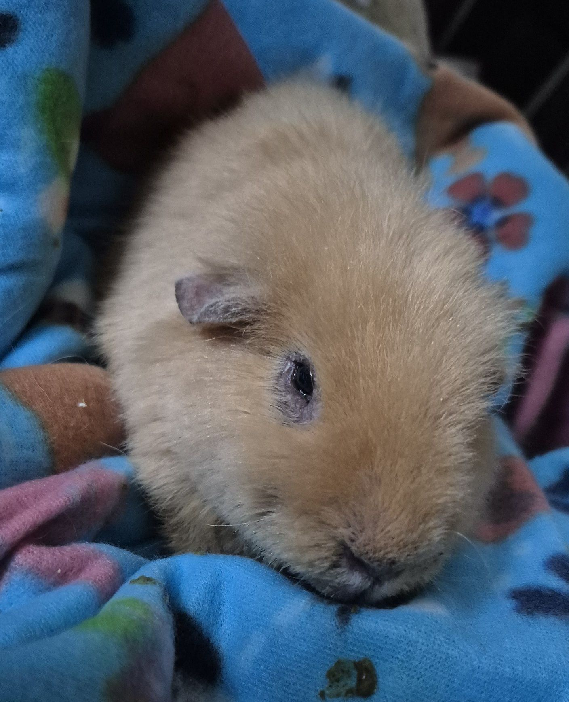

I’m so pleased with how Novel is coming along.

<!-- truncate -->

He’s bright-eyed, more mobile than he’s been in a long time, and really benefiting from pain management and lots of handfeeding. While he probably won’t ever be zooming around the cage, he’s now able to putter around—and most importantly, he doesn’t sit in his urine anymore, which is a huge win for his health and comfort.

We’re up to about 60ml of recovery food per feeding, which is amazing! He takes to handfeeding so well that I’m about to try offering an additional 60ml to see if he’s interested. Now that he’s moving around and eating a bit on his own, my next goal is to get his weight up to a more normal number.

I’ll probably be handfeeding him for the rest of his life, considering how worn down his jaw is, but thankfully he makes it so easy.

He’s also rediscovering some favorite foods—he loves spring mix, celery, and will even push through the discomfort for a baby carrot (though I’ve started giving him shredded carrot to make it easier to chew). 🥕💛

⸻

## 🙏  Support Our Rescue Work

If you believe in the work we do, please consider making a contribution.
Your support helps us continue saving and caring for the most vulnerable small animals. 💕

⸻

### 💸  Ways to Donate
 - PayPal: donations@helpingalllittlethings.org
 - Venmo: [@haltrescue](https://account.venmo.com/u/haltrescue) (watch for imposters — it’s _not_ haltrescue_)
 - CashApp: [$haltrescue](https://cash.app/$Haltrescue)
 - Mail a Check:  
  
    Helping All Little Things    
    PO Box 11    
    Deerfield, NH 03037    
    (Make checks payable to Helping All Little Things)    

### 🛒 Wishlist Donations
 - 🛍️ [Amazon Wishlist](https://tinyurl.com/HALT-Amazon-Wishlist)
 - 🛍️ [Chewy Wishlist](https://tinyurl.com/HALT-Chewy-Wishlist)

### 📞 Donate Directly to Our Vets
 - Southern Maine Hospital for Small Mammals: (207) 535-9330
 - Broadview Vets of Dover: (603) 740-1800
 - House Paws: (856) 234-5230
(Note: The account may still be under Helping All Little Pipsqueaks — we’re in the process of updating it.)

Thank you for your continued love and support.
Every life matters, and we’re so grateful you’re part of this mission with us. 🐹💕
