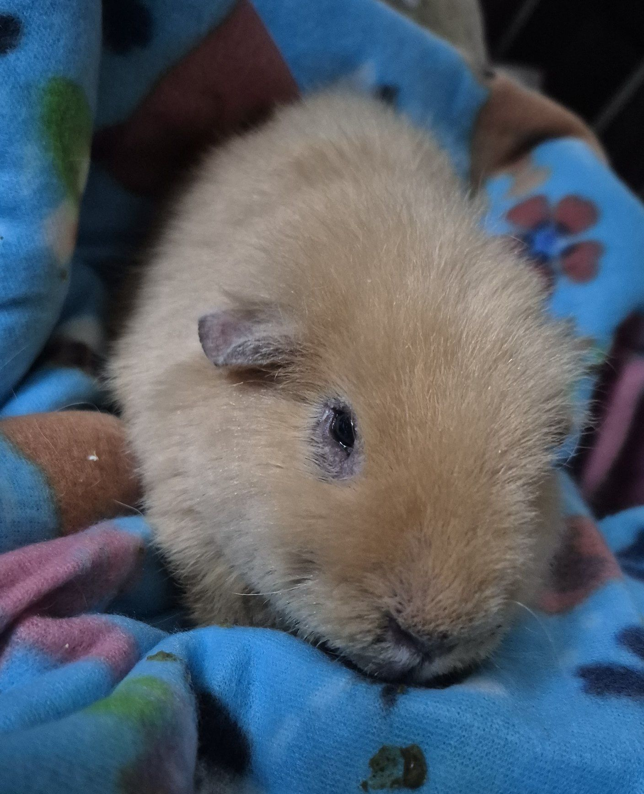

I’m so pleased with how Novel is coming along.

<!-- truncate -->

He’s bright-eyed, more mobile than he’s been in a long time, and really benefiting from pain management and lots of handfeeding. While he probably won’t ever be zooming around the cage, he’s now able to putter around—and most importantly, he doesn’t sit in his urine anymore, which is a huge win for his health and comfort.

We’re up to about 60ml of recovery food per feeding, which is amazing! He takes to handfeeding so well that I’m about to try offering an additional 60ml to see if he’s interested. Now that he’s moving around and eating a bit on his own, my next goal is to get his weight up to a more normal number.

I’ll probably be handfeeding him for the rest of his life, considering how worn down his jaw is, but thankfully he makes it so easy.

He’s also rediscovering some favorite foods—he loves spring mix, celery, and will even push through the discomfort for a baby carrot (though I’ve started giving him shredded carrot to make it easier to chew). 🥕💛

<SupportUs />
