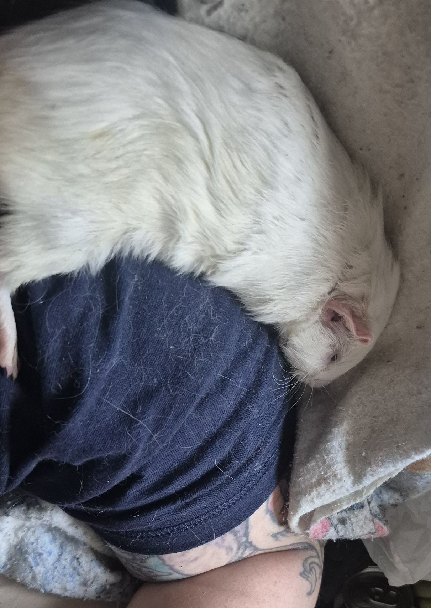

I’m in a bit of a tizzy—Hero isn’t feeling well. 😔

<!-- truncate -->

Monday night, he was 10,000% his normal self—playing on my shoulder, jumping on my head, being his usual joyful little chaos gremlin. I had scheduled a vet appointment for Tuesday just to double-check his teeth, and when I packed him into his carrier, everything still seemed completely normal.

But when we arrived at the vet, I noticed his breathing was slightly labored. Dr. Ford listened to his chest and said his lungs sounded junky, so we started him on antibiotics, suspecting pneumonia.

As the day went on, his breathing became more labored, and he even developed a cough. My heart dropped. I started to worry that maybe it wasn’t pneumonia—maybe it was a heart issue. I called every emergency vet in New Hampshire, but not one would see a guinea pig.

Boston was my backup plan, but Hero remained alert and relatively active, so I held off. Our primary vet is fully booked today, but thankfully our backup vet was able to squeeze us in. He’s currently on oxygen to help him breathe more comfortably, and we’ll be doing chest X-rays shortly.

Dr. MacDearmid noted that Hero “looks like he’s enjoying himself,” because of course—even now—he’s still the happiest pig in the world, no matter what’s going on.

He’s upright, alert, and still active—just not quite as rambunctious as usual.
I hate to say I’m hoping for pneumonia, because it can be very serious… but at least it’s treatable.
I have this nagging worry that it could be heart disease, and I hope with everything I’ve got that I’m wrong.

This was another very unexpected vet visit, and while this clinic is amazing and often gives us breaks, it’s still more expensive than our primary vet.
If you’re able, please consider sponsoring his oxygen or X-rays—any little bit helps.

⸻

## 🙏  Support Our Rescue Work

If you believe in the work we do, please consider making a contribution.
Your support helps us continue saving and caring for the most vulnerable small animals. 💕

⸻

### 💸  Ways to Donate
 - PayPal: donations@helpingalllittlethings.org
 - Venmo: [@haltrescue](https://account.venmo.com/u/haltrescue) (watch for imposters — it’s _not_ haltrescue_)
 - CashApp: [$haltrescue](https://cash.app/$Haltrescue)
 - Mail a Check:  
  
    Helping All Little Things    
    PO Box 11    
    Deerfield, NH 03037    
    (Make checks payable to Helping All Little Things)    

### 🛒 Wishlist Donations
 - 🛍️ [Amazon Wishlist](https://tinyurl.com/HALT-Amazon-Wishlist)
 - 🛍️ [Chewy Wishlist](https://tinyurl.com/HALT-Chewy-Wishlist)

### 📞 Donate Directly to Our Vets
 - Southern Maine Hospital for Small Mammals: (207) 535-9330
 - Broadview Vets of Dover: (603) 740-1800
 - House Paws: (856) 234-5230
(Note: The account may still be under Helping All Little Pipsqueaks — we’re in the process of updating it.)

Thank you for your continued love and support.
Every life matters, and we’re so grateful you’re part of this mission with us. 🐹💕
