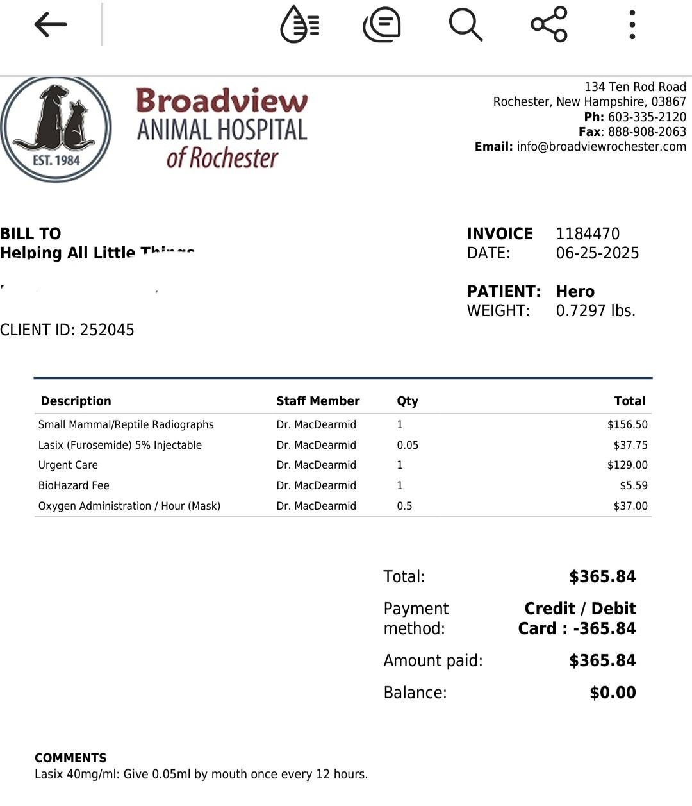
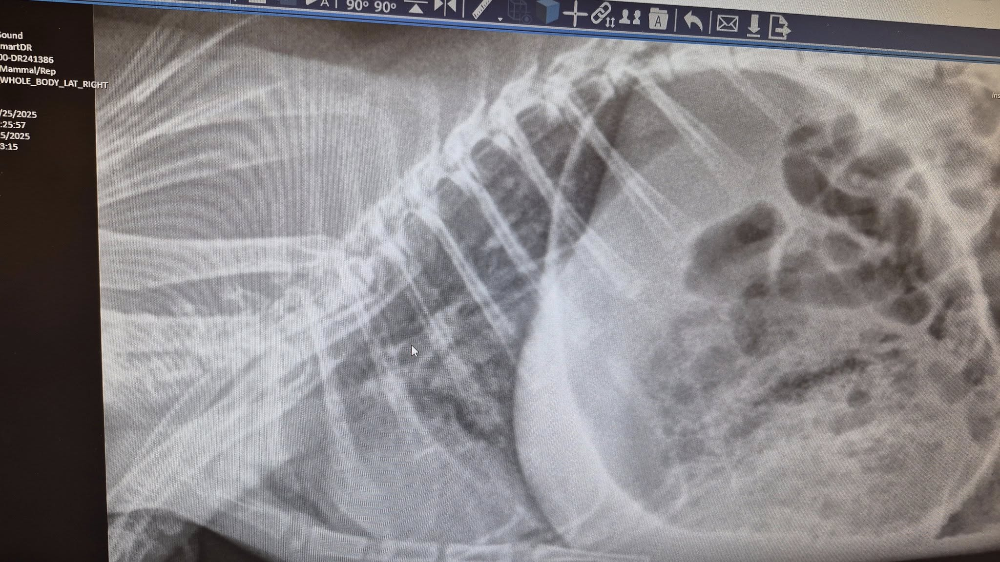
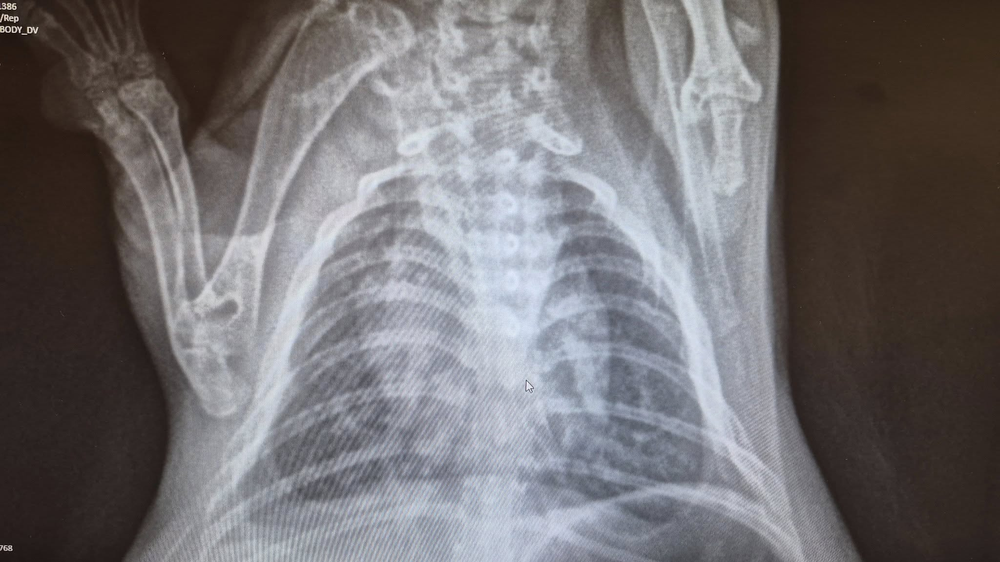
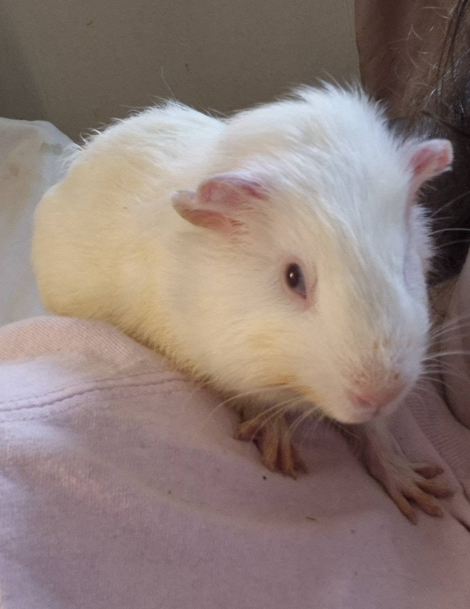

Hero is doing better after some oxygen support and a dose of Lasix.

<!-- truncate -->

Thankfully, I already had Lasix on hand for Alice and Ellis, who are both managing congestive heart failure, so we didn’t need to fill any new prescriptions today.

But… my heart hurts.

I had truly hoped that since Hero is so high-functioning, he might have a chance at a more “normal-ish” lifespan. This just doesn’t feel fair. He’s my little shoulder buddy—so full of life and joy—and now he has this to deal with too.

He still wants to be on my shoulder at all times, which gives me comfort, but he tires so easily now.
The hardest part about heart disease is knowing that a cardiac event could happen at any time. The only small mercy is that when it happens, it’s usually fast—too fast for suffering.

I’ve been considering investing in an oxygen concentrator for the rescue for years, but until now, we haven’t had a consistent need. That may be changing. We’re seeing a rise in heart disease across multiple species, and now might be the time to seriously pursue it.

Today’s vet visit, thankfully, wasn’t as costly as I’d feared—but we still need help covering the expenses. Every little bit helps, especially as Hero begins what may be a long road of management and care.

We also have a follow-up appointment scheduled with Dr. Ford first thing tomorrow morning. Right now, it’s a placeholder in case his breathing worsens overnight. If he’s stable, we can cancel—but if things go downhill, we’ll be ready.

Thank you, as always, for being in Hero’s corner. 💛
(And yes, he’s currently curled up on my shoulder, right where he wants to be.)

<SupportUs />
