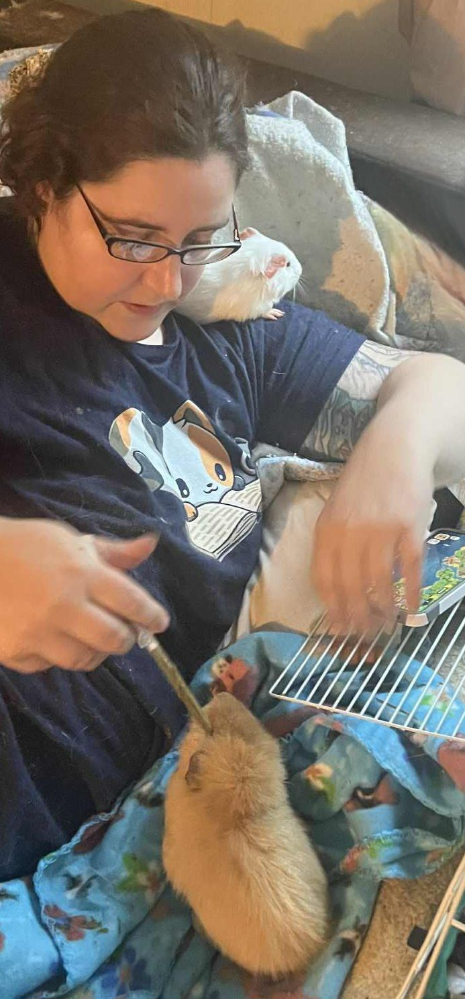

It may seem like a small win, but to me it’s a big one:

<!-- truncate -->

Novel has started drinking water from a bottle! 💧

That means I can cut back significantly on giving him sub-q fluids—which is a huge relief for both of us.

I don’t usually like sharing photos of myself, but Alanna snapped this one the other night, and honestly, it captures my evenings perfectly. This is my life:

- Handfeeding whoever needs it.
- Hero on my shoulder.
- Sometimes Parody pops out to see what’s going on.
- I noodle around on my phone while they chew. The baseball game or music is playing in the background, and if it’s music, I sing softly to them.

It’s not glamorous. It’s not quiet. But it’s ours.

I love this little routine, and I treasure every moment—because I know it won’t last forever.

(Also, I swear the oral syringe is not poking Novel in the eye like it looks in the photo 😆😆)

⸻

## 🙏  Support Our Rescue Work

If you believe in the work we do, please consider making a contribution.
Your support helps us continue saving and caring for the most vulnerable small animals. 💕

⸻

### 💸  Ways to Donate
 - PayPal: donations@helpingalllittlethings.org
 - Venmo: [@haltrescue](https://account.venmo.com/u/haltrescue) (watch for imposters — it’s _not_ haltrescue_)
 - CashApp: [$haltrescue](https://cash.app/$Haltrescue)
 - Mail a Check:  
  
    Helping All Little Things    
    PO Box 11    
    Deerfield, NH 03037    
    (Make checks payable to Helping All Little Things)    

### 🛒 Wishlist Donations
 - 🛍️ [Amazon Wishlist](https://tinyurl.com/HALT-Amazon-Wishlist)
 - 🛍️ [Chewy Wishlist](https://tinyurl.com/HALT-Chewy-Wishlist)

### 📞 Donate Directly to Our Vets
 - Southern Maine Hospital for Small Mammals: (207) 535-9330
 - Broadview Vets of Dover: (603) 740-1800
 - House Paws: (856) 234-5230
(Note: The account may still be under Helping All Little Pipsqueaks — we’re in the process of updating it.)

Thank you for your continued love and support.
Every life matters, and we’re so grateful you’re part of this mission with us. 🐹💕
