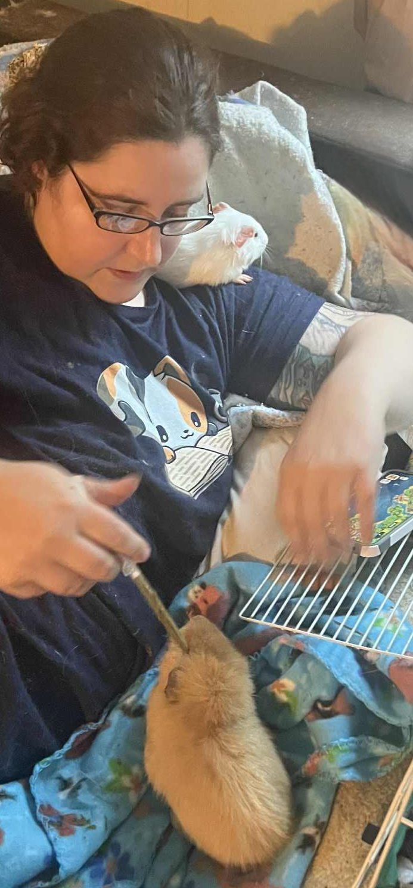

It may seem like a small win, but to me it’s a big one:

<!-- truncate -->

Novel has started drinking water from a bottle! 💧

That means I can cut back significantly on giving him sub-q fluids—which is a huge relief for both of us.

I don’t usually like sharing photos of myself, but Alanna snapped this one the other night, and honestly, it captures my evenings perfectly. This is my life:

- Handfeeding whoever needs it.
- Hero on my shoulder.
- Sometimes Parody pops out to see what’s going on.
- I noodle around on my phone while they chew. The baseball game or music is playing in the background, and if it’s music, I sing softly to them.

It’s not glamorous. It’s not quiet. But it’s ours.

I love this little routine, and I treasure every moment—because I know it won’t last forever.

(Also, I swear the oral syringe is not poking Novel in the eye like it looks in the photo 😆😆)

<SupportUs />
