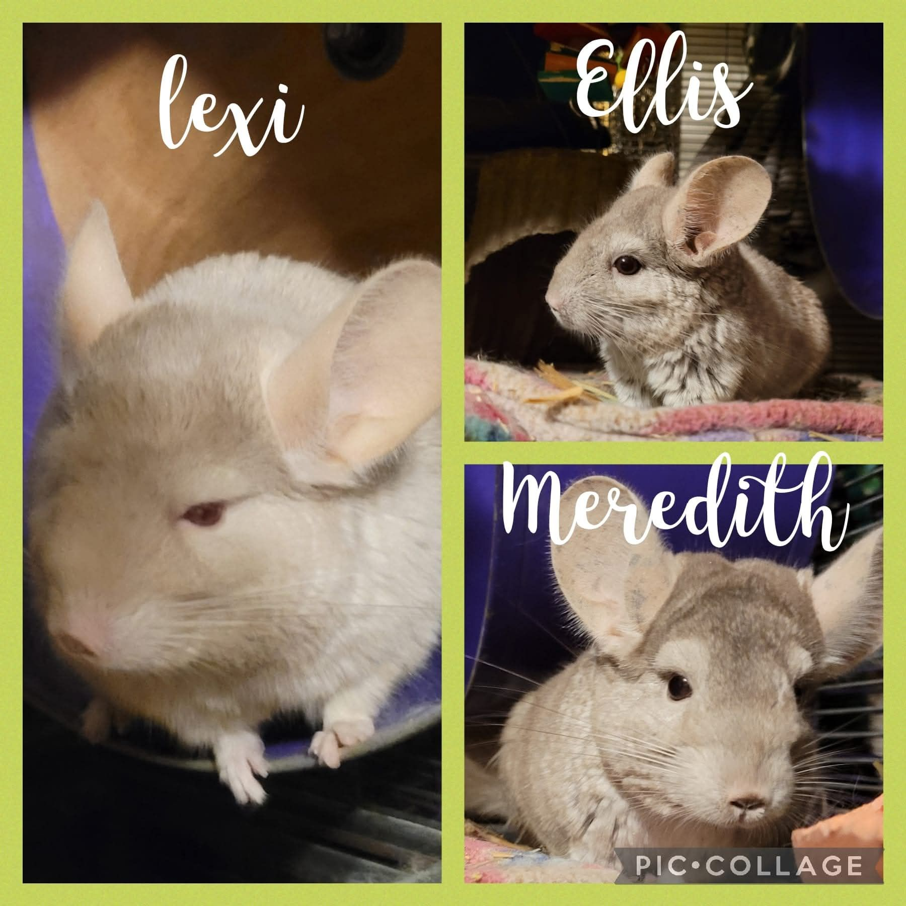

Several days ago, I was very shocked to find that Meredith the chinnie had passed away. She was Ellis’s sister—our chinchilla with congestive heart failure—and a bonded companion to Lexi.

<!-- truncate -->

I spoke with our vet, and he explained that Meredith may have also had heart disease, even without showing symptoms. Sadly, heart disease is becoming much more common in chinchillas—so much so that our vet now does chest X-rays before any surgery to make sure their hearts are strong enough for anesthesia.

People often asked me how I could tell Ellis and Meredith apart, and for me, it was easy:
Meredith had more freckles on her ears, and she was always just a bit more human-friendly.

Of course, I would never try to replace Meredith—or any animal that passes under my care—but yesterday we received a message about a single female chinchilla in need. Thanks to quick action from one of our rescue friends and Jen, this girl will be coming to us on Sunday with a group of piggies.

I’m doing this mostly for Lexi.

Ellis could pass away at any time, and I don’t want to be scrambling to find a companion for Lexi in the middle of grief. My hope is to bond them as a trio, so Lexi won’t be left alone when the time comes.

This is one of the hardest parts of rescue. Sometimes, even when your human heart isn’t ready, you have to put the emotional needs of herd animals first—because they don’t understand loss the way we do. But they feel it all the same.

⸻

## 🙏  Support Our Rescue Work

If you believe in the work we do, please consider making a contribution.
Your support helps us continue saving and caring for the most vulnerable small animals. 💕

⸻

### 💸  Ways to Donate
 - PayPal: donations@helpingalllittlethings.org
 - Venmo: [@haltrescue](https://account.venmo.com/u/haltrescue) (watch for imposters — it’s _not_ haltrescue_)
 - CashApp: [$haltrescue](https://cash.app/$Haltrescue)
 - Mail a Check:  
  
    Helping All Little Things    
    PO Box 11    
    Deerfield, NH 03037    
    (Make checks payable to Helping All Little Things)    

### 🛒 Wishlist Donations
 - 🛍️ [Amazon Wishlist](https://tinyurl.com/HALT-Amazon-Wishlist)
 - 🛍️ [Chewy Wishlist](https://tinyurl.com/HALT-Chewy-Wishlist)

### 📞 Donate Directly to Our Vets
 - Southern Maine Hospital for Small Mammals: (207) 535-9330
 - Broadview Vets of Dover: (603) 740-1800
 - House Paws: (856) 234-5230
(Note: The account may still be under Helping All Little Pipsqueaks — we’re in the process of updating it.)

Thank you for your continued love and support.
Every life matters, and we’re so grateful you’re part of this mission with us. 🐹💕
