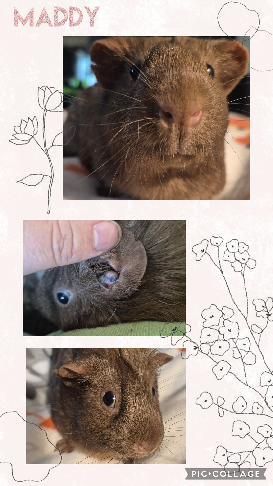

SURPRISE!
Maddy has a tumor in her ear. 😞

<!-- truncate -->

I first saw her—and her bonded cagemates—on our friends’ page at Judge’s Park. I was immediately drawn to Maddy because she reminded me so much of a very special pig from my past, Maddox. Then I saw that they were all listed as six years old, and I thought, you know what? They can come here. I love little old ladies.

They arrived today, and during my intake checks, I found the tumor—and my heart dropped.

It needs to come out immediately. Tumors in this location can spread into the ear bulla or even reach the brain if left untreated. It’s difficult to get clean margins in the ear, but we’ve done this before: when Nova had an ear tumor removed, it took years to come back. So I’m definitely willing to give this a go—if we can raise the funds.

I’ll be getting a surgical quote tomorrow when I’m up at Southern Maine Hospital for Small Mammals, but we’re estimating around $500 for the procedure.

One note: I’m starting to think Maddy may be younger than her cagemates. They definitely seem older, but Maddy herself might be closer to three years old—which makes the idea of pursuing surgery even more hopeful.

If you’re able to chip in toward Maddy’s urgent surgery, it would mean the world. Let’s give this sweet girl the fighting chance she deserves. 💛

<SupportUs />
