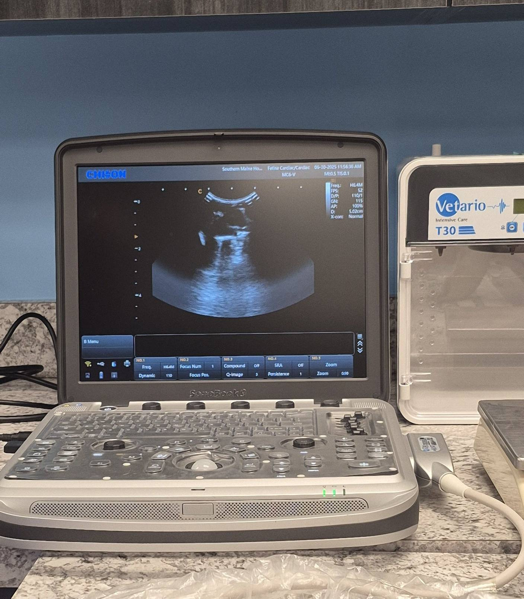

I brought several piggies to Southern Maine Hospital for Small Mammals today, and I know I owe everyone updates on both the new arrivals and those who were seen—but I want to start with Hero’s appointment.

<!-- truncate -->

The good news: Hero is doing significantly better on Lasix.

We did an ultrasound of his heart, and it turns out that his likely birth defect is muscular—one side of his heart beats harder than the other, which caused some fluid to build up and leak.

The even better news?

Because it’s a muscular defect (not valve-related), it means he may live much longer than we originally expected when he was first diagnosed with heart disease. 💛

Hero will be on Lasix for the rest of his life, but it’s already made a huge difference in his quality of life. He’s popcorning again, which is incredible to see—but he does tire more easily and takes frequent naps. And honestly? That’s okay. He’s still the happiest little pig, and I’m so grateful we caught this early enough to help him feel better.

⸻

## 🙏  Support Our Rescue Work

If you believe in the work we do, please consider making a contribution.
Your support helps us continue saving and caring for the most vulnerable small animals. 💕

⸻

### 💸  Ways to Donate
 - PayPal: donations@helpingalllittlethings.org
 - Venmo: [@haltrescue](https://account.venmo.com/u/haltrescue) (watch for imposters — it’s _not_ haltrescue_)
 - CashApp: [$haltrescue](https://cash.app/$Haltrescue)
 - Mail a Check:  
  
    Helping All Little Things    
    PO Box 11    
    Deerfield, NH 03037    
    (Make checks payable to Helping All Little Things)    

### 🛒 Wishlist Donations
 - 🛍️ [Amazon Wishlist](https://tinyurl.com/HALT-Amazon-Wishlist)
 - 🛍️ [Chewy Wishlist](https://tinyurl.com/HALT-Chewy-Wishlist)

### 📞 Donate Directly to Our Vets
 - Southern Maine Hospital for Small Mammals: (207) 535-9330
 - Broadview Vets of Dover: (603) 740-1800
 - House Paws: (856) 234-5230
(Note: The account may still be under Helping All Little Pipsqueaks — we’re in the process of updating it.)

Thank you for your continued love and support.
Every life matters, and we’re so grateful you’re part of this mission with us. 🐹💕
