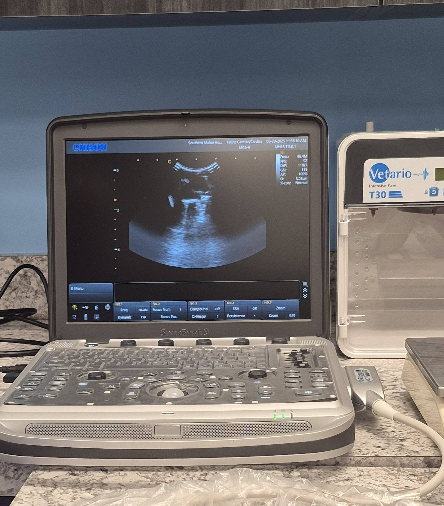

I brought several piggies to Southern Maine Hospital for Small Mammals today, and I know I owe everyone updates on both the new arrivals and those who were seen—but I want to start with Hero’s appointment.

<!-- truncate -->

The good news: Hero is doing significantly better on Lasix.

We did an ultrasound of his heart, and it turns out that his likely birth defect is muscular—one side of his heart beats harder than the other, which caused some fluid to build up and leak.

The even better news?

Because it’s a muscular defect (not valve-related), it means he may live much longer than we originally expected when he was first diagnosed with heart disease. 💛

Hero will be on Lasix for the rest of his life, but it’s already made a huge difference in his quality of life. He’s popcorning again, which is incredible to see—but he does tire more easily and takes frequent naps. And honestly? That’s okay. He’s still the happiest little pig, and I’m so grateful we caught this early enough to help him feel better.

<SupportUs />
