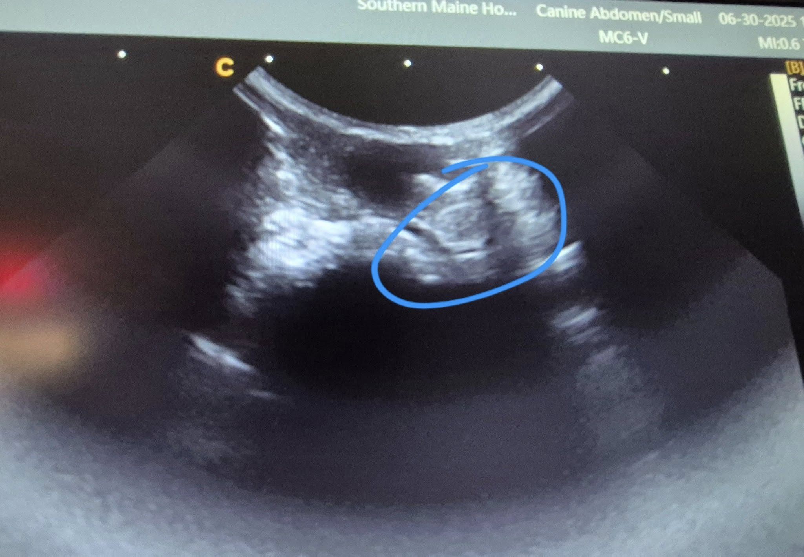
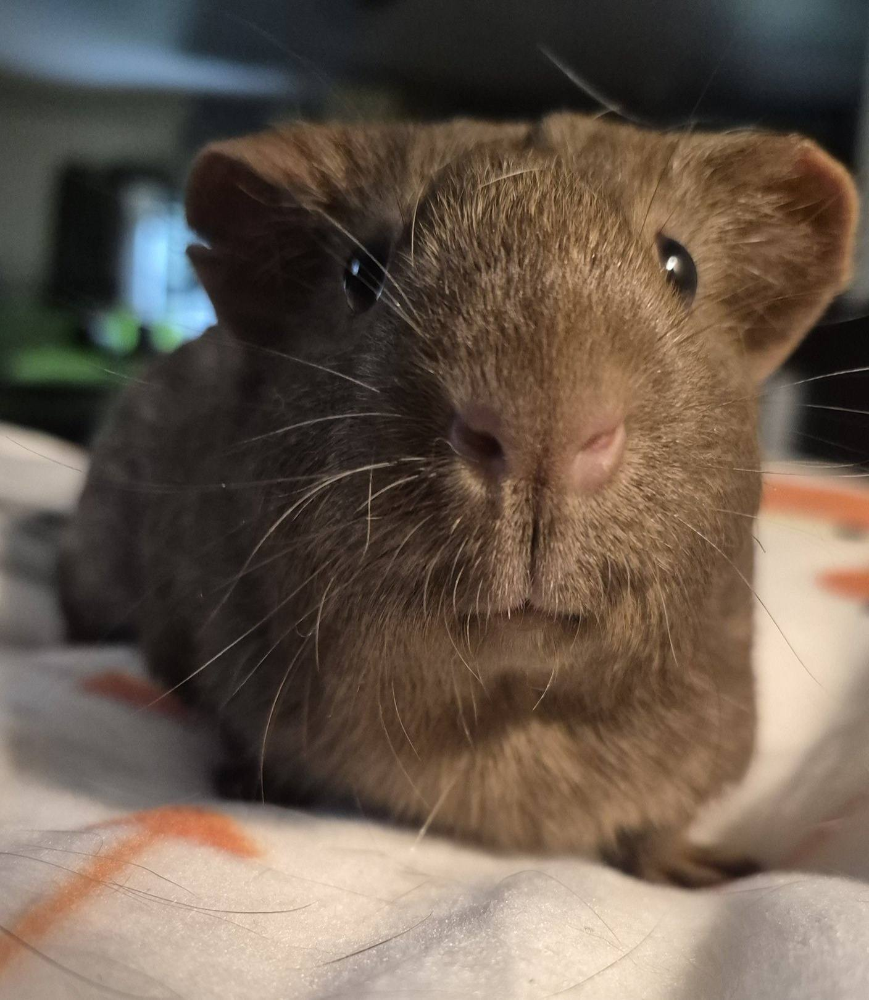
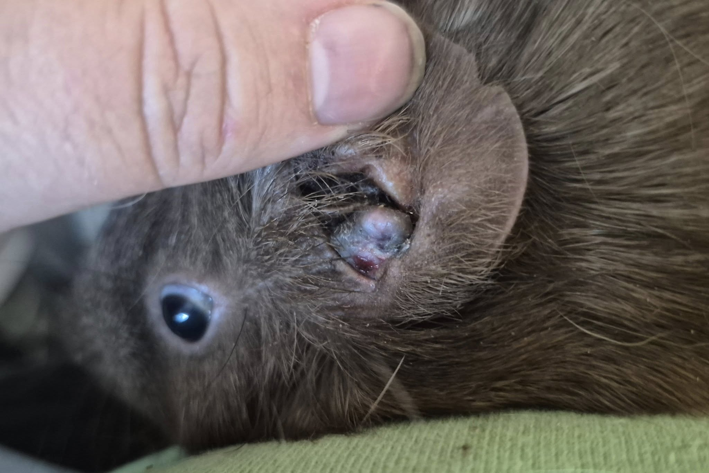

Some optimistic news about Maddy! 💛

<!-- truncate -->

The tumor in her ear isn’t too deep into the canal, and our vet is very hopeful about the outcome of surgical removal.

We actually did an ultrasound of her ear—which I’ve never done before—and it was pretty cool to see! That sort of oblong shape on the screen is the tumor. I got a photo of that view, though I missed the one showing the ear canal itself.

Maddy is scheduled for surgery on July 10th, with an estimated cost of $406.
I decided against scheduling it right before the holiday weekend—just in case there were complications, I wanted to ensure full access to post-op care.

I do have a full cost breakdown in the rescue room, but I’m going to be honest—I feel like hot garbage right now. I’m going to rest a bit, watch the ballgame, and maybe doze off for half an hour before jumping back into everything.

In the meantime, we urgently need help covering:
 - Today’s appointment for five piggies, which came to over $300
 - Maddy’s upcoming surgery, quoted at $400+

⸻

## 🙏  Support Our Rescue Work

If you believe in the work we do, please consider making a contribution.
Your support helps us continue saving and caring for the most vulnerable small animals. 💕

⸻

### 💸  Ways to Donate
 - PayPal: donations@helpingalllittlethings.org
 - Venmo: [@haltrescue](https://account.venmo.com/u/haltrescue) (watch for imposters — it’s _not_ haltrescue_)
 - CashApp: [$haltrescue](https://cash.app/$Haltrescue)
 - Mail a Check:  
  
    Helping All Little Things    
    PO Box 11    
    Deerfield, NH 03037    
    (Make checks payable to Helping All Little Things)    

### 🛒 Wishlist Donations
 - 🛍️ [Amazon Wishlist](https://tinyurl.com/HALT-Amazon-Wishlist)
 - 🛍️ [Chewy Wishlist](https://tinyurl.com/HALT-Chewy-Wishlist)

### 📞 Donate Directly to Our Vets
 - Southern Maine Hospital for Small Mammals: (207) 535-9330
 - Broadview Vets of Dover: (603) 740-1800
 - House Paws: (856) 234-5230
(Note: The account may still be under Helping All Little Pipsqueaks — we’re in the process of updating it.)

Thank you for your continued love and support.
Every life matters, and we’re so grateful you’re part of this mission with us. 🐹💕
