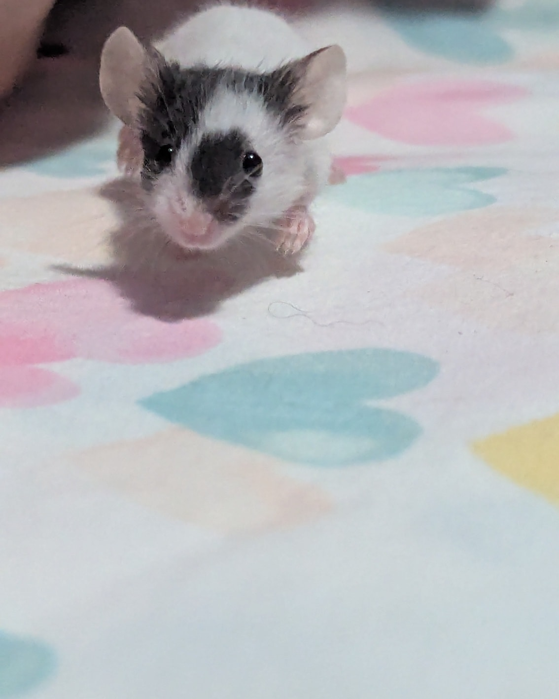
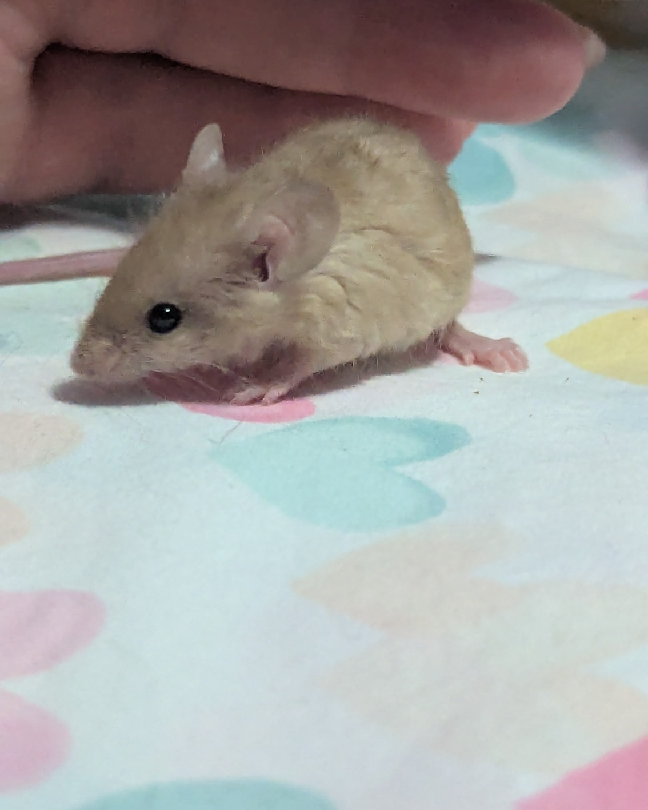
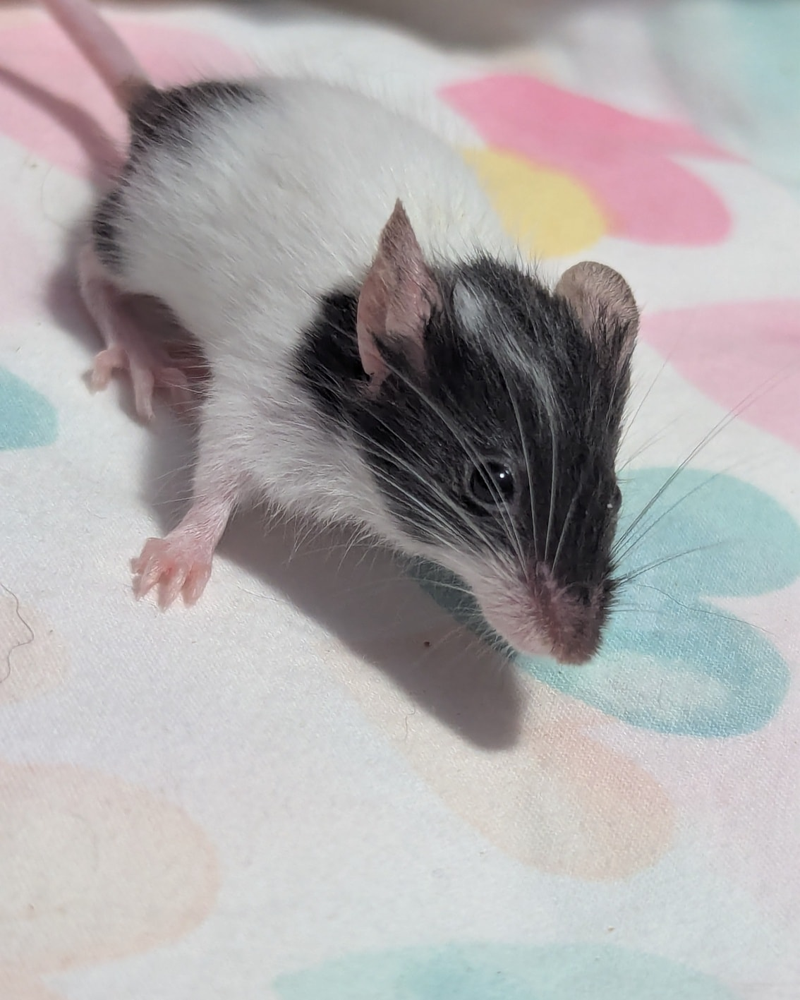
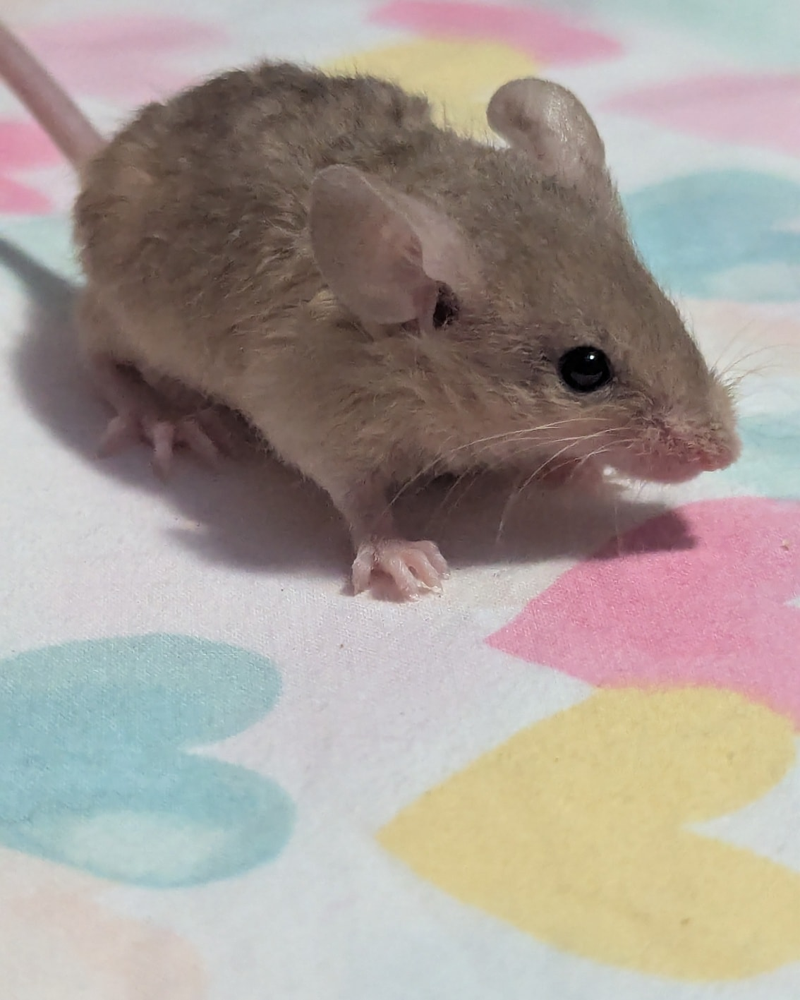
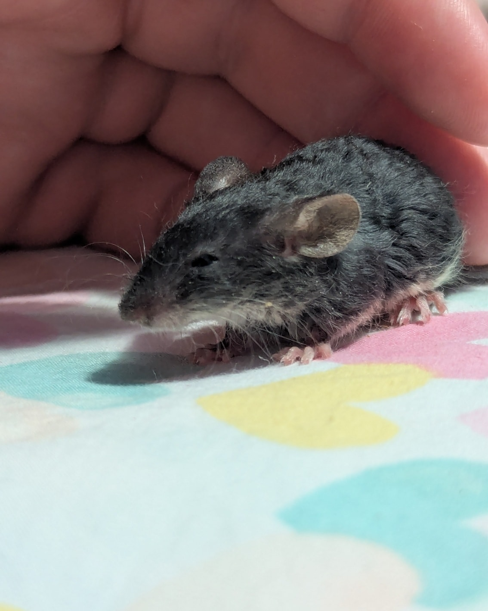
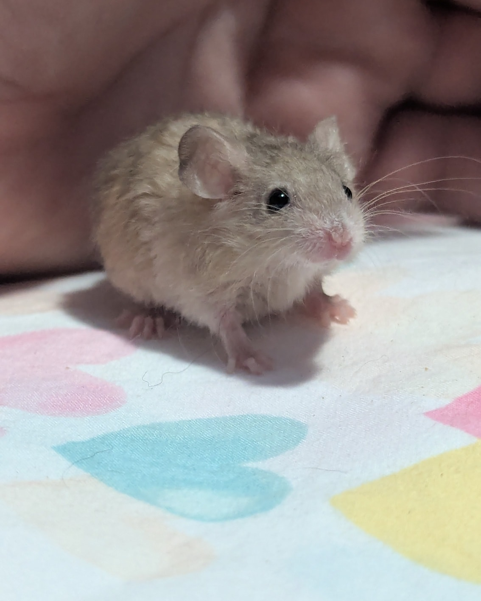
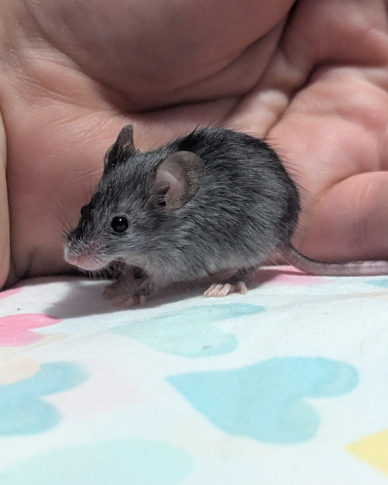

Remember the baby mice who came in at just a week old without a mom?
Well… they’ve grown SO much, they’re almost unrecognizable now! 😻

<!-- truncate -->

These adorable little guys and gals are fully eating solid food and doing remarkably well, all things considered. They’re still a bit smaller than we’d like for their age, but that’s pretty common in hand-reared babies. We’ll be holding most of them back for at least another month to give them time to catch up in weight and continue thriving—but we’re hopeful that many will be ready for adoption soon! 🥰

Now I know what you’re all thinking:
“But what about names?”
Because clearly, I have such a great track record with names… 🥴

Well, Finding Nemo has been on my sleep-deprived mind lately, and it felt like a perfect theme. Except, of course, I couldn’t stick with normal names. So, I’m very proud (and slightly unhinged) to introduce you to:

🐠 P. Sherman, 42 Wallaby Way, Sydney    
🐟 Just Keep Swimming    
🫧 I Shall Call Him Squishy    
🍴 Fish Are Friends, Not Food    
🦈 Shark Bait, Hoo Ha Ha    
🚫 I’m Going to Touch the Butt    
🗣 Mine Mine Mine    

At some point, Danni is definitely going to stop letting me name things 😂
(My other brilliant idea today was to name our satin guinea pigs after Twilight vampires because they sparkle—“This is the fur of a killer, Bella.” 😅)

Anyway, this turned into quite a ramble—but we hope you enjoyed meeting the not-so-little-anymore babies!
As always, if you’re able to support our work, donations are greatly appreciated. 💛

⸻

## 🙏  Support Our Rescue Work

If you believe in the work we do, please consider making a contribution.
Your support helps us continue saving and caring for the most vulnerable small animals. 💕

⸻

### 💸  Ways to Donate
 - PayPal: donations@helpingalllittlethings.org
 - Venmo: [@haltrescue](https://account.venmo.com/u/haltrescue) (watch for imposters — it’s _not_ haltrescue_)
 - CashApp: [$haltrescue](https://cash.app/$Haltrescue)
 - Mail a Check:  
  
    Helping All Little Things    
    PO Box 11    
    Deerfield, NH 03037    
    (Make checks payable to Helping All Little Things)    

### 🛒 Wishlist Donations
 - 🛍️ [Amazon Wishlist](https://tinyurl.com/HALT-Amazon-Wishlist)
 - 🛍️ [Chewy Wishlist](https://tinyurl.com/HALT-Chewy-Wishlist)

### 📞 Donate Directly to Our Vets
 - Southern Maine Hospital for Small Mammals: (207) 535-9330
 - Broadview Vets of Dover: (603) 740-1800
 - House Paws: (856) 234-5230
(Note: The account may still be under Helping All Little Pipsqueaks — we’re in the process of updating it.)

Thank you for your continued love and support.
Every life matters, and we’re so grateful you’re part of this mission with us. 🐹💕
