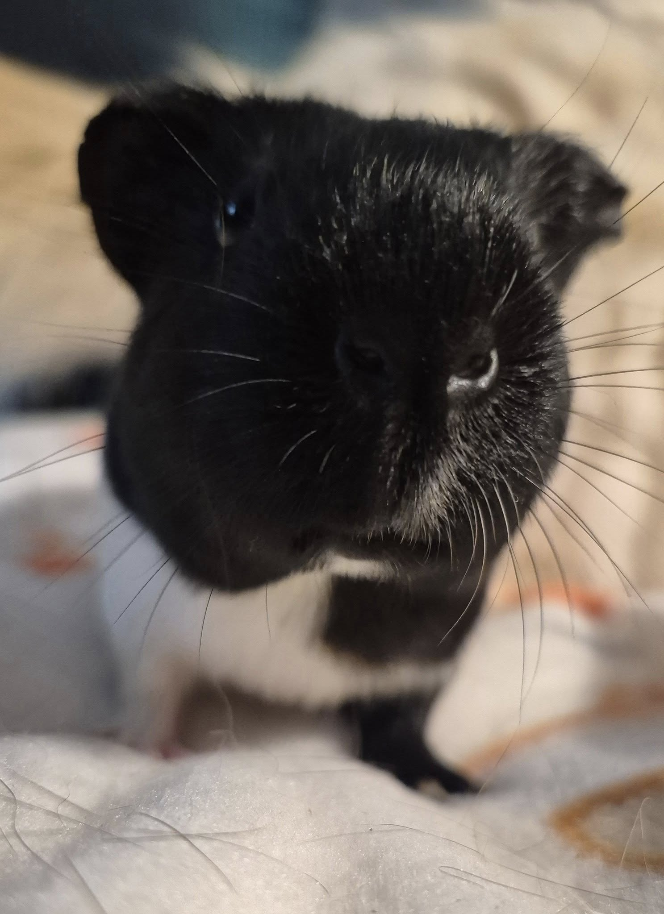
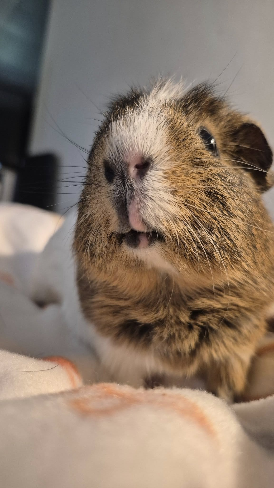
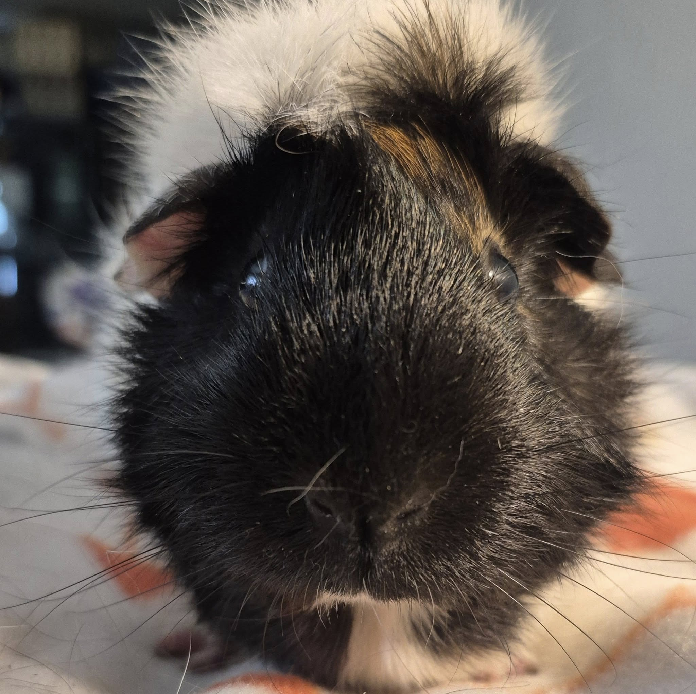

Just a few more updates from yesterday’s vet visit—nothing too exciting, but still worth sharing!

<!-- truncate -->

🐹 Sonnet was originally my parents’ foster piggie. She had a very wonky uterus and ovarian cysts, which were removed before she came up here to be a companion for Old Man Colin (who just doesn’t do well with other boys).
At her check-up, we found that one of her stitches hadn’t absorbed properly and had gotten a tiny bit infected. It was removed, and it already looks so much better.

Also—she is so itty bitty for her age! She’s a year and a half old, but she’s maybe the size of a 3–4 month old baby.

🐷 Lillia is one of Maddy’s bonded friends. She’s definitely on the older side—around six years old—and very arthritic. But oh my goodness, what a love bug she is! She adores sprawling out and getting chin rubs. Total sweetheart.

🐽 Marlow came to us as a private owner surrender. She’s also a senior lady, but here’s the exciting part: she got a clean bill of health! And honestly? That’s thrilling to me. 😂

⸻

## 🙏  Support Our Rescue Work

If you believe in the work we do, please consider making a contribution.
Your support helps us continue saving and caring for the most vulnerable small animals. 💕

⸻

### 💸  Ways to Donate
 - PayPal: donations@helpingalllittlethings.org
 - Venmo: [@haltrescue](https://account.venmo.com/u/haltrescue) (watch for imposters — it’s _not_ haltrescue_)
 - CashApp: [$haltrescue](https://cash.app/$Haltrescue)
 - Mail a Check:  
  
    Helping All Little Things    
    PO Box 11    
    Deerfield, NH 03037    
    (Make checks payable to Helping All Little Things)    

### 🛒 Wishlist Donations
 - 🛍️ [Amazon Wishlist](https://tinyurl.com/HALT-Amazon-Wishlist)
 - 🛍️ [Chewy Wishlist](https://tinyurl.com/HALT-Chewy-Wishlist)

### 📞 Donate Directly to Our Vets
 - Southern Maine Hospital for Small Mammals: (207) 535-9330
 - Broadview Vets of Dover: (603) 740-1800
 - House Paws: (856) 234-5230
(Note: The account may still be under Helping All Little Pipsqueaks — we’re in the process of updating it.)

Thank you for your continued love and support.
Every life matters, and we’re so grateful you’re part of this mission with us. 🐹💕
