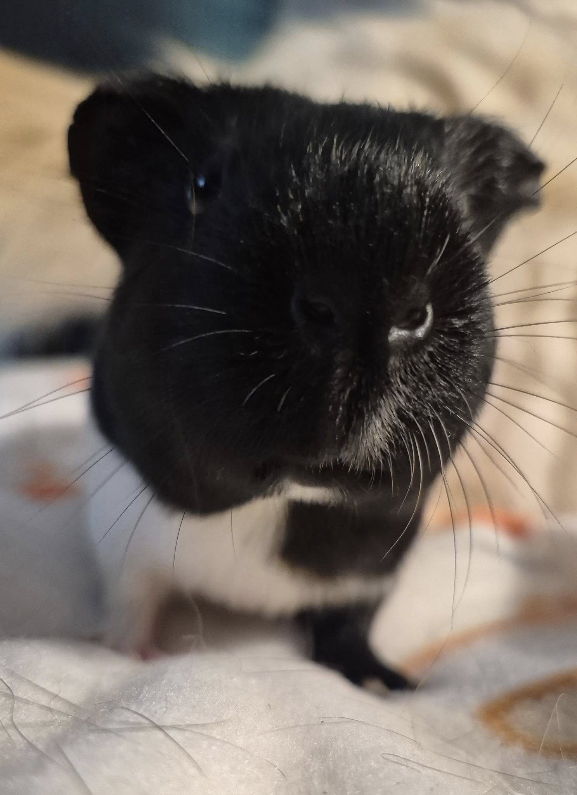
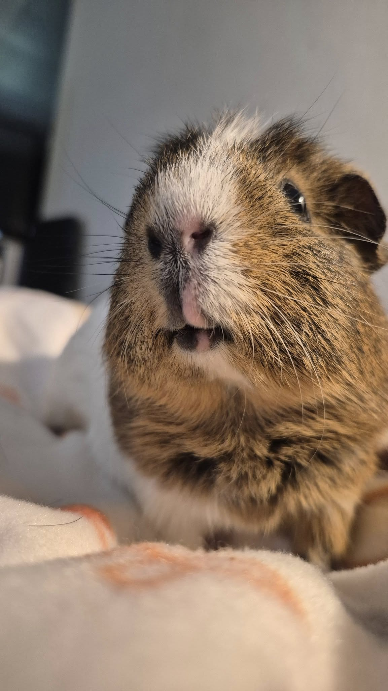
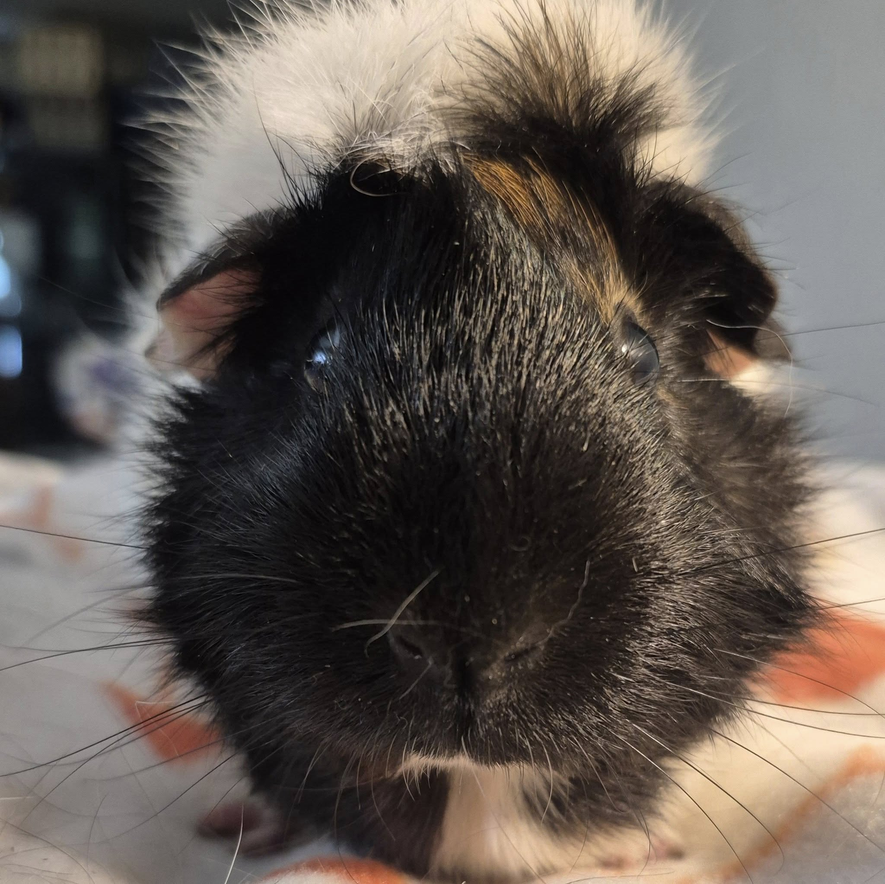

Just a few more updates from yesterday’s vet visit—nothing too exciting, but still worth sharing!

<!-- truncate -->

🐹 Sonnet was originally my parents’ foster piggie. She had a very wonky uterus and ovarian cysts, which were removed before she came up here to be a companion for Old Man Colin (who just doesn’t do well with other boys).
At her check-up, we found that one of her stitches hadn’t absorbed properly and had gotten a tiny bit infected. It was removed, and it already looks so much better.

Also—she is so itty bitty for her age! She’s a year and a half old, but she’s maybe the size of a 3–4 month old baby.

🐷 Lillia is one of Maddy’s bonded friends. She’s definitely on the older side—around six years old—and very arthritic. But oh my goodness, what a love bug she is! She adores sprawling out and getting chin rubs. Total sweetheart.

🐽 Marlow came to us as a private owner surrender. She’s also a senior lady, but here’s the exciting part: she got a clean bill of health! And honestly? That’s thrilling to me. 😂

<SupportUs />
