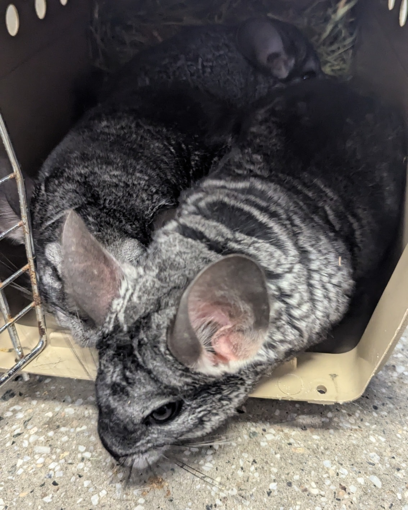
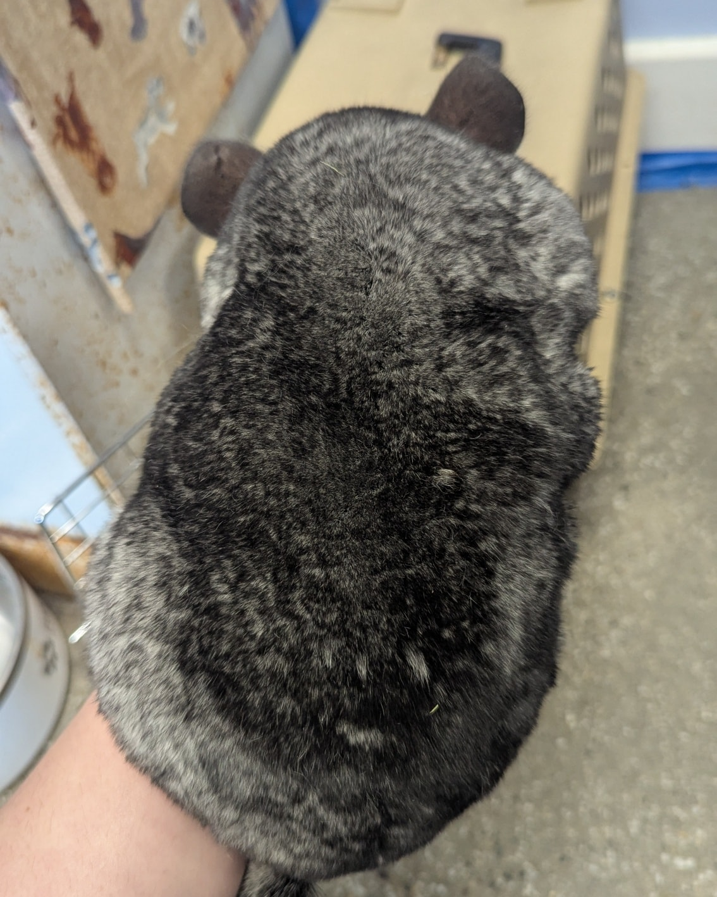

Our first surrender of the day is a trio of chinchillas—how cute are these ladies?! 😻

<!-- truncate -->

They also come with one of the funnier surrender stories we’ve heard in a while…

The person who surrendered them wasn’t actually expecting to have chinchillas at all. Her significant other is a contractor and was doing work in someone’s home. As he was leaving, the homeowner asked, “Do you want a chinchilla?”

He—being a perfectly reasonable person—replied, “No, I don’t know anything about chinchillas!”

But she persisted.
“How about you take all three?”
So… off he went, with three chinchillas in tow. 😂

His partner was amused, but understandably overwhelmed. She explained that she had no experience with chinchillas and didn’t feel equipped to care for three surprise floofs. They genuinely wanted the best for the girls and reached out to us—and of course, we said yes!

All three are girls (yay!) and one of them is especially adorable and… a little extra round—she’s practically rolling. 😂 We’ll make sure she gets on a healthy track, and they’ll all receive the care, space, and one-on-one attention they deserve.

Even better? They’ll be living permanently with one of our amazing board members! 💖

⸻

## 🙏  Support Our Rescue Work

If you believe in the work we do, please consider making a contribution.
Your support helps us continue saving and caring for the most vulnerable small animals. 💕

⸻

### 💸  Ways to Donate
 - PayPal: donations@helpingalllittlethings.org
 - Venmo: [@haltrescue](https://account.venmo.com/u/haltrescue) (watch for imposters — it’s _not_ haltrescue_)
 - CashApp: [$haltrescue](https://cash.app/$Haltrescue)
 - Mail a Check:  
  
    Helping All Little Things    
    PO Box 11    
    Deerfield, NH 03037    
    (Make checks payable to Helping All Little Things)    

### 🛒 Wishlist Donations
 - 🛍️ [Amazon Wishlist](https://tinyurl.com/HALT-Amazon-Wishlist)
 - 🛍️ [Chewy Wishlist](https://tinyurl.com/HALT-Chewy-Wishlist)

### 📞 Donate Directly to Our Vets
 - Southern Maine Hospital for Small Mammals: (207) 535-9330
 - Broadview Vets of Dover: (603) 740-1800
 - House Paws: (856) 234-5230
(Note: The account may still be under Helping All Little Pipsqueaks — we’re in the process of updating it.)

Thank you for your continued love and support.
Every life matters, and we’re so grateful you’re part of this mission with us. 🐹💕
