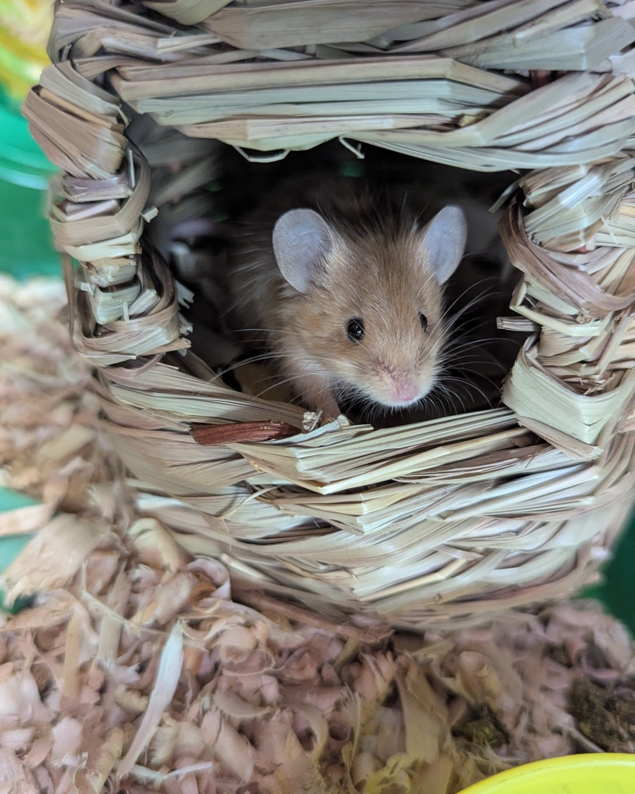
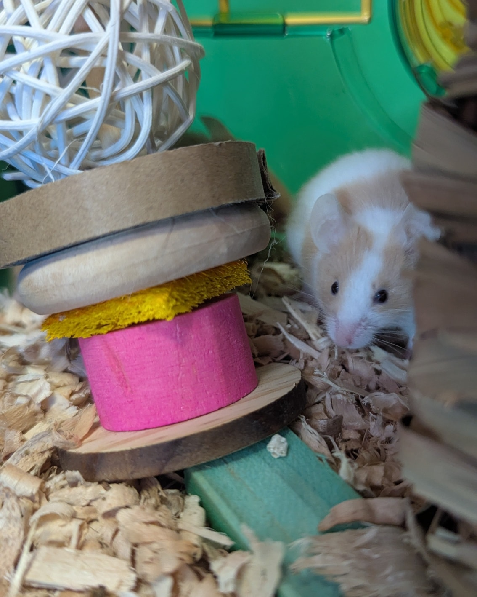
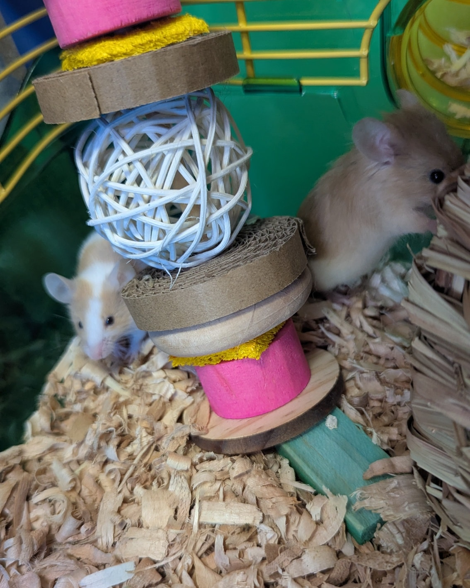

I got a little busy yesterday… and then went home and fell asleep 😅—so I never got around to introducing our newest intake.

<!-- truncate -->

It is… more mice! 🐭

Because honestly, what’s two more mice at this point?

These adorable little ladies have just arrived and are settling in well—but they come with a not-so-great backstory.

We saw them posted in a rehoming group and reached out immediately. The person who ended up with them hadn’t intended to adopt mice—her son had discovered that his coworker was keeping them in his car in 90° heat. The mice were in a cage with a frozen water bottle, but it was dangerously hot and completely unsafe.

Knowing they wouldn’t survive those conditions, her son offered to take them, and the coworker agreed.

While the family wanted to make sure the mice went to a safe, loving home, they felt overwhelmed about how to screen potential adopters—so they reached out to us. And of course, we said yes!

We’re happy to have these two sweet girls with us now—and they are definitely enjoying the air conditioning. ❄️

The little orange girl is a bit braver than her sister, but we’re confident they’ll both come out of their shells in no time.

And of course… I had to give them slightly strange names because would it really be me if I didn’t? 🥴
So please meet:

🥯 Bagel Sandwich (orange girl)
🧀 Cream Cheese (white/orange girl)

⸻

## 🙏  Support Our Rescue Work

If you believe in the work we do, please consider making a contribution.
Your support helps us continue saving and caring for the most vulnerable small animals. 💕

⸻

### 💸  Ways to Donate
 - PayPal: donations@helpingalllittlethings.org
 - Venmo: [@haltrescue](https://account.venmo.com/u/haltrescue) (watch for imposters — it’s _not_ haltrescue_)
 - CashApp: [$haltrescue](https://cash.app/$Haltrescue)
 - Mail a Check:  
  
    Helping All Little Things    
    PO Box 11    
    Deerfield, NH 03037    
    (Make checks payable to Helping All Little Things)    

### 🛒 Wishlist Donations
 - 🛍️ [Amazon Wishlist](https://tinyurl.com/HALT-Amazon-Wishlist)
 - 🛍️ [Chewy Wishlist](https://tinyurl.com/HALT-Chewy-Wishlist)

### 📞 Donate Directly to Our Vets
 - Southern Maine Hospital for Small Mammals: (207) 535-9330
 - Broadview Vets of Dover: (603) 740-1800
 - House Paws: (856) 234-5230
(Note: The account may still be under Helping All Little Pipsqueaks — we’re in the process of updating it.)

Thank you for your continued love and support.
Every life matters, and we’re so grateful you’re part of this mission with us. 🐹💕
