You've probably noticed that social media, especially Facebook, has been frustrating lately - it's hard to see the content you're looking for. This has a really negative effect on non-profits who depend on reaching their audience on social media! We've put together a list of ways you can help us and ensure you and others see our content. 

<!-- truncate -->

Facebook and other platforms don’t always show you everything from the pages you follow. Here’s how you can make sure you don’t miss updates from us — and help us reach more people:

### Facebook

1. Follow our Page – click the Follow button if you haven’t already. If you "liked" our page many years ago, check and make sure that's been updated to "following," which has now taken the place of "like."
2. Add us to Favorites – tap the “Following” dropdown and select Favorites. This tells Facebook to show you our posts higher in your feed.
3. Engage with our posts – every like, comment, share, or click signals to Facebook that people want to see more of our content. The love, care, and wow reactions seem to help the most. And don't worry about making a clever comment - just comment 4 or more words! "Wow, they're so cute!" will do. 

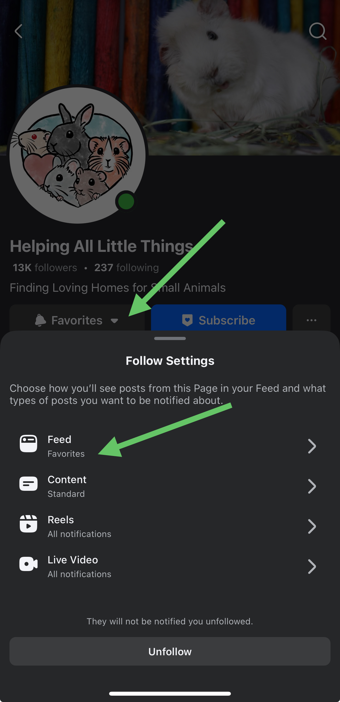

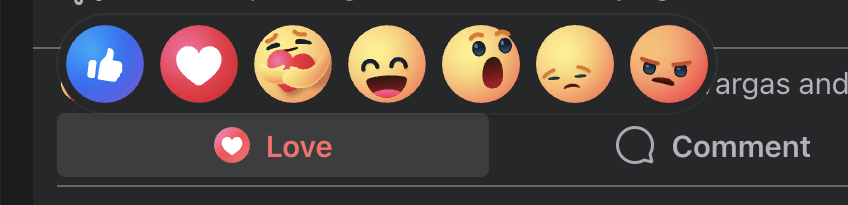

### Instagram

 - Tap the Follow button.
 - Go to our profile → tap the bell icon → Turn on notifications for posts & stories.
 - Like, share to your stories, or comment to help us show up in more feeds.

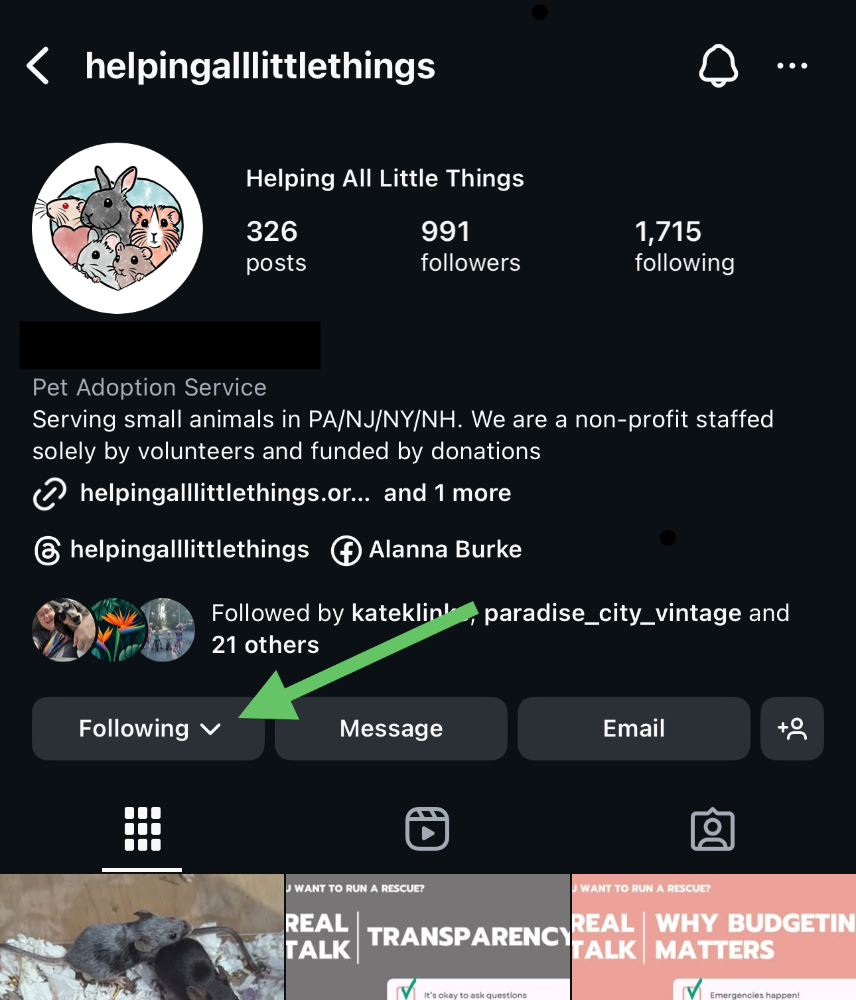

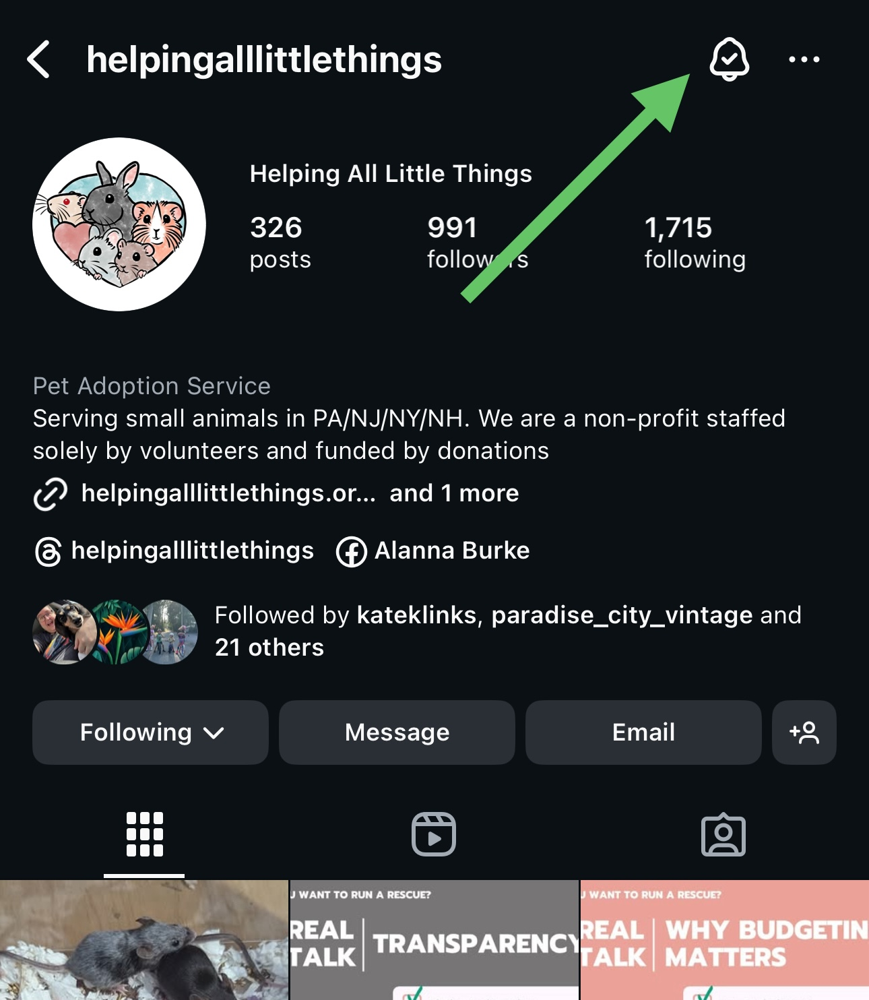

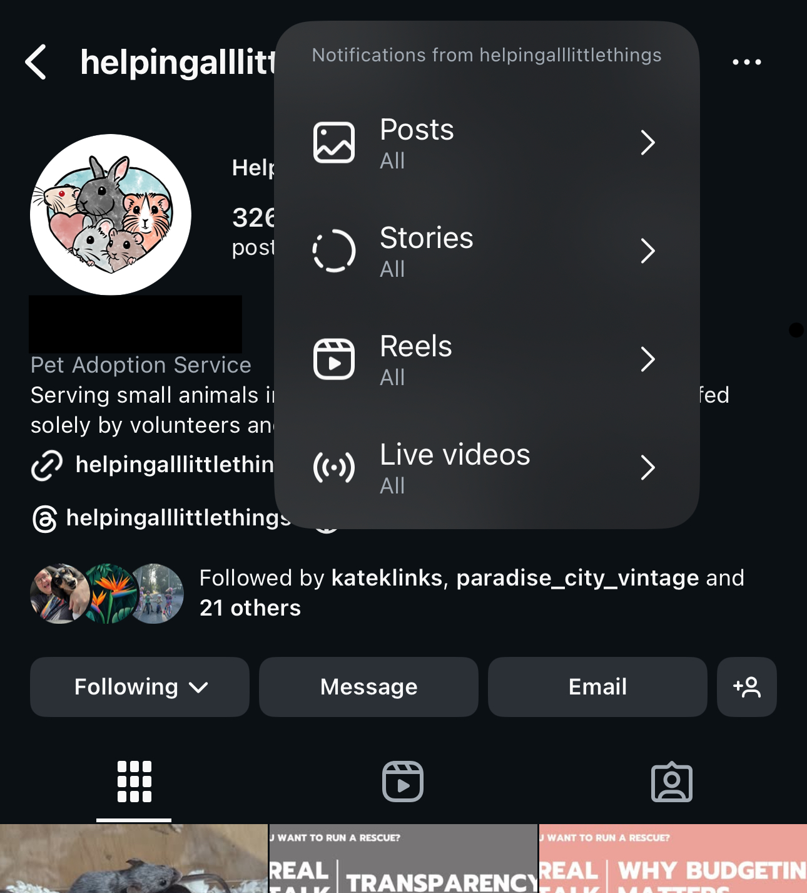

### Threads

 - Tap the Follow button.
 - Go to our profile → tap the bell icon → Turn on notifications for posts & stories.
 - Like, share to your stories, or comment to help us show up in more feeds.

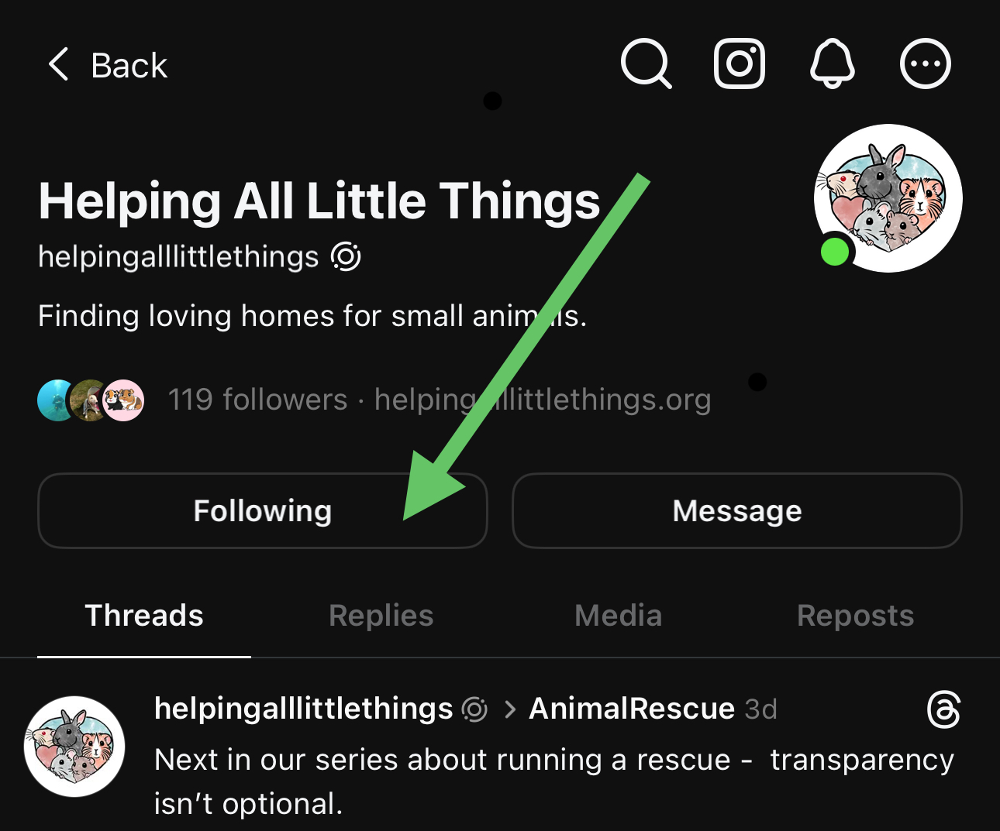

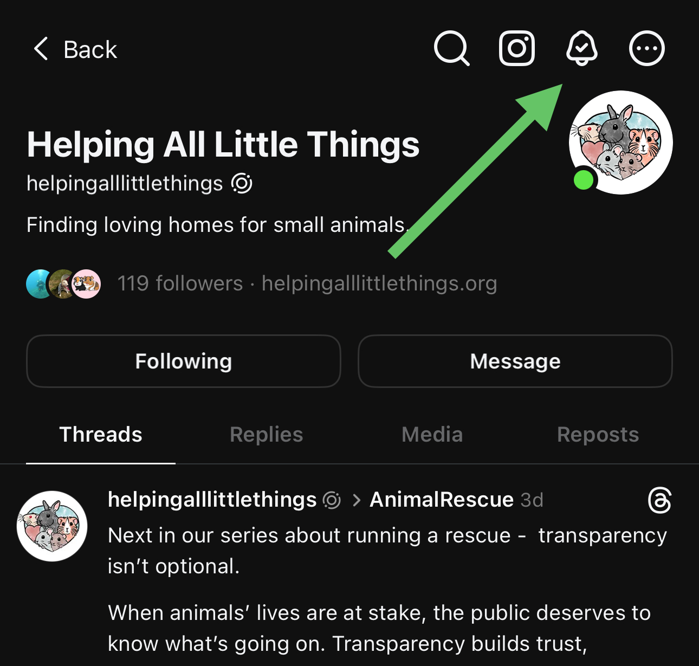

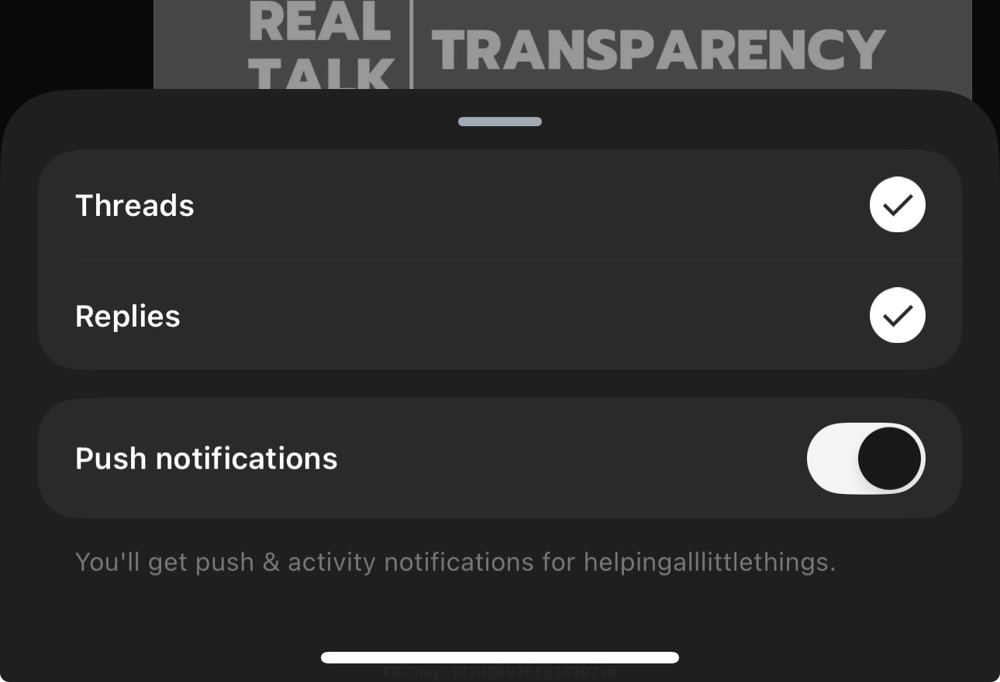

### Mastodon

 - Follow us to see updates.
 - Like and reply to our content - engagement helps!
 - Boost and repost our content — this is one of the strongest ways to spread the word.

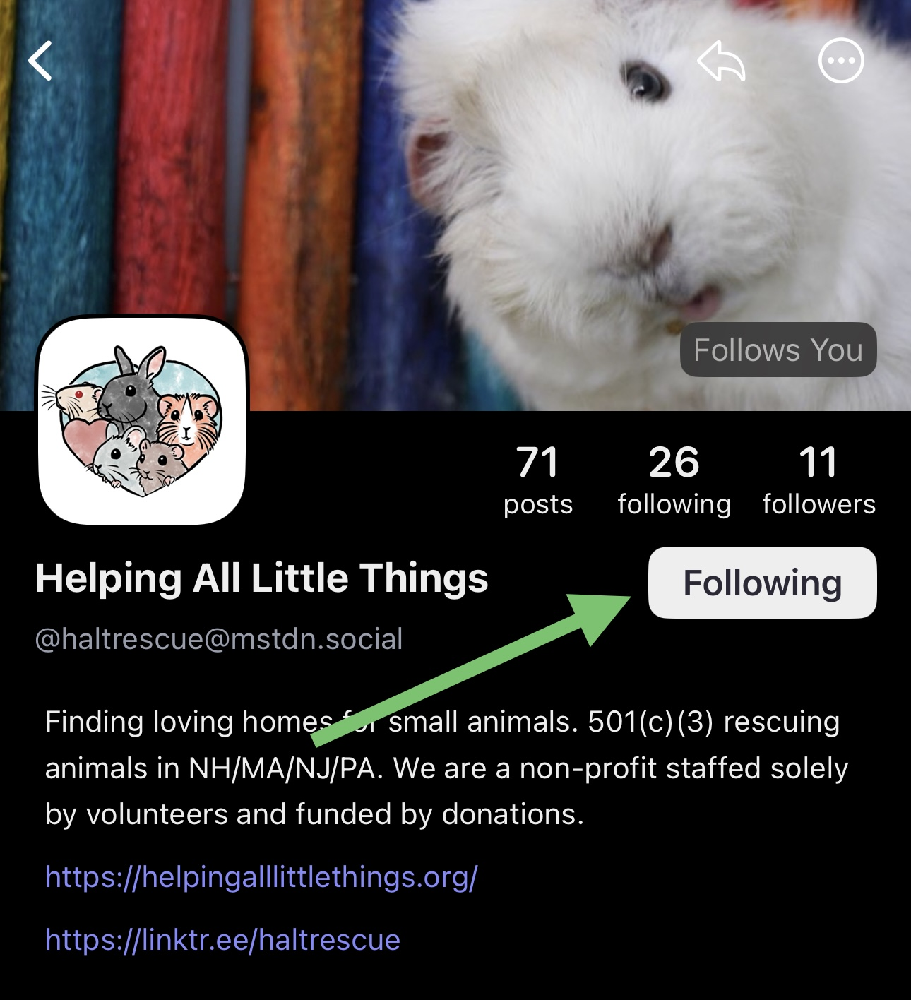

### Bluesky

 - Follow us to see updates.
 - Like and reply to our content - engagement helps!
 - Boost and repost our content — this is one of the strongest ways to spread the word.

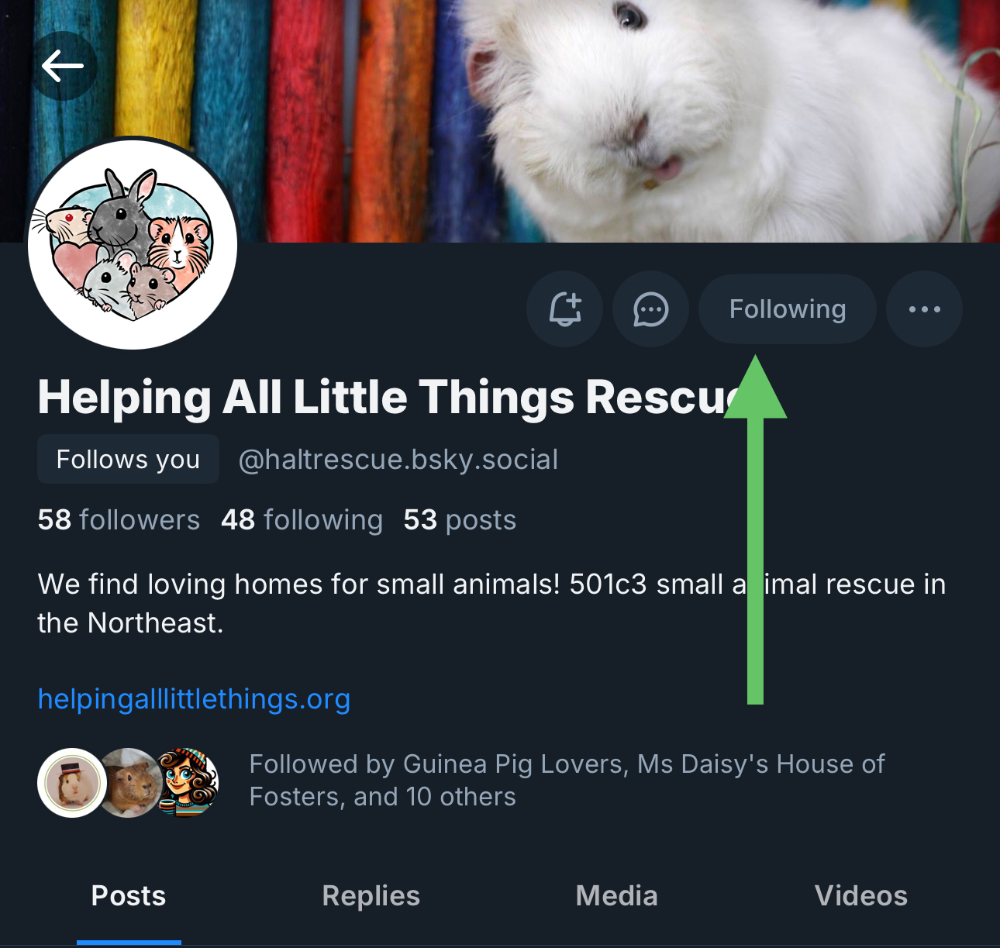

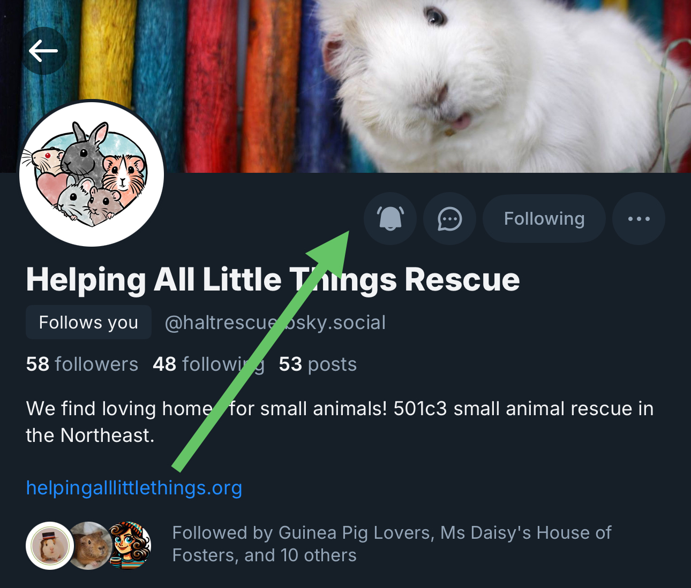

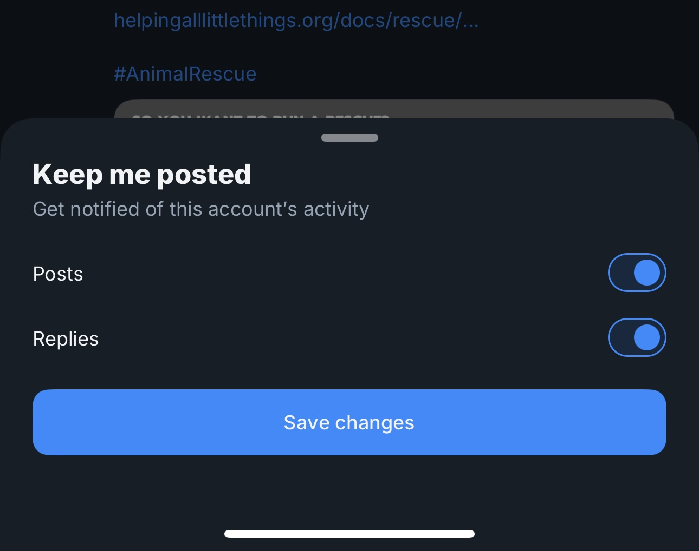

### Why This Matters

Social media platforms show our posts to more people when you interact with them. Following, favoriting, liking, sharing, or even leaving a quick emoji comment makes a big difference.

It’s a free and easy way to support our work and make sure the animals in our care get seen and supported.

⸻

## 🙏  Support Our Rescue Work

If you believe in the work we do, please consider making a contribution.
Your support helps us continue saving and caring for the most vulnerable small animals. 💕

⸻

### 💸  Ways to Donate

 - PayPal: donations@helpingalllittlethings.org
 - Venmo: [@haltrescue](https://account.venmo.com/u/haltrescue) (watch for imposters — it’s _not_ haltrescue_)
 - CashApp: [$haltrescue](https://cash.app/$Haltrescue)
 - Mail a Check:  
  
    Helping All Little Things
    PO Box 11
    Deerfield, NH 03037
    (Make checks payable to Helping All Little Things)

### 🛒 Wishlist Donations

 - 🛍️ [Amazon Wishlist](https://tinyurl.com/HALT-Amazon-Wishlist)
 - 🛍️ [Chewy Wishlist](https://tinyurl.com/HALT-Chewy-Wishlist)

### 📞 Donate Directly to Our Vets

 - Southern Maine Hospital for Small Mammals: (207) 535-9330
 - Broadview Vets of Dover: (603) 740-1800
 - House Paws: (856) 234-5230
(Note: The account may still be under Helping All Little Pipsqueaks — we’re in the process of updating it.)

Thank you for your continued love and support.
Every life matters, and we’re so grateful you’re part of this mission with us. 🐹💕
