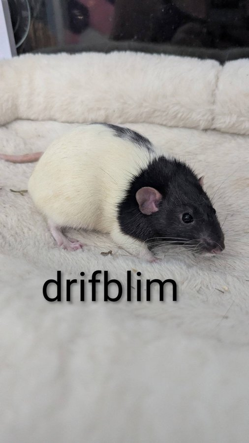
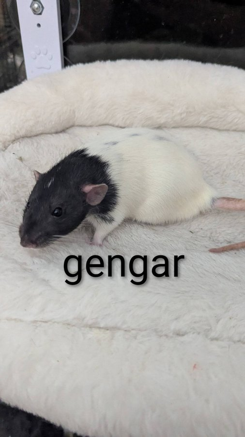

We are barely 24 hours into 2026 and we already have our first foster fail of the year — and honestly, we couldn't be happier about it.

<!-- truncate -->

Jen has decided to keep her foster rats. After losing several of her senior rats last year, and given that these boys have some unique personality quirks that make them a little harder to place, Jen made the call to give them a permanent home. We wholeheartedly support her decision.

*The boys who decided they were home already.*

A "foster fail" in rescue is actually a success story — it means a foster parent fell so in love with their foster animal that they couldn't bear to let them go. For animals with special needs or shy personalities, a foster fail is often the very best outcome.

  

    
  

  

    
  

  

    
  

These boys are settling in beautifully with Jen and will be well loved for the rest of their days. Welcome to your forever home, little guys. 🐀

*All five boys, officially home.*

<SupportUs />
