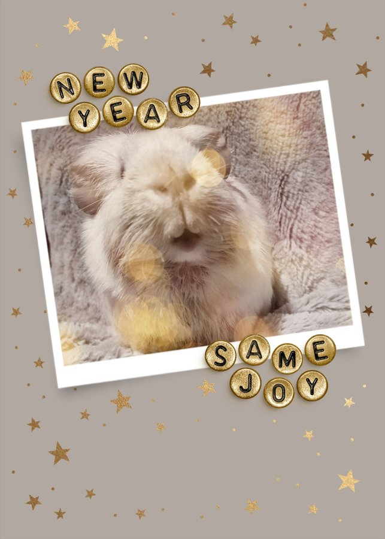

What a year it has been. As we step into 2026, we want to take a moment to reflect on everything we accomplished together — and to thank every single person who made it possible.

<!-- truncate -->

*Gratitude, growth, and a whole lot of tiny paws.*

## Our Numbers Tell a Story

Our 2025 numbers look a little different from previous years, and that's intentional. We made a deliberate shift toward **specialized care for senior, hospice, and special needs small animals** — the ones who are hardest to place and most in need of experienced hands.

Even with that transition, we were able to:

- **Place 110 animals** into loving forever homes
- Provide **sanctuary care for 95 senior, hospice, and special needs animals** across all of our board members and experienced foster homes

Those 95 sanctuary animals represent countless sleepless nights, emergency vet runs, hand-feedings, and moments of pure joy watching a once-suffering animal thrive on a carefully managed care plan.

## A Year of Medical Firsts

2025 was genuinely one of the most medically complex years we have ever experienced. We encountered conditions we had never seen before, worked with veterinary specialists pushing the boundaries of exotic animal medicine, and came out the other side with a depth of knowledge that will directly benefit every animal we care for going forward.

We saw firsthand how veterinary science has advanced — new treatment protocols, new medications being applied to exotic species, and a growing community of vets who take small animals as seriously as dogs and cats. Our philosophy has always been: **there is no cap on knowledge**. The best thing we can do for our animal friends is to keep an open mind as science evolves, follow the research, and advocate relentlessly.

## A Special Thank-You to Dr. Ford

We want to send an extra-special shout-out to **Dr. Ford at Southern Maine Hospital for Small Mammals** and his incredible team. His advanced knowledge of exotic mammal medicine has helped us provide a quality of care that many thought impossible for animals this small. So many of our sanctuary residents are thriving on their treatment plans, and seeing them happy and comfortable has brought a new level of joy to everyone on our team.

If you are in the New England area and need an exotic small mammal specialist, we cannot recommend Dr. Ford highly enough.

## Thank You to Our Village

None of this happens without you. To our **adopters, fosters, supporters, friends, and families** — your unwavering confidence in the work we do means everything. You show up for us in so many ways: sharing our posts, donating supplies, sponsoring vet visits, and simply cheering us on when things get hard.

To our rescue board members — **Jen, Alanna, Lynne, and Ericka** — I am in awe of you every single day. You roll with every punch, say yes to every crazy idea, and show up for each other and for these animals without hesitation. I could not imagine a better team.

And to our rescue friends across the US and around the globe: the group chats, the shared knowledge, the late-night check-ins on each other's mental health — teamwork truly makes the dreamwork. This community is something special.

## Looking Ahead

Here's to 2026 being another year full of learning, growth, and happy endings — hopefully with a little less stress along the way. 💛

We are so grateful for every one of you.

<SupportUs />
