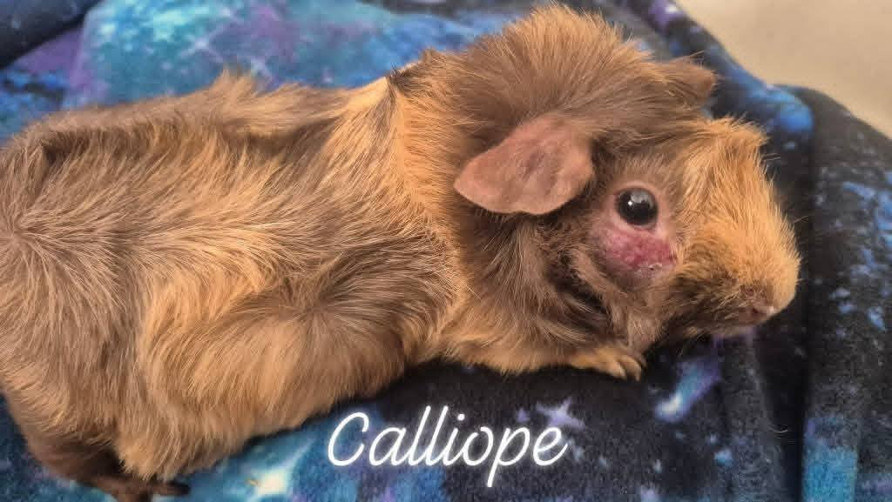
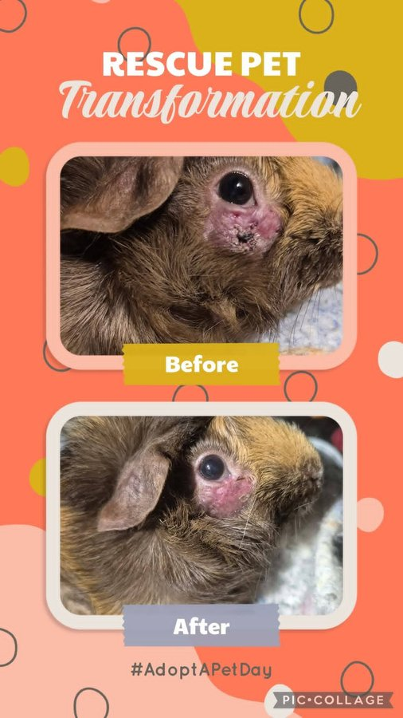
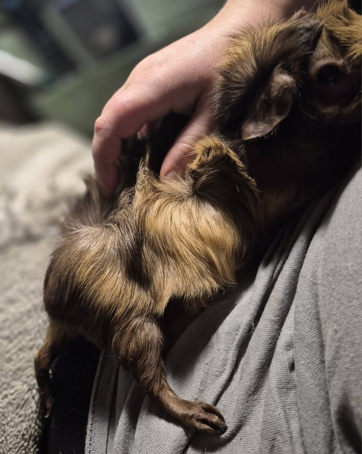

This is Calliope's story. It is a story about a skin condition that started small, was mismanaged before she came to us, and ultimately became something far more serious. We are sharing it because we believe her experience can help other guinea pig owners recognize warning signs and advocate for their animals before things escalate.

<!-- truncate -->

*Calliope, our sweet girl.*

## How It Started

Calliope came to us with what appeared to be ringworm — a fungal infection (dermatophytosis) that is common in guinea pigs. Ringworm in guinea pigs typically presents as circular patches of hair loss, often with scaly or crusty skin at the edges. When caught early, it is very treatable with antifungal medication.

The problem is that ringworm is often misidentified, and treatment is sometimes delayed or incomplete. In Calliope's case, the infection had been left untreated long enough that it had progressed well beyond a simple fungal issue.

## When Ringworm Becomes Something Worse

What we discovered was that the original fungal infection had created an entry point for bacteria. The wound had become a complicated, inflamed **staph infection with vasculitis** — a serious condition involving inflammation of the blood vessels in the skin.

*The extent of the infection when she arrived.*

Vasculitis in guinea pigs is not common, and it is not easy to manage. While we were never able to fully cure it, we were able to keep it well-managed with a combination of treatments. Calliope hated oral medications and topical treatments, so after each treatment session, we would give her a gentle back massage — medium pressure, which she loved. She would kick her little feet out in contentment, and those moments made every difficult treatment session worth it.

## The Lesson: Early Treatment Matters

Ringworm in guinea pigs is very treatable when caught early. A simple fungal infection that gets trimmed at the follicle and treated immediately is an easy fix. Left untreated, it can become a complicated, multi-layered infection that is much harder to resolve.

*Calliope in one of her favorite spots.*

**Signs of ringworm in guinea pigs to watch for:**
- Circular patches of hair loss, especially around the face, ears, and back
- Scaly, flaky, or crusty skin at the edges of the bald patches
- Redness or irritation in the affected area
- Scratching or rubbing at the area

If you notice any of these signs, please contact an exotic-knowledgeable veterinarian promptly. Do not wait to see if it resolves on its own.

:::tip Check Our Resources
We have a comprehensive guide on [skin conditions and parasites in guinea pigs](/docs/guinea-pigs/illnesses-and-conditions/parasites-in-guinea-pigs) that covers common skin issues and when to seek veterinary care.
:::

## Goodbye, Calliope

We are so sorry we couldn't completely fix you, sweet girl. But you were loved every single day you were with us, and now you are whole and well and popcorning over the rainbow bridge. 🌈

<SupportUs />
