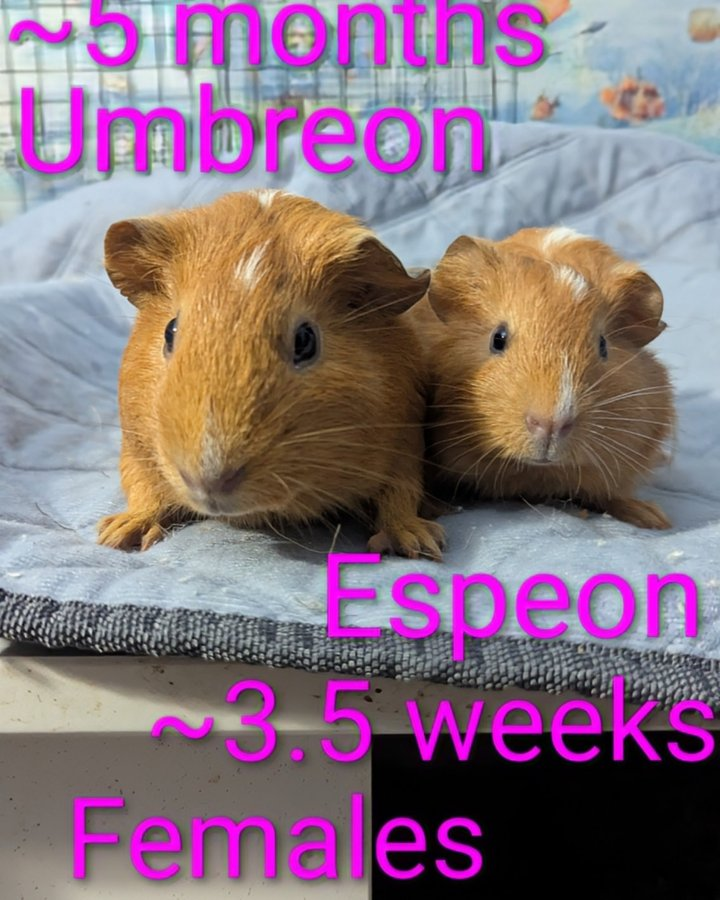

We are kicking off 2026 with our very first adoption of the year — and it's a double! Mama Umbreon and her daughter Espeon have gone home, and we couldn't be more thrilled about where they landed.

<!-- truncate -->

*Umbreon and Espeon, heading to their forever home.*

## A Perfect Match

Umbreon and Espeon went home with one of our fantastic previous adopters — someone who had already proven themselves to be a wonderful guinea pig parent. They had recently lost one of their guinea pigs and were looking to expand their herd again.

Their plan is to bond Umbreon and Espeon with their two current guinea pigs, giving everyone a chance to become one big happy family. They are also completely comfortable keeping them separate if Umbreon — who can be a little grumpy with other pigs sometimes — decides she's not interested in making new friends. That kind of flexibility and patience is exactly what makes a great adopter.

## Our First Foster Fail of the Year Too!

This adoption came alongside our first foster fail of 2026 as well, making for a very happy start to the new year. Between the foster fail and this adoption, we are already off to a wonderful start.

Happy trails, Umbreon and Espeon. We can't wait to hear about all your adventures in your new home. 💛

<SupportUs />
