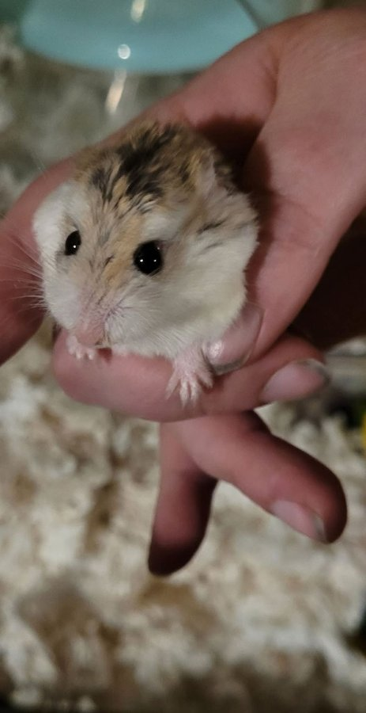

We are heartbroken to share that our resident ancient roborovski hamster, Carrie, passed away this week. She was not a spring chicken when she was surrendered to us, and she would have been with us for a full year on January 25th. She kept her energy and her sass right until the very end.

<!-- truncate -->

*Carrie in her beloved 40-gallon tank — the tiny queen of a very large kingdom.*

## A Tiny Life, Fully Lived

Carrie was a whopping 21 grams. She had an entire 40-gallon tank all to herself, and honestly, it was sometimes very easy to lose her in there. She loved her wheel, she loved exploring every inch of her space, and she had an attitude that was absolutely disproportionate to her size.

Roborovski hamsters are the smallest of the hamster species, and they are known for their speed and energy. Carrie was no exception. Even in her final weeks, she was still zooming around and doing things entirely on her own terms.

## Sanctuary Life for Senior Hamsters

Carrie is a perfect example of why we take in senior and hospice animals. She came to us at an age when many rescues would have passed, and she got to spend her final year in a safe, enriched environment where she was loved and cared for every single day. That matters.

:::tip Learn More
Interested in hamster care and what makes a great hamster habitat? Check out our [hamster care resources](/docs/Hamsters/getting-started/hamster-basic-care) for information on housing, enrichment, and more.
:::

Till we meet again, tiny friend. 🐹

<SupportUs />
