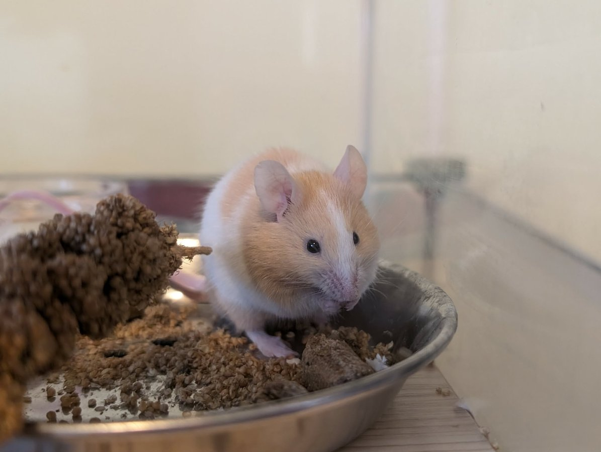
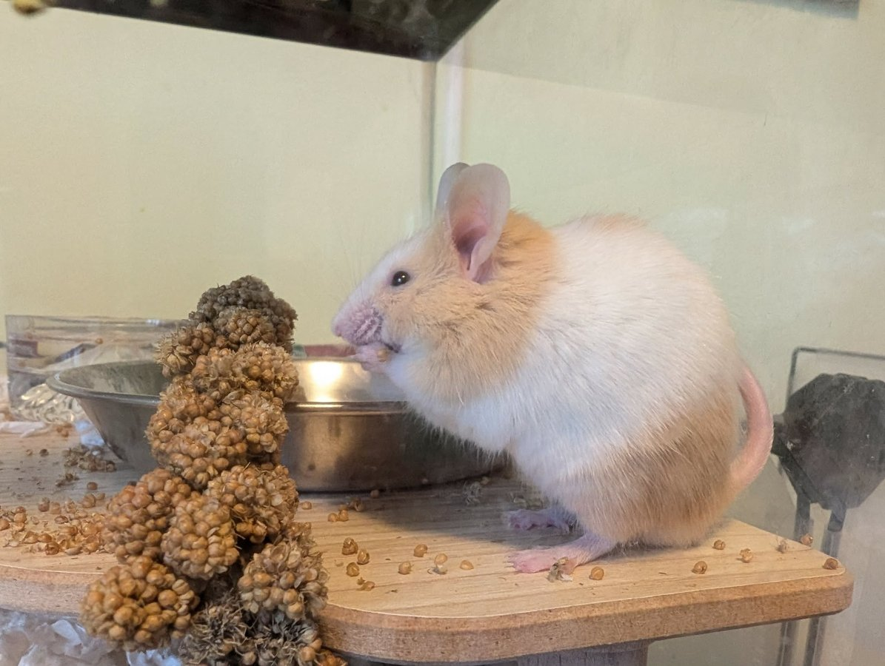

Meet Julius Cheeser — one of our Long Island mice who was found in a storm drain and has come so incredibly far from where he started. He is ready for his forever home, and we want to make sure the right family finds him.

<!-- truncate -->

*Julius Cheeser, the dashing gentleman of our mouse crew.*

## Getting to Know Julius

Since moving in with his foster mom in Boston, we have learned so much about this little guy:

**He is a champion burrower.** Given the right bedding, Julius will construct elaborate tunnel systems that would impress any engineer. Newspaper bedding is his absolute favorite, and he would love to have that in his forever home.

**He is a shy wheel user.** We know the wheel is getting used — there is always evidence in the morning — but his foster mom has yet to catch him in the act. He manages to get his exercise entirely in secret, which is very on-brand for a mouse.

**He is warming up to hands.** Julius is still a little nervous about being handled, but he has been getting more curious and bolder every week. Fingers are especially interesting to him, probably because fingers bring food. Priorities.

**He is seed-obsessed.** Julius will begrudgingly eat his rodent block, but seeds are his true love. He will eat the block, but his enthusiasm is noticeably different.

**He is a happy, energetic little dude.** When Julius is in a good mood, he popcorns around his cage with pure joy. It is one of the most delightful things to witness.

*Julius investigating his world.*

## His Journey

Julius came to us as part of a group of mice found in a storm drain on Long Island. The circumstances were not ideal, but he has made extraordinary progress. He went from a terrified, defensive little mouse to a curious, increasingly trusting companion who is ready to take the next step into his forever home.

We are looking for someone patient and experienced with mice — someone who will give Julius the time and space he needs to fully come out of his shell. He will reward that patience tenfold.

:::tip Learn More About Mice
If you are considering adopting a mouse, check out our [mouse care resources](/docs/Mice/getting-started/mouse-basic-care) for information on housing, enrichment, and what makes mice such wonderful companions.
:::

If Julius sounds like the right fit for your home, please reach out to us! 💛

<SupportUs />
